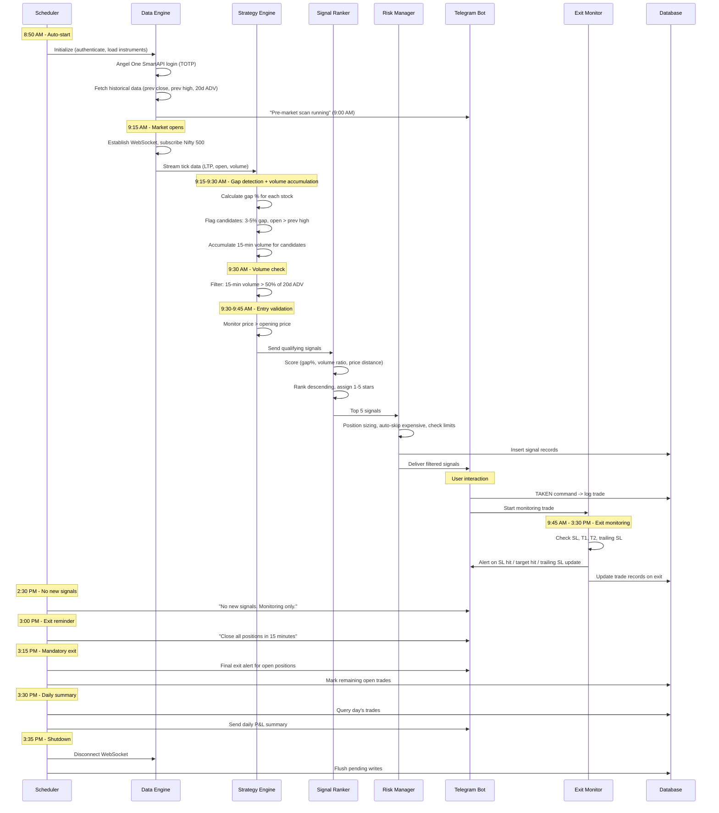
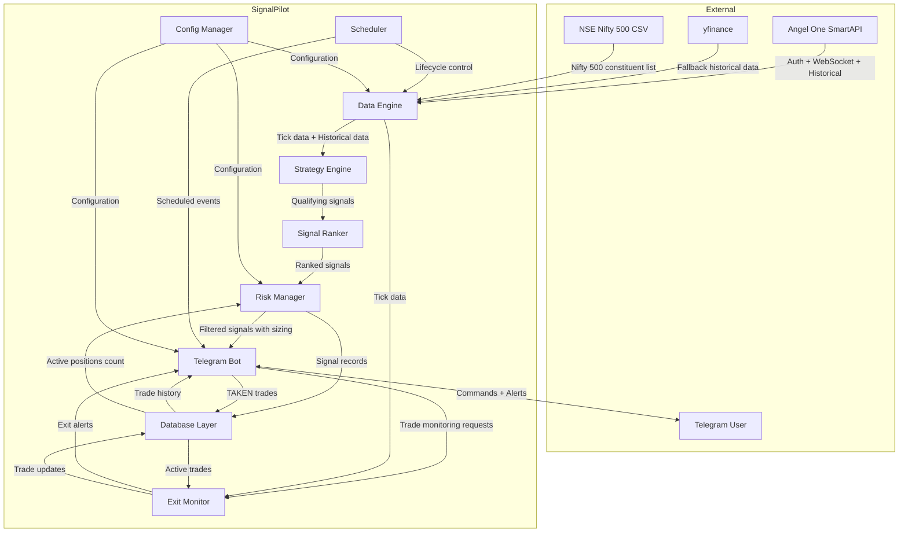
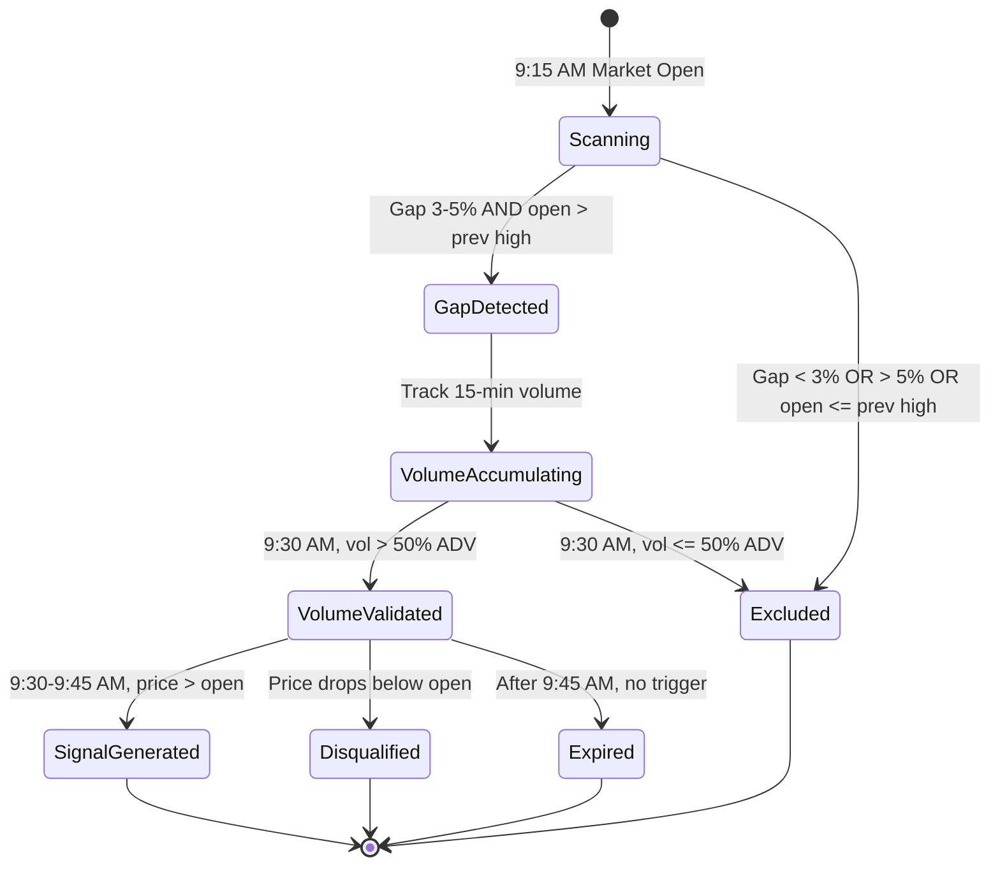
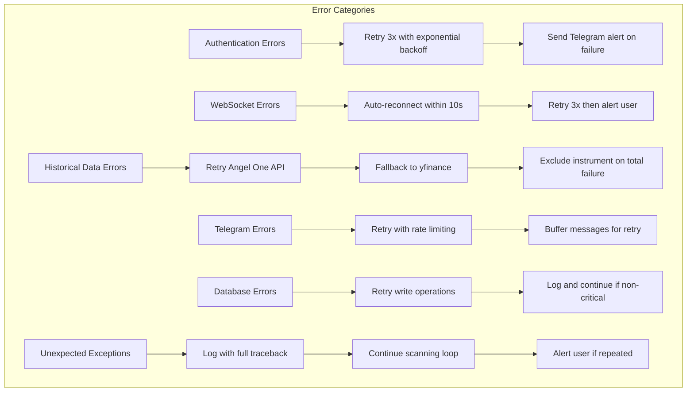

# SignalPilot -- Technical Design Document

## Table of Contents

1. [Overview](#1-overview)
2. [Architecture](#2-architecture)
3. [Project Structure](#3-project-structure)
4. [Components and Interfaces](#4-components-and-interfaces)
5. [Data Models](#5-data-models)
6. [Database Design](#6-database-design)
7. [Configuration Management](#7-configuration-management)
8. [Error Handling](#8-error-handling)
9. [Testing Strategy](#9-testing-strategy)
10. [Key Technical Decisions](#10-key-technical-decisions)

---

## 1. Overview

### 1.1 Purpose

SignalPilot is a rule-based intraday signal generation tool for Indian equity markets (NSE). It scans Nifty 500 stocks during market hours (9:15 AM -- 3:30 PM IST), identifies high-probability Gap and Go trade setups, and delivers actionable BUY signals via Telegram with entry price, stop loss, targets, quantity, and signal strength rating.

This design document covers the Phase 1 MVP: the Gap and Go strategy, real-time data ingestion via Angel One SmartAPI, signal ranking, risk management, exit monitoring, Telegram delivery, trade journaling via SQLite, and application lifecycle management.

### 1.2 Design Goals

- **Single-user, single-machine deployment**: Runs as a long-lived Python process on the developer's local machine during market hours.
- **Event-driven architecture**: Real-time tick data from WebSocket drives strategy evaluation and exit monitoring without polling delays.
- **Extensibility**: The scanning loop and strategy engine are designed so that Phase 2 and Phase 3 strategies (VWAP Bounce, ORB, Momentum) plug in with no architectural changes.
- **Resilience**: Automatic reconnection, crash recovery, and fallback data sources ensure the system stays operational during market hours.
- **Simplicity**: No microservices, no message queues, no external databases. A single Python process with SQLite is sufficient for the MVP.

### 1.3 Key Architectural Decisions Summary

| Decision | Choice | Rationale |
|----------|--------|-----------|
| Async framework | `asyncio` native event loop | All key libraries (SmartAPI WebSocket, python-telegram-bot, APScheduler) support asyncio natively. A single event loop avoids thread-safety issues. |
| WebSocket strategy | Single connection, 500 tokens | Angel One allows up to 1,000 tokens per connection and 3 simultaneous connections. Nifty 500 (500 tokens) fits in a single connection with room to spare. |
| Data storage | SQLite via `aiosqlite` | Lightweight, zero-setup, sufficient for single-user workloads. Async wrapper avoids blocking the event loop on DB operations. |
| Scheduling | APScheduler 3.x `AsyncIOScheduler` | Integrates natively with the asyncio event loop. Supports cron-style triggers for market-time events. |
| Telegram library | `python-telegram-bot` v22+ | Fully async since v20. Provides high-level `Application` class with built-in handler dispatch and rate limiting. |
| Configuration | `.env` file + `pydantic-settings` | Secrets stay out of code. Pydantic provides validation, type coercion, and clear error messages for missing config. |
| Nifty 500 list source | NSE India CSV + Angel One instrument master cross-reference | The Angel One instrument master does not tag index membership. A separate Nifty 500 CSV from NSE is required and cross-referenced with the instrument master to obtain Angel One tokens. |

---

## 2. Architecture

### 2.1 High-Level System Architecture

```
+------------------------------------------------------------------+
|                          SignalPilot                              |
|                     (Single Python Process)                      |
+------------------------------------------------------------------+
|                                                                  |
|  +----------------+    +------------------+    +---------------+ |
|  |  Data Engine   |--->| Strategy Engine  |--->| Signal Ranker | |
|  | (SmartAPI +    |    | (Gap & Go logic) |    | (Scoring +    | |
|  |  WebSocket +   |    |                  |    |  Top 5 filter)| |
|  |  yfinance)     |    +------------------+    +-------+-------+ |
|  +-------+--------+                                    |         |
|          |                                             v         |
|          |    +----------------+    +------------------+-------+ |
|          |    | Exit Monitor   |<---| Risk Manager              | |
|          +--->| (SL/Target/    |    | (Position sizing,         | |
|               |  Trailing SL/  |    |  max positions,           | |
|               |  Time exits)   |    |  auto-skip expensive)     | |
|               +-------+--------+    +---------------------------+ |
|                       |                                          |
|                       v                                          |
|               +-------+--------+                                 |
|               | Telegram Bot   |<-----> User (Telegram)          |
|               | (Delivery +    |                                 |
|               |  Commands)     |                                 |
|               +-------+--------+                                 |
|                       |                                          |
|                       v                                          |
|               +-------+--------+    +------------------+        |
|               | Database Layer |    | Scheduler        |        |
|               | (SQLite)       |    | (APScheduler)    |        |
|               +----------------+    +------------------+        |
|                                                                  |
+------------------------------------------------------------------+
```

### 2.2 Data Flow -- Trading Day Lifecycle



### 2.3 Component Interaction Diagram



---

## 3. Project Structure

```
SignalPilot/
|-- signalpilot/                    # Main application package
|   |-- __init__.py
|   |-- main.py                     # Application entry point, lifecycle orchestration
|   |-- config.py                   # Pydantic settings, configuration loading
|   |
|   |-- data/                       # Data Engine module
|   |   |-- __init__.py
|   |   |-- auth.py                 # Angel One SmartAPI authentication (TOTP)
|   |   |-- websocket_client.py     # WebSocket connection manager, tick handler
|   |   |-- historical.py           # Historical data fetcher (SmartAPI + yfinance fallback)
|   |   |-- instruments.py          # Nifty 500 instrument list management
|   |   |-- market_data_store.py    # In-memory data store for ticks and historical data
|   |
|   |-- strategy/                   # Strategy Engine module
|   |   |-- __init__.py
|   |   |-- base.py                 # Abstract base class for strategies
|   |   |-- gap_and_go.py           # Gap & Go strategy implementation
|   |
|   |-- ranking/                    # Signal Ranker module
|   |   |-- __init__.py
|   |   |-- scorer.py               # Multi-factor composite scoring
|   |   |-- ranker.py               # Ranking, star rating, top-N selection
|   |
|   |-- risk/                       # Risk Manager module
|   |   |-- __init__.py
|   |   |-- position_sizer.py       # Position sizing calculations
|   |   |-- risk_manager.py         # Max positions, auto-skip, signal filtering
|   |
|   |-- monitor/                    # Exit Monitor module
|   |   |-- __init__.py
|   |   |-- exit_monitor.py         # SL, target, trailing SL, time-based exit logic
|   |
|   |-- telegram/                   # Telegram Bot module
|   |   |-- __init__.py
|   |   |-- bot.py                  # Bot setup, command handlers, message dispatch
|   |   |-- formatters.py           # Signal and alert message formatting templates
|   |   |-- handlers.py             # TAKEN, STATUS, JOURNAL, CAPITAL, HELP handlers
|   |
|   |-- db/                         # Database Layer module
|   |   |-- __init__.py
|   |   |-- database.py             # SQLite connection manager, schema initialization
|   |   |-- models.py               # Dataclass models for signals, trades, user_config
|   |   |-- signal_repo.py          # CRUD operations for signals table
|   |   |-- trade_repo.py           # CRUD operations for trades table
|   |   |-- config_repo.py          # CRUD operations for user_config table
|   |   |-- metrics.py              # Performance metrics queries (win rate, P&L, etc.)
|   |
|   |-- scheduler/                  # Scheduler module
|   |   |-- __init__.py
|   |   |-- scheduler.py            # APScheduler setup, market-time jobs
|   |   |-- lifecycle.py            # App startup, shutdown, crash recovery logic
|   |
|   |-- utils/                      # Shared utilities
|       |-- __init__.py
|       |-- market_calendar.py      # NSE trading day/holiday checks, IST time helpers
|       |-- logger.py               # Logging configuration
|       |-- constants.py            # Magic numbers, market times, thresholds
|
|-- data/                           # Static data files
|   |-- nifty500_list.csv           # Nifty 500 constituent list (periodically updated)
|
|-- tests/                          # Test suite
|   |-- __init__.py
|   |-- conftest.py                 # Shared fixtures
|   |-- test_data/                  # Test data fixtures (mock ticks, historical data)
|   |-- test_strategy/              # Strategy engine tests
|   |-- test_ranking/               # Ranker tests
|   |-- test_risk/                  # Risk manager tests
|   |-- test_monitor/               # Exit monitor tests
|   |-- test_telegram/              # Telegram handler tests
|   |-- test_db/                    # Database layer tests
|   |-- test_integration/           # Integration tests
|
|-- .env.example                    # Template for environment variables
|-- pyproject.toml                  # Project metadata, dependencies, tool config
|-- README.md                       # Project documentation
```

---

## 4. Components and Interfaces

### 4.1 Data Engine

The Data Engine is responsible for all external data acquisition: authenticating with Angel One, managing the WebSocket connection for real-time ticks, fetching historical OHLCV data, and maintaining the Nifty 500 instrument list.

#### 4.1.1 Authentication (`data/auth.py`)

**Responsibilities:**
- Authenticate with Angel One SmartAPI using API key, client ID, MPIN, and TOTP secret.
- Store and refresh session tokens (JWT auth token, feed token, refresh token).
- Auto-re-authenticate when the session expires during market hours.

**Key Class:**

```python
class SmartAPIAuthenticator:
    """Manages Angel One SmartAPI authentication lifecycle."""

    def __init__(self, config: AppConfig):
        self.api_key: str = config.angel_api_key
        self.client_id: str = config.angel_client_id
        self.mpin: str = config.angel_mpin
        self.totp_secret: str = config.angel_totp_secret
        self._smart_connect: SmartConnect | None = None
        self._auth_token: str | None = None
        self._feed_token: str | None = None
        self._refresh_token: str | None = None

    async def authenticate(self) -> bool:
        """
        Authenticate with Angel One SmartAPI.
        Retries up to 3 times with exponential backoff.
        Returns True on success, raises AuthenticationError on failure.
        """
        ...

    async def refresh_session(self) -> bool:
        """Re-authenticate using the refresh token."""
        ...

    @property
    def auth_token(self) -> str:
        """Current JWT auth token. Raises if not authenticated."""
        ...

    @property
    def feed_token(self) -> str:
        """Current feed token for WebSocket. Raises if not authenticated."""
        ...

    @property
    def smart_connect(self) -> SmartConnect:
        """The underlying SmartConnect instance."""
        ...
```

**Design Decisions:**
- TOTP is generated at login time using `pyotp.TOTP(secret).now()`. Since TOTP codes are time-sensitive (30-second window), the authenticator retries with a fresh TOTP on failure.
- Authentication runs in an executor (`asyncio.to_thread`) because the `SmartConnect` library uses synchronous HTTP requests internally.

#### 4.1.2 WebSocket Client (`data/websocket_client.py`)

**Responsibilities:**
- Establish and maintain a WebSocket connection to Angel One SmartAPI.
- Subscribe to real-time tick data for all Nifty 500 instruments.
- Parse binary tick data and update the in-memory market data store.
- Auto-reconnect on disconnection with up to 3 retries.

**Key Class:**

```python
class WebSocketClient:
    """Manages the Angel One SmartAPI WebSocket connection."""

    def __init__(
        self,
        authenticator: SmartAPIAuthenticator,
        instruments: InstrumentManager,
        market_data_store: MarketDataStore,
        on_disconnect_alert: Callable[[str], Awaitable[None]],
    ):
        self._ws: SmartWebSocketV2 | None = None
        self._subscribed_tokens: list[dict] = []
        ...

    async def connect(self) -> None:
        """Establish WebSocket connection and subscribe to all instruments."""
        ...

    async def disconnect(self) -> None:
        """Gracefully close the WebSocket connection."""
        ...

    def _on_data(self, ws, message) -> None:
        """
        Callback for incoming tick data.
        Parses binary message and updates MarketDataStore.
        """
        ...

    def _on_close(self, ws, code, reason) -> None:
        """Callback for connection close. Triggers reconnection."""
        ...

    def _on_error(self, ws, error) -> None:
        """Callback for WebSocket errors."""
        ...
```

**Design Decisions:**
- Angel One SmartAPI WebSocket v2 supports up to 1,000 token subscriptions per connection and up to 3 simultaneous connections. Since Nifty 500 requires only 500 tokens, a single connection is sufficient.
- The SmartAPI WebSocket library (`SmartWebSocketV2`) runs its own internal thread for the WebSocket event loop. Tick data callbacks will use `asyncio.get_event_loop().call_soon_threadsafe()` to push updates to the main asyncio event loop safely.
- Binary tick data from the WebSocket is parsed at specific byte offsets (as per SmartAPI binary protocol) to extract LTP, open, high, low, close, and volume fields.

#### 4.1.3 Historical Data Fetcher (`data/historical.py`)

**Responsibilities:**
- Fetch previous trading day's close price and high price for all Nifty 500 stocks.
- Fetch 20-day average daily volume (ADV) for each stock.
- Fall back to yfinance if Angel One API fails after retries.

**Key Class:**

```python
class HistoricalDataFetcher:
    """Fetches historical OHLCV data from Angel One or yfinance."""

    def __init__(
        self,
        authenticator: SmartAPIAuthenticator,
        instruments: InstrumentManager,
    ):
        ...

    async def fetch_previous_day_data(self) -> dict[str, PreviousDayData]:
        """
        Fetch previous day's close and high for all Nifty 500 stocks.
        Returns mapping of symbol -> PreviousDayData.
        Falls back to yfinance on failure.
        """
        ...

    async def fetch_average_daily_volume(self, lookback_days: int = 20) -> dict[str, float]:
        """
        Fetch ADV over the last N trading sessions.
        Returns mapping of symbol -> average daily volume.
        Falls back to yfinance on failure.
        """
        ...

    async def _fetch_from_angel_one(self, symbol: str, token: str, ...) -> pd.DataFrame:
        """Fetch historical candle data from Angel One SmartAPI."""
        ...

    async def _fetch_from_yfinance(self, symbol: str, ...) -> pd.DataFrame:
        """Fallback: fetch data from yfinance. Logs a warning."""
        ...
```

**Design Decisions:**
- Angel One historical API is called per-instrument. For 500 stocks, this is batched with rate limiting (approximately 3 requests/second) to avoid hitting API limits. The calls are run concurrently using `asyncio.Semaphore` to cap parallelism.
- yfinance symbols for NSE stocks use the `.NS` suffix (e.g., `SBIN.NS`). The instrument manager maintains this mapping.
- Historical data fetch is an initialization step that runs once before market open. It does not need to be ultra-fast but must complete before 9:15 AM.

#### 4.1.4 Instrument Manager (`data/instruments.py`)

**Responsibilities:**
- Load the Nifty 500 constituent list from a local CSV file.
- Cross-reference with Angel One's instrument master (`OpenAPIScripMaster.json`) to obtain tokens.
- Provide symbol-to-token and token-to-symbol mappings.

**Key Class:**

```python
class InstrumentManager:
    """Manages the Nifty 500 instrument list and Angel One token mappings."""

    def __init__(self, nifty500_csv_path: str):
        self._instruments: dict[str, Instrument] = {}  # symbol -> Instrument
        self._token_map: dict[str, str] = {}            # angel_token -> symbol
        ...

    async def load(self) -> None:
        """
        Load Nifty 500 list from CSV, fetch Angel One instrument master,
        cross-reference to build token mappings.
        Logs warnings for any symbols not found in instrument master.
        """
        ...

    def get_all_tokens(self) -> list[dict]:
        """Return token list in the format required for WebSocket subscription."""
        ...

    def get_symbol_by_token(self, token: str) -> str | None:
        """Look up symbol from Angel One token."""
        ...

    def get_instrument(self, symbol: str) -> Instrument | None:
        """Get full instrument details by symbol."""
        ...

    @property
    def symbols(self) -> list[str]:
        """All loaded Nifty 500 symbols."""
        ...
```

**Design Decisions:**
- The Angel One instrument master JSON (`OpenAPIScripMaster.json`) is approximately 30 MB. It is fetched once at startup, filtered for NSE equity (`exch_seg == "NSE"` and symbol ends with `-EQ`), and cross-referenced with the Nifty 500 CSV.
- The Nifty 500 CSV is stored locally in `data/nifty500_list.csv` and should be updated periodically (quarterly, when NSE reconstitutes the index). A future enhancement could auto-download this from the NSE website.

#### 4.1.5 Market Data Store (`data/market_data_store.py`)

**Responsibilities:**
- Hold real-time tick data in memory for all subscribed instruments.
- Hold historical reference data (previous close, previous high, 20-day ADV).
- Provide thread-safe read access for the strategy engine and exit monitor.

**Key Class:**

```python
@dataclass
class TickData:
    symbol: str
    ltp: float
    open_price: float
    high: float
    low: float
    close: float  # Previous close from tick
    volume: int
    last_traded_timestamp: datetime
    updated_at: datetime

@dataclass
class HistoricalReference:
    previous_close: float
    previous_high: float
    average_daily_volume: float

class MarketDataStore:
    """Thread-safe in-memory store for real-time and historical market data."""

    def __init__(self):
        self._ticks: dict[str, TickData] = {}
        self._historical: dict[str, HistoricalReference] = {}
        self._volume_accumulator: dict[str, int] = {}  # For 15-min volume tracking
        self._lock: asyncio.Lock = asyncio.Lock()

    async def update_tick(self, symbol: str, tick: TickData) -> None:
        """Update the latest tick data for a symbol."""
        ...

    async def get_tick(self, symbol: str) -> TickData | None:
        """Get the latest tick data for a symbol."""
        ...

    async def set_historical(self, symbol: str, data: HistoricalReference) -> None:
        """Set historical reference data for a symbol."""
        ...

    async def get_historical(self, symbol: str) -> HistoricalReference | None:
        """Get historical reference data for a symbol."""
        ...

    async def accumulate_volume(self, symbol: str, volume: int) -> None:
        """Update cumulative volume for the 9:15-9:30 window."""
        ...

    async def get_accumulated_volume(self, symbol: str) -> int:
        """Get the cumulative volume accumulated since 9:15 AM."""
        ...

    async def get_all_ticks(self) -> dict[str, TickData]:
        """Get a snapshot of all current tick data."""
        ...
```

**Design Decisions:**
- `asyncio.Lock` is used rather than `threading.Lock` because the primary consumers are all asyncio coroutines. The WebSocket callback bridges into the asyncio loop via `call_soon_threadsafe`.
- Volume accumulation for the 9:15-9:30 window uses the `volume` field from tick data. Since Angel One provides `volume_trade_for_the_day` in the binary tick, the accumulator simply tracks the latest volume value per symbol (cumulative volume from market open is already what we need).

---

### 4.2 Strategy Engine

The Strategy Engine evaluates market conditions against predefined strategy rules and produces candidate signals. It is designed with an abstract base class so that future strategies (VWAP Bounce, ORB) can be added as new subclasses without modifying the engine loop.

#### 4.2.1 Strategy Base Class (`strategy/base.py`)

```python
from abc import ABC, abstractmethod
from enum import Enum

class StrategyPhase(Enum):
    """Phases of the trading day that a strategy may operate in."""
    PRE_MARKET = "pre_market"          # Before 9:15 AM
    OPENING = "opening"                 # 9:15-9:30 AM
    ENTRY_WINDOW = "entry_window"       # 9:30-9:45 AM
    CONTINUOUS = "continuous"           # 9:45 AM-2:30 PM
    WIND_DOWN = "wind_down"            # 2:30-3:30 PM

class SignalDirection(Enum):
    BUY = "BUY"
    SELL = "SELL"

@dataclass
class CandidateSignal:
    """A raw signal produced by a strategy before ranking and filtering."""
    symbol: str
    direction: SignalDirection
    strategy_name: str
    entry_price: float
    stop_loss: float
    target_1: float
    target_2: float
    gap_pct: float
    volume_ratio: float
    price_distance_from_open_pct: float
    reason: str
    generated_at: datetime

class BaseStrategy(ABC):
    """Abstract base class for all trading strategies."""

    @property
    @abstractmethod
    def name(self) -> str:
        """Human-readable strategy name."""
        ...

    @property
    @abstractmethod
    def active_phases(self) -> list[StrategyPhase]:
        """Which phases of the trading day this strategy operates in."""
        ...

    @abstractmethod
    async def evaluate(
        self,
        market_data: MarketDataStore,
        current_phase: StrategyPhase,
    ) -> list[CandidateSignal]:
        """
        Evaluate current market conditions and return candidate signals.
        Called by the scanning loop on each tick cycle during active phases.
        """
        ...
```

#### 4.2.2 Gap and Go Strategy (`strategy/gap_and_go.py`)

**Responsibilities:**
- Detect stocks gapping up 3-5% at market open.
- Validate that open price is above previous day's high.
- Accumulate and check 15-minute volume against 50% of 20-day ADV.
- Validate price holds above opening price in the 9:30-9:45 AM window.
- Calculate stop loss (opening price, capped at 3% below entry) and targets (5%, 7%).

**Key Class:**

```python
class GapAndGoStrategy(BaseStrategy):
    """
    Gap & Go strategy: identifies stocks that gap up 3-5% at open
    with strong volume, then holds above opening price.
    """

    def __init__(self, market_data: MarketDataStore, config: AppConfig):
        self._market_data = market_data
        self._gap_candidates: dict[str, GapCandidate] = {}
        self._volume_validated: set[str] = set()
        self._disqualified: set[str] = set()
        self._signals_generated: set[str] = set()
        ...

    @property
    def name(self) -> str:
        return "Gap & Go"

    @property
    def active_phases(self) -> list[StrategyPhase]:
        return [StrategyPhase.OPENING, StrategyPhase.ENTRY_WINDOW]

    async def evaluate(
        self,
        market_data: MarketDataStore,
        current_phase: StrategyPhase,
    ) -> list[CandidateSignal]:
        """
        Phase-dependent evaluation:
        - OPENING (9:15-9:30): detect gaps, accumulate volume
        - ENTRY_WINDOW (9:30-9:45): validate price hold, generate signals
        """
        if current_phase == StrategyPhase.OPENING:
            return await self._detect_gaps_and_accumulate_volume()
        elif current_phase == StrategyPhase.ENTRY_WINDOW:
            return await self._validate_and_generate_signals()
        return []

    async def _detect_gaps_and_accumulate_volume(self) -> list[CandidateSignal]:
        """
        Scan all Nifty 500 stocks for gap-up conditions.
        At 9:15 AM: identify gap candidates.
        9:15-9:30 AM: track volume accumulation for candidates.
        Returns empty list (signals not generated in this phase).
        """
        ...

    async def _validate_and_generate_signals(self) -> list[CandidateSignal]:
        """
        For each volume-validated gap candidate:
        - Check current price > opening price
        - If yes: generate CandidateSignal
        - If price drops below open: disqualify
        """
        ...

    def _calculate_gap_percentage(self, open_price: float, prev_close: float) -> float:
        return ((open_price - prev_close) / prev_close) * 100

    def _calculate_stop_loss(self, entry_price: float, open_price: float) -> float:
        """
        SL = opening price.
        If risk > 3%, cap SL at entry - 3%.
        """
        sl = open_price
        max_sl = entry_price * 0.97
        return max(sl, max_sl)

    def _calculate_targets(self, entry_price: float) -> tuple[float, float]:
        target_1 = entry_price * 1.05
        target_2 = entry_price * 1.07
        return target_1, target_2
```

**State Machine for Gap and Go Candidates:**



---

### 4.3 Signal Ranker

The Signal Ranker takes candidate signals from the strategy engine, scores them using a multi-factor composite, ranks them, assigns star ratings, and selects the top N.

#### 4.3.1 Scorer (`ranking/scorer.py`)

```python
@dataclass
class ScoringWeights:
    """Configurable weights for the composite scoring formula."""
    gap_pct_weight: float = 0.40
    volume_ratio_weight: float = 0.35
    price_distance_weight: float = 0.25

class SignalScorer:
    """Calculates composite scores for candidate signals."""

    def __init__(self, weights: ScoringWeights):
        self._weights = weights

    def score(self, signal: CandidateSignal) -> float:
        """
        Composite score = (normalized_gap * w1) + (normalized_volume * w2) +
                          (normalized_price_distance * w3)

        All factors are normalized to 0-1 range before weighting.
        """
        ...

    def _normalize_gap(self, gap_pct: float) -> float:
        """Normalize gap% to 0-1 range. 3% maps to 0.0, 5% maps to 1.0."""
        return min(max((gap_pct - 3.0) / 2.0, 0.0), 1.0)

    def _normalize_volume_ratio(self, volume_ratio: float) -> float:
        """Normalize volume ratio. 0.5 (threshold) maps to 0.0, 3.0+ maps to 1.0."""
        return min(max((volume_ratio - 0.5) / 2.5, 0.0), 1.0)

    def _normalize_price_distance(self, pct: float) -> float:
        """
        Normalize price distance from open.
        Higher distance (more above open) = stronger confirmation = higher score.
        0% maps to 0.0, 3%+ maps to 1.0.
        """
        return min(max(pct / 3.0, 0.0), 1.0)
```

#### 4.3.2 Ranker (`ranking/ranker.py`)

```python
class SignalRanker:
    """Ranks scored signals, assigns star ratings, selects top N."""

    def __init__(self, scorer: SignalScorer, max_signals: int = 5):
        self._scorer = scorer
        self._max_signals = max_signals

    def rank(self, candidates: list[CandidateSignal]) -> list[RankedSignal]:
        """
        Score all candidates, sort descending, assign star ratings,
        return top N signals.
        """
        scored = []
        for candidate in candidates:
            score = self._scorer.score(candidate)
            scored.append((candidate, score))

        scored.sort(key=lambda x: x[1], reverse=True)

        ranked = []
        for i, (candidate, score) in enumerate(scored[:self._max_signals]):
            stars = self._score_to_stars(score)
            ranked.append(RankedSignal(
                candidate=candidate,
                composite_score=score,
                rank=i + 1,
                signal_strength=stars,
            ))
        return ranked

    def _score_to_stars(self, score: float) -> int:
        """
        Map composite score to 1-5 star rating.
        0.0-0.2 -> 1 star, 0.2-0.4 -> 2 stars, ..., 0.8-1.0 -> 5 stars
        """
        return min(5, max(1, int(score * 5) + 1))

@dataclass
class RankedSignal:
    candidate: CandidateSignal
    composite_score: float
    rank: int
    signal_strength: int  # 1-5 stars
```

---

### 4.4 Risk Manager

The Risk Manager applies capital-based filters and position sizing to ranked signals before they are delivered.

#### 4.4.1 Position Sizer (`risk/position_sizer.py`)

```python
class PositionSizer:
    """Calculates position sizes based on user capital and constraints."""

    def calculate(
        self,
        entry_price: float,
        total_capital: float,
        max_positions: int,
    ) -> PositionSize:
        """
        Per-trade capital = total_capital / max_positions
        Quantity = floor(per_trade_capital / entry_price)
        Returns PositionSize with quantity and capital_required.
        """
        per_trade_capital = total_capital / max_positions
        quantity = int(per_trade_capital // entry_price)
        capital_required = quantity * entry_price
        return PositionSize(
            quantity=quantity,
            capital_required=capital_required,
            per_trade_capital=per_trade_capital,
        )

@dataclass
class PositionSize:
    quantity: int
    capital_required: float
    per_trade_capital: float
```

#### 4.4.2 Risk Manager (`risk/risk_manager.py`)

```python
class RiskManager:
    """Applies risk filters to ranked signals before delivery."""

    def __init__(
        self,
        position_sizer: PositionSizer,
        db: DatabaseManager,
        config: AppConfig,
    ):
        self._sizer = position_sizer
        self._db = db
        self._config = config

    async def filter_and_size(
        self,
        ranked_signals: list[RankedSignal],
        total_capital: float,
        max_positions: int,
    ) -> list[FinalSignal]:
        """
        For each ranked signal:
        1. Check if max open positions reached -> suppress
        2. Calculate position size -> if quantity == 0, auto-skip (too expensive)
        3. Build FinalSignal with all delivery fields
        """
        active_count = await self._db.get_active_trade_count()
        available_slots = max_positions - active_count

        if available_slots <= 0:
            return []

        final_signals = []
        for ranked in ranked_signals[:available_slots]:
            size = self._sizer.calculate(
                entry_price=ranked.candidate.entry_price,
                total_capital=total_capital,
                max_positions=max_positions,
            )
            if size.quantity == 0:
                # Auto-skip: stock price exceeds per-trade allocation
                logger.info(
                    f"Auto-skipped {ranked.candidate.symbol}: "
                    f"price {ranked.candidate.entry_price} exceeds "
                    f"per-trade allocation {size.per_trade_capital}"
                )
                continue

            final_signals.append(FinalSignal(
                ranked_signal=ranked,
                quantity=size.quantity,
                capital_required=size.capital_required,
                expires_at=datetime.now(IST) + timedelta(minutes=30),
            ))

        return final_signals

@dataclass
class FinalSignal:
    ranked_signal: RankedSignal
    quantity: int
    capital_required: float
    expires_at: datetime
```

---

### 4.5 Exit Monitor

The Exit Monitor continuously checks active (TAKEN) trades against exit conditions: stop loss, Target 1, Target 2, trailing stop loss, and time-based exits.

#### 4.5.1 Exit Monitor (`monitor/exit_monitor.py`)

```python
class ExitType(Enum):
    SL_HIT = "sl_hit"
    T1_HIT = "t1_hit"
    T2_HIT = "t2_hit"
    TRAILING_SL_HIT = "trailing_sl"
    TIME_EXIT = "time_exit"

@dataclass
class TrailingStopState:
    current_stop: float
    is_breakeven: bool = False
    is_trailing: bool = False
    highest_price: float = 0.0

class ExitMonitor:
    """Monitors active trades for exit conditions on every tick."""

    def __init__(
        self,
        market_data: MarketDataStore,
        db: DatabaseManager,
        alert_callback: Callable[[ExitAlert], Awaitable[None]],
    ):
        self._market_data = market_data
        self._db = db
        self._alert_callback = alert_callback
        self._trailing_stops: dict[int, TrailingStopState] = {}  # trade_id -> state
        self._t1_alerted: set[int] = set()  # trade IDs that already got T1 alert

    async def check_all_trades(self) -> None:
        """
        Called on each tick cycle. Checks all active trades against:
        1. Stop loss / trailing stop loss
        2. Target 1 (partial profit alert)
        3. Target 2 (full exit recommendation)
        4. Trailing SL updates (breakeven at +2%, trail at +4%)
        """
        active_trades = await self._db.get_active_trades()
        for trade in active_trades:
            await self._check_trade(trade)

    async def _check_trade(self, trade: TradeRecord) -> None:
        tick = await self._market_data.get_tick(trade.symbol)
        if tick is None:
            return

        current_price = tick.ltp
        trailing = self._trailing_stops.get(trade.id, TrailingStopState(
            current_stop=trade.stop_loss,
            highest_price=trade.entry_price,
        ))

        # Update highest price seen
        trailing.highest_price = max(trailing.highest_price, current_price)

        # Check trailing SL updates
        await self._update_trailing_stop(trade, current_price, trailing)

        # Check SL hit (using current trailing stop)
        effective_sl = trailing.current_stop
        if current_price <= effective_sl:
            exit_type = ExitType.TRAILING_SL_HIT if trailing.is_trailing else ExitType.SL_HIT
            await self._trigger_exit(trade, current_price, exit_type)
            return

        # Check Target 2 first (higher priority)
        if current_price >= trade.target_2:
            await self._trigger_exit(trade, current_price, ExitType.T2_HIT)
            return

        # Check Target 1 (alert only, not an exit)
        if current_price >= trade.target_1 and trade.id not in self._t1_alerted:
            self._t1_alerted.add(trade.id)
            await self._alert_callback(ExitAlert(
                trade=trade,
                exit_type=ExitType.T1_HIT,
                current_price=current_price,
                pnl_pct=((current_price - trade.entry_price) / trade.entry_price) * 100,
                is_alert_only=True,  # T1 is advisory, not a close
            ))

        self._trailing_stops[trade.id] = trailing

    async def _update_trailing_stop(
        self,
        trade: TradeRecord,
        current_price: float,
        trailing: TrailingStopState,
    ) -> None:
        """
        Trailing SL logic:
        - Price +2% above entry -> SL moves to entry (breakeven)
        - Price +4% above entry -> SL trails at current_price - 2%
        - Trailing SL never moves down.
        """
        pct_above_entry = ((current_price - trade.entry_price) / trade.entry_price) * 100

        if pct_above_entry >= 4.0:
            new_stop = current_price * 0.98  # Trail at 2% below current
            if new_stop > trailing.current_stop:
                old_stop = trailing.current_stop
                trailing.current_stop = new_stop
                trailing.is_trailing = True
                if not trailing.is_trailing or new_stop != old_stop:
                    await self._alert_callback(ExitAlert(
                        trade=trade,
                        exit_type=None,
                        current_price=current_price,
                        pnl_pct=pct_above_entry,
                        is_alert_only=True,
                        trailing_sl_update=new_stop,
                    ))
        elif pct_above_entry >= 2.0 and not trailing.is_breakeven:
            trailing.current_stop = trade.entry_price
            trailing.is_breakeven = True
            await self._alert_callback(ExitAlert(
                trade=trade,
                exit_type=None,
                current_price=current_price,
                pnl_pct=pct_above_entry,
                is_alert_only=True,
                trailing_sl_update=trade.entry_price,
            ))

    async def _trigger_exit(
        self,
        trade: TradeRecord,
        exit_price: float,
        exit_type: ExitType,
    ) -> None:
        """Record exit in database and send alert."""
        pnl_amount = (exit_price - trade.entry_price) * trade.quantity
        pnl_pct = ((exit_price - trade.entry_price) / trade.entry_price) * 100
        await self._db.close_trade(
            trade_id=trade.id,
            exit_price=exit_price,
            pnl_amount=pnl_amount,
            pnl_pct=pnl_pct,
            exit_reason=exit_type.value,
        )
        await self._alert_callback(ExitAlert(
            trade=trade,
            exit_type=exit_type,
            current_price=exit_price,
            pnl_pct=pnl_pct,
            is_alert_only=False,
        ))
        # Cleanup trailing state
        self._trailing_stops.pop(trade.id, None)
        self._t1_alerted.discard(trade.id)

    async def trigger_time_exit_check(self) -> None:
        """Called at 3:00 PM and 3:15 PM for time-based exits."""
        ...

@dataclass
class ExitAlert:
    trade: TradeRecord
    exit_type: ExitType | None
    current_price: float
    pnl_pct: float
    is_alert_only: bool  # True for T1 and trailing SL updates
    trailing_sl_update: float | None = None
```

---

### 4.6 Telegram Bot

The Telegram Bot handles two-way communication: delivering signals and alerts to the user, and processing user commands.

#### 4.6.1 Bot Setup (`telegram/bot.py`)

```python
class SignalPilotBot:
    """Main Telegram bot manager."""

    def __init__(
        self,
        config: AppConfig,
        db: DatabaseManager,
        market_data: MarketDataStore,
        exit_monitor: ExitMonitor,
    ):
        self._config = config
        self._db = db
        self._market_data = market_data
        self._exit_monitor = exit_monitor
        self._application: Application | None = None

    async def start(self) -> None:
        """Initialize the bot, register handlers, start polling."""
        builder = ApplicationBuilder().token(self._config.telegram_bot_token).build()
        self._application = builder

        # Register command handlers
        self._application.add_handler(MessageHandler(
            filters.TEXT & filters.Regex(r"^TAKEN$"),
            self._handle_taken,
        ))
        self._application.add_handler(MessageHandler(
            filters.TEXT & filters.Regex(r"^STATUS$"),
            self._handle_status,
        ))
        self._application.add_handler(MessageHandler(
            filters.TEXT & filters.Regex(r"^JOURNAL$"),
            self._handle_journal,
        ))
        self._application.add_handler(MessageHandler(
            filters.TEXT & filters.Regex(r"^CAPITAL\s+\d+"),
            self._handle_capital,
        ))
        self._application.add_handler(MessageHandler(
            filters.TEXT & filters.Regex(r"^HELP$"),
            self._handle_help,
        ))

        await self._application.initialize()
        await self._application.start()
        await self._application.updater.start_polling()

    async def stop(self) -> None:
        """Gracefully stop the bot."""
        if self._application:
            await self._application.updater.stop()
            await self._application.stop()
            await self._application.shutdown()

    async def send_signal(self, signal: FinalSignal) -> None:
        """Format and send a signal message to the user's chat."""
        message = format_signal_message(signal)
        await self._application.bot.send_message(
            chat_id=self._config.telegram_chat_id,
            text=message,
            parse_mode="HTML",
        )

    async def send_alert(self, text: str) -> None:
        """Send a plain alert message."""
        await self._application.bot.send_message(
            chat_id=self._config.telegram_chat_id,
            text=text,
            parse_mode="HTML",
        )

    async def send_exit_alert(self, alert: ExitAlert) -> None:
        """Format and send an exit alert."""
        message = format_exit_alert(alert)
        await self.send_alert(message)
```

#### 4.6.2 Message Formatters (`telegram/formatters.py`)

```python
def format_signal_message(signal: FinalSignal) -> str:
    """
    Format a FinalSignal into the user-facing Telegram message.
    Uses HTML parse mode for formatting.
    """
    c = signal.ranked_signal.candidate
    risk_pct = abs(
        ((c.stop_loss - c.entry_price) / c.entry_price) * 100
    )
    stars = star_rating(signal.ranked_signal.signal_strength)

    return (
        f"<b>BUY SIGNAL -- {c.symbol}</b>\n"
        f"\n"
        f"Entry Price: {c.entry_price:.2f}\n"
        f"Stop Loss: {c.stop_loss:.2f} ({risk_pct:.2f}% risk)\n"
        f"Target 1: {c.target_1:.2f} (5%)\n"
        f"Target 2: {c.target_2:.2f} (7%)\n"
        f"Quantity: {signal.quantity} shares\n"
        f"Capital Required: {signal.capital_required:,.0f}\n"
        f"Signal Strength: {stars}\n"
        f"Strategy: {c.strategy_name}\n"
        f"Reason: {c.reason}\n"
        f"\n"
        f"Valid Until: {signal.expires_at.strftime('%I:%M %p')} "
        f"(auto-expires)\n"
        f"{'=' * 30}\n"
        f"Reply TAKEN to log this trade\n"
        f"Reply STATUS to check open signals\n"
        f"Reply JOURNAL to view your performance"
    )

def star_rating(strength: int) -> str:
    """Convert 1-5 int to star display."""
    labels = {1: "Weak", 2: "Fair", 3: "Moderate", 4: "Strong", 5: "Very Strong"}
    filled = "*" * strength
    empty = "." * (5 - strength)
    return f"{filled}{empty} ({labels.get(strength, '')})"

def format_exit_alert(alert: ExitAlert) -> str:
    """Format exit alerts for SL hit, target hit, trailing SL updates."""
    ...

def format_status_message(signals: list, trades: list) -> str:
    """Format the STATUS command response."""
    ...

def format_journal_message(metrics: PerformanceMetrics) -> str:
    """Format the JOURNAL command response."""
    ...

def format_daily_summary(summary: DailySummary) -> str:
    """Format the 3:30 PM daily summary."""
    ...
```

#### 4.6.3 Command Handlers (`telegram/handlers.py`)

| Command | Trigger | Behavior |
|---------|---------|----------|
| `TAKEN` | Exact match "TAKEN" | Finds the most recent active (non-expired) signal. Logs a trade in the `trades` table linked to the signal. Responds with confirmation. Starts exit monitoring for this trade. If no active signal exists, responds with a helpful message. If signal is expired, informs the user. |
| `STATUS` | Exact match "STATUS" | Queries active signals and open TAKEN trades from the database. For each trade, fetches current LTP from the market data store to calculate live P&L. Responds with formatted status. |
| `JOURNAL` | Exact match "JOURNAL" | Queries all trades from the database. Calculates performance metrics (win rate, total P&L, avg win, avg loss, risk-reward, best/worst trade). Responds with formatted summary. |
| `CAPITAL <amount>` | Regex `CAPITAL \d+` | Parses the amount, validates it is a positive number. Updates `user_config` table. Responds with confirmation showing new per-trade allocation. |
| `HELP` | Exact match "HELP" | Responds with a formatted list of all commands and their descriptions. |

---

### 4.7 Database Layer

The Database Layer provides async SQLite access for persisting signals, trades, and user configuration.

#### 4.7.1 Database Manager (`db/database.py`)

```python
class DatabaseManager:
    """Manages SQLite connection and schema initialization."""

    def __init__(self, db_path: str = "signalpilot.db"):
        self._db_path = db_path
        self._connection: aiosqlite.Connection | None = None

    async def initialize(self) -> None:
        """Open connection and create tables if they don't exist."""
        self._connection = await aiosqlite.connect(self._db_path)
        await self._connection.execute("PRAGMA journal_mode=WAL")
        await self._connection.execute("PRAGMA foreign_keys=ON")
        await self._create_tables()

    async def close(self) -> None:
        """Close the database connection."""
        if self._connection:
            await self._connection.close()

    async def _create_tables(self) -> None:
        """Create all tables defined in the schema."""
        await self._connection.executescript(SCHEMA_SQL)
        await self._connection.commit()
```

#### 4.7.2 Repository Pattern

Each table has a dedicated repository class providing CRUD operations:

- `SignalRepository` -- insert signal, update status (sent/expired), query by date/status
- `TradeRepository` -- insert trade, close trade (update exit fields), query active/by date
- `ConfigRepository` -- get/update user config (capital, max positions)
- `MetricsCalculator` -- aggregate queries for win rate, P&L, best/worst trade

---

### 4.8 Scheduler and Application Lifecycle

#### 4.8.1 Scheduler (`scheduler/scheduler.py`)

The scheduler uses APScheduler 3.x `AsyncIOScheduler` to trigger time-based events during the trading day.

**Scheduled Jobs:**

| Time | Job | Description |
|------|-----|-------------|
| 8:50 AM | `startup` | Full startup sequence (auth, instruments, historical, WebSocket) |
| 9:00 AM | `pre_market_alert` | Send "Pre-market scan running" to Telegram |
| 9:15 AM | `start_scanning` | Begin the continuous scanning loop |
| 9:30 AM | `volume_check` | Trigger Gap and Go volume validation |
| 2:30 PM | `stop_new_signals` | Stop generating new signals, send notification |
| 3:00 PM | `exit_reminder` | Send "Close all positions" reminder with trade P&L |
| 3:15 PM | `mandatory_exit` | Send mandatory exit alert for all open positions |
| 3:30 PM | `daily_summary` | Generate and send daily summary |
| 3:35 PM | `shutdown` | Graceful shutdown (disconnect WS, close DB) |

```python
class MarketScheduler:
    """Manages scheduled events for the trading day."""

    def __init__(self):
        self._scheduler = AsyncIOScheduler(timezone=IST)

    def configure_jobs(self, app: SignalPilotApp) -> None:
        """Register all trading day jobs."""
        self._scheduler.add_job(
            app.pre_market_alert,
            CronTrigger(hour=9, minute=0, timezone=IST),
            id="pre_market_alert",
        )
        self._scheduler.add_job(
            app.start_scanning,
            CronTrigger(hour=9, minute=15, timezone=IST),
            id="start_scanning",
        )
        # ... additional jobs for each scheduled event

    def start(self) -> None:
        self._scheduler.start()

    def shutdown(self) -> None:
        self._scheduler.shutdown()
```

#### 4.8.2 Application Lifecycle (`scheduler/lifecycle.py`)

```python
class SignalPilotApp:
    """
    Main application orchestrator.
    Owns all components and manages the lifecycle.
    """

    def __init__(self, config: AppConfig):
        self.config = config
        self.db = DatabaseManager(config.db_path)
        self.authenticator = SmartAPIAuthenticator(config)
        self.instruments = InstrumentManager(config.nifty500_csv_path)
        self.market_data = MarketDataStore()
        self.historical = HistoricalDataFetcher(self.authenticator, self.instruments)
        self.websocket = WebSocketClient(
            self.authenticator, self.instruments, self.market_data,
            on_disconnect_alert=self._on_ws_disconnect,
        )
        self.strategy = GapAndGoStrategy(self.market_data, config)
        self.scorer = SignalScorer(ScoringWeights())
        self.ranker = SignalRanker(self.scorer)
        self.position_sizer = PositionSizer()
        self.risk_manager = RiskManager(self.position_sizer, self.db, config)
        self.exit_monitor = ExitMonitor(
            self.market_data, self.db,
            alert_callback=self._on_exit_alert,
        )
        self.bot = SignalPilotBot(config, self.db, self.market_data, self.exit_monitor)
        self.scheduler = MarketScheduler()
        self._scanning = False
        self._generating_signals = True

    async def startup(self) -> None:
        """Full startup sequence."""
        await self.db.initialize()
        await self.authenticator.authenticate()
        await self.instruments.load()
        hist_data = await self.historical.fetch_previous_day_data()
        adv_data = await self.historical.fetch_average_daily_volume()
        for symbol in self.instruments.symbols:
            if symbol in hist_data and symbol in adv_data:
                await self.market_data.set_historical(symbol, HistoricalReference(
                    previous_close=hist_data[symbol].close,
                    previous_high=hist_data[symbol].high,
                    average_daily_volume=adv_data[symbol],
                ))
        await self.bot.start()
        self.scheduler.configure_jobs(self)
        self.scheduler.start()

    async def start_scanning(self) -> None:
        """Begin the continuous scanning loop (called at 9:15 AM)."""
        await self.websocket.connect()
        self._scanning = True
        asyncio.create_task(self._scan_loop())

    async def _scan_loop(self) -> None:
        """
        Main scanning loop. Runs every second while scanning is active.
        Determines the current market phase and delegates to strategies + exit monitor.
        """
        while self._scanning:
            now = datetime.now(IST)
            phase = self._determine_phase(now)

            if self._generating_signals and phase in (
                StrategyPhase.OPENING, StrategyPhase.ENTRY_WINDOW
            ):
                candidates = await self.strategy.evaluate(self.market_data, phase)
                if candidates:
                    ranked = self.ranker.rank(candidates)
                    user_config = await self.db.get_user_config()
                    final = await self.risk_manager.filter_and_size(
                        ranked, user_config.total_capital, user_config.max_positions,
                    )
                    for signal in final:
                        await self.db.insert_signal(signal)
                        await self.bot.send_signal(signal)

            # Always check exits for active trades
            await self.exit_monitor.check_all_trades()

            # Check for expired signals
            await self._expire_stale_signals()

            await asyncio.sleep(1)

    def _determine_phase(self, now: datetime) -> StrategyPhase:
        """Map current time to a StrategyPhase."""
        t = now.time()
        if t < time(9, 15):
            return StrategyPhase.PRE_MARKET
        elif t < time(9, 30):
            return StrategyPhase.OPENING
        elif t < time(9, 45):
            return StrategyPhase.ENTRY_WINDOW
        elif t < time(14, 30):
            return StrategyPhase.CONTINUOUS
        else:
            return StrategyPhase.WIND_DOWN

    async def shutdown(self) -> None:
        """Graceful shutdown sequence."""
        self._scanning = False
        await self.websocket.disconnect()
        self.scheduler.shutdown()
        await self.bot.stop()
        await self.db.close()

    async def recover(self) -> None:
        """
        Crash recovery: re-authenticate, reconnect, reload today's state.
        Called when the app restarts during market hours.
        """
        await self.db.initialize()
        today_signals = await self.db.get_signals_by_date(date.today())
        active_trades = await self.db.get_active_trades()
        await self.authenticator.authenticate()
        await self.instruments.load()
        await self.websocket.connect()
        # Restore exit monitor state for active trades
        for trade in active_trades:
            self.exit_monitor.register_trade(trade)
        await self.bot.send_alert("System recovered from interruption. Monitoring resumed.")
        self._scanning = True
        asyncio.create_task(self._scan_loop())
```

#### 4.8.3 Crash Recovery

Crash recovery is handled at two levels:

1. **OS-level watchdog**: A simple shell script or systemd/launchd service that monitors the process and restarts it if it dies during market hours (9:15 AM -- 3:30 PM). Tracks crash count in a file; if it exceeds 3 in a single session, sends a Telegram alert and stops restarting.

2. **Application-level recovery**: When the app starts, it checks if it is during market hours and if there are today's signals/trades in the database. If so, it enters recovery mode instead of the normal startup sequence, skipping historical data fetch (already in DB) and resuming exit monitoring for active trades.

---

## 5. Data Models

### 5.1 Core Dataclasses

All data models are Python `dataclass` objects, serving as the contract between components.

```python
from dataclasses import dataclass, field
from datetime import datetime, date
from enum import Enum

# --- Instrument ---

@dataclass
class Instrument:
    symbol: str               # e.g., "SBIN"
    name: str                 # e.g., "State Bank of India"
    angel_token: str          # e.g., "3045"
    exchange: str             # "NSE"
    nse_symbol: str           # e.g., "SBIN-EQ" (Angel One format)
    yfinance_symbol: str      # e.g., "SBIN.NS"
    lot_size: int = 1

# --- Market Data ---

@dataclass
class TickData:
    symbol: str
    ltp: float
    open_price: float
    high: float
    low: float
    close: float              # Previous day close (from tick feed)
    volume: int               # Cumulative volume for the day
    last_traded_timestamp: datetime
    updated_at: datetime

@dataclass
class HistoricalReference:
    previous_close: float
    previous_high: float
    average_daily_volume: float

@dataclass
class PreviousDayData:
    close: float
    high: float
    low: float
    open: float
    volume: int

# --- Strategy ---

class SignalDirection(Enum):
    BUY = "BUY"
    SELL = "SELL"

@dataclass
class CandidateSignal:
    symbol: str
    direction: SignalDirection
    strategy_name: str
    entry_price: float
    stop_loss: float
    target_1: float
    target_2: float
    gap_pct: float
    volume_ratio: float
    price_distance_from_open_pct: float
    reason: str
    generated_at: datetime

# --- Ranking ---

@dataclass
class RankedSignal:
    candidate: CandidateSignal
    composite_score: float
    rank: int
    signal_strength: int      # 1-5 stars

# --- Risk / Delivery ---

@dataclass
class PositionSize:
    quantity: int
    capital_required: float
    per_trade_capital: float

@dataclass
class FinalSignal:
    ranked_signal: RankedSignal
    quantity: int
    capital_required: float
    expires_at: datetime

# --- Database Records ---

@dataclass
class SignalRecord:
    id: int | None = None
    date: date = field(default_factory=date.today)
    symbol: str = ""
    strategy: str = ""
    entry_price: float = 0.0
    stop_loss: float = 0.0
    target_1: float = 0.0
    target_2: float = 0.0
    quantity: int = 0
    capital_required: float = 0.0
    signal_strength: int = 0
    gap_pct: float = 0.0
    volume_ratio: float = 0.0
    reason: str = ""
    created_at: datetime | None = None
    expires_at: datetime | None = None
    status: str = "sent"       # "sent" | "expired"

@dataclass
class TradeRecord:
    id: int | None = None
    signal_id: int = 0
    date: date = field(default_factory=date.today)
    symbol: str = ""
    entry_price: float = 0.0
    exit_price: float | None = None
    stop_loss: float = 0.0
    target_1: float = 0.0
    target_2: float = 0.0
    quantity: int = 0
    pnl_amount: float | None = None
    pnl_pct: float | None = None
    exit_reason: str | None = None
    taken_at: datetime | None = None
    exited_at: datetime | None = None

@dataclass
class UserConfig:
    id: int | None = None
    telegram_chat_id: str = ""
    total_capital: float = 50000.0
    max_positions: int = 5
    created_at: datetime | None = None
    updated_at: datetime | None = None

# --- Exit Monitor ---

class ExitType(Enum):
    SL_HIT = "sl_hit"
    T1_HIT = "t1_hit"
    T2_HIT = "t2_hit"
    TRAILING_SL_HIT = "trailing_sl"
    TIME_EXIT = "time_exit"

@dataclass
class ExitAlert:
    trade: TradeRecord
    exit_type: ExitType | None
    current_price: float
    pnl_pct: float
    is_alert_only: bool
    trailing_sl_update: float | None = None

# --- Performance Metrics ---

@dataclass
class PerformanceMetrics:
    date_range_start: date
    date_range_end: date
    total_signals: int
    trades_taken: int
    wins: int
    losses: int
    win_rate: float
    total_pnl: float
    avg_win: float
    avg_loss: float
    risk_reward_ratio: float
    best_trade_symbol: str
    best_trade_pnl: float
    worst_trade_symbol: str
    worst_trade_pnl: float

@dataclass
class DailySummary:
    date: date
    signals_sent: int
    trades_taken: int
    wins: int
    losses: int
    total_pnl: float
    cumulative_pnl: float
    trades: list[TradeRecord]
```

---

## 6. Database Design

### 6.1 SQLite Schema

```sql
-- Enable WAL mode for better concurrent read performance
PRAGMA journal_mode=WAL;
PRAGMA foreign_keys=ON;

-- Signals table: every signal generated by the system
CREATE TABLE IF NOT EXISTS signals (
    id              INTEGER PRIMARY KEY AUTOINCREMENT,
    date            TEXT    NOT NULL,   -- ISO date: YYYY-MM-DD
    symbol          TEXT    NOT NULL,
    strategy        TEXT    NOT NULL,   -- e.g., "Gap & Go"
    entry_price     REAL    NOT NULL,
    stop_loss       REAL    NOT NULL,
    target_1        REAL    NOT NULL,
    target_2        REAL    NOT NULL,
    quantity        INTEGER NOT NULL,
    capital_required REAL   NOT NULL,
    signal_strength INTEGER NOT NULL,   -- 1-5 stars
    gap_pct         REAL    NOT NULL,   -- Gap percentage at open
    volume_ratio    REAL    NOT NULL,   -- 15-min vol / 20d ADV
    reason          TEXT    NOT NULL,   -- Human-readable reasoning
    created_at      TEXT    NOT NULL,   -- ISO datetime
    expires_at      TEXT    NOT NULL,   -- ISO datetime (created_at + 30 min)
    status          TEXT    NOT NULL DEFAULT 'sent'  -- 'sent' | 'expired'
);

CREATE INDEX IF NOT EXISTS idx_signals_date ON signals(date);
CREATE INDEX IF NOT EXISTS idx_signals_status ON signals(status);
CREATE INDEX IF NOT EXISTS idx_signals_date_status ON signals(date, status);

-- Trades table: trades the user has TAKEN
CREATE TABLE IF NOT EXISTS trades (
    id              INTEGER PRIMARY KEY AUTOINCREMENT,
    signal_id       INTEGER NOT NULL REFERENCES signals(id),
    date            TEXT    NOT NULL,   -- ISO date: YYYY-MM-DD
    symbol          TEXT    NOT NULL,
    entry_price     REAL    NOT NULL,
    exit_price      REAL,               -- NULL until trade is closed
    stop_loss       REAL    NOT NULL,
    target_1        REAL    NOT NULL,
    target_2        REAL    NOT NULL,
    quantity        INTEGER NOT NULL,
    pnl_amount      REAL,               -- NULL until trade is closed
    pnl_pct         REAL,               -- NULL until trade is closed
    exit_reason     TEXT,               -- 'sl_hit'|'t1_hit'|'t2_hit'|'trailing_sl'|'time_exit'
    taken_at        TEXT    NOT NULL,   -- ISO datetime
    exited_at       TEXT                -- ISO datetime, NULL while open
);

CREATE INDEX IF NOT EXISTS idx_trades_date ON trades(date);
CREATE INDEX IF NOT EXISTS idx_trades_signal_id ON trades(signal_id);
CREATE INDEX IF NOT EXISTS idx_trades_exited_at ON trades(exited_at);

-- User config table: stores user preferences
CREATE TABLE IF NOT EXISTS user_config (
    id              INTEGER PRIMARY KEY AUTOINCREMENT,
    telegram_chat_id TEXT   NOT NULL,
    total_capital   REAL    NOT NULL DEFAULT 50000.0,
    max_positions   INTEGER NOT NULL DEFAULT 5,
    created_at      TEXT    NOT NULL,   -- ISO datetime
    updated_at      TEXT    NOT NULL    -- ISO datetime
);
```

### 6.2 Key Queries

**Get active (non-expired, non-taken) signals for today:**
```sql
SELECT * FROM signals
WHERE date = ? AND status = 'sent'
  AND expires_at > datetime('now')
ORDER BY created_at DESC;
```

**Get active (open) trades:**
```sql
SELECT * FROM trades
WHERE exited_at IS NULL
ORDER BY taken_at DESC;
```

**Count active trades (for position limit check):**
```sql
SELECT COUNT(*) FROM trades
WHERE exited_at IS NULL;
```

**Close a trade:**
```sql
UPDATE trades
SET exit_price = ?, pnl_amount = ?, pnl_pct = ?,
    exit_reason = ?, exited_at = ?
WHERE id = ?;
```

**Expire stale signals:**
```sql
UPDATE signals
SET status = 'expired'
WHERE status = 'sent' AND expires_at <= datetime('now');
```

**Performance metrics (for JOURNAL command):**
```sql
-- Win rate
SELECT
    COUNT(*) as total,
    SUM(CASE WHEN pnl_amount > 0 THEN 1 ELSE 0 END) as wins,
    SUM(CASE WHEN pnl_amount <= 0 THEN 1 ELSE 0 END) as losses,
    SUM(pnl_amount) as total_pnl,
    AVG(CASE WHEN pnl_amount > 0 THEN pnl_amount END) as avg_win,
    AVG(CASE WHEN pnl_amount <= 0 THEN pnl_amount END) as avg_loss,
    MAX(pnl_amount) as best_pnl,
    MIN(pnl_amount) as worst_pnl
FROM trades
WHERE exited_at IS NOT NULL;
```

**Daily summary (for 3:30 PM report):**
```sql
SELECT * FROM trades
WHERE date = ?
ORDER BY taken_at;
```

---

## 7. Configuration Management

### 7.1 Environment Variables

All secrets and deployment-specific settings are loaded from a `.env` file using `pydantic-settings`.

```python
from pydantic_settings import BaseSettings
from pydantic import Field

class AppConfig(BaseSettings):
    """Application configuration loaded from environment variables."""

    # Angel One SmartAPI
    angel_api_key: str = Field(..., description="Angel One SmartAPI API key")
    angel_client_id: str = Field(..., description="Angel One client ID")
    angel_mpin: str = Field(..., description="Angel One MPIN")
    angel_totp_secret: str = Field(..., description="TOTP secret key (32 chars)")

    # Telegram
    telegram_bot_token: str = Field(..., description="Telegram Bot API token")
    telegram_chat_id: str = Field(..., description="Telegram chat ID for delivery")

    # Database
    db_path: str = Field(default="signalpilot.db", description="SQLite database path")

    # Instrument data
    nifty500_csv_path: str = Field(
        default="data/nifty500_list.csv",
        description="Path to Nifty 500 constituent CSV",
    )

    # Risk management defaults
    default_capital: float = Field(default=50000.0, description="Default trading capital (INR)")
    default_max_positions: int = Field(default=5, description="Max simultaneous positions")

    # Strategy parameters
    gap_min_pct: float = Field(default=3.0, description="Minimum gap % for Gap & Go")
    gap_max_pct: float = Field(default=5.0, description="Maximum gap % for Gap & Go")
    volume_threshold_pct: float = Field(
        default=50.0,
        description="15-min volume must exceed this % of 20-day ADV",
    )
    target_1_pct: float = Field(default=5.0, description="Target 1 as % from entry")
    target_2_pct: float = Field(default=7.0, description="Target 2 as % from entry")
    max_risk_pct: float = Field(default=3.0, description="Max stop loss risk % from entry")
    signal_expiry_minutes: int = Field(default=30, description="Signal expiry in minutes")

    # Scoring weights
    scoring_gap_weight: float = Field(default=0.40)
    scoring_volume_weight: float = Field(default=0.35)
    scoring_price_distance_weight: float = Field(default=0.25)

    # Trailing stop loss
    trailing_sl_breakeven_trigger_pct: float = Field(default=2.0)
    trailing_sl_trail_trigger_pct: float = Field(default=4.0)
    trailing_sl_trail_distance_pct: float = Field(default=2.0)

    # Retry / resilience
    auth_max_retries: int = Field(default=3)
    ws_max_reconnect_attempts: int = Field(default=3)
    historical_api_rate_limit: int = Field(default=3, description="Requests per second")
    max_crashes_per_session: int = Field(default=3)

    class Config:
        env_file = ".env"
        env_file_encoding = "utf-8"
```

### 7.2 Example `.env` File

```env
# Angel One SmartAPI Credentials
ANGEL_API_KEY=your_api_key_here
ANGEL_CLIENT_ID=your_client_id
ANGEL_MPIN=your_mpin
ANGEL_TOTP_SECRET=your_32_char_totp_secret

# Telegram Bot
TELEGRAM_BOT_TOKEN=your_telegram_bot_token
TELEGRAM_CHAT_ID=your_chat_id

# Database
DB_PATH=signalpilot.db

# Instrument data
NIFTY500_CSV_PATH=data/nifty500_list.csv

# Risk management
DEFAULT_CAPITAL=50000
DEFAULT_MAX_POSITIONS=5

# Strategy parameters (optional, defaults are sensible)
# GAP_MIN_PCT=3.0
# GAP_MAX_PCT=5.0
# VOLUME_THRESHOLD_PCT=50.0
# TARGET_1_PCT=5.0
# TARGET_2_PCT=7.0
```

### 7.3 Secrets Handling

- The `.env` file is listed in `.gitignore` to prevent accidental commit of secrets.
- A `.env.example` file is committed with placeholder values for documentation.
- At runtime, `pydantic-settings` validates that all required fields are present and raises clear errors if any are missing.
- The TOTP secret is never logged; all logging of credentials is redacted.

---

## 8. Error Handling

### 8.1 Error Handling Strategy Overview



### 8.2 Retry Logic

All external API calls use a common retry decorator:

```python
import asyncio
import functools
from typing import TypeVar, Callable

T = TypeVar("T")

def with_retry(
    max_retries: int = 3,
    base_delay: float = 1.0,
    max_delay: float = 30.0,
    exponential: bool = True,
    exceptions: tuple = (Exception,),
):
    """
    Decorator for async functions that should be retried on failure.
    Uses exponential backoff by default.
    """
    def decorator(func: Callable[..., T]) -> Callable[..., T]:
        @functools.wraps(func)
        async def wrapper(*args, **kwargs) -> T:
            last_exception = None
            for attempt in range(max_retries + 1):
                try:
                    return await func(*args, **kwargs)
                except exceptions as e:
                    last_exception = e
                    if attempt < max_retries:
                        delay = base_delay * (2 ** attempt) if exponential else base_delay
                        delay = min(delay, max_delay)
                        logger.warning(
                            f"{func.__name__} failed (attempt {attempt + 1}/{max_retries + 1}): "
                            f"{e}. Retrying in {delay}s..."
                        )
                        await asyncio.sleep(delay)
            raise last_exception
        return wrapper
    return decorator
```

### 8.3 Fallback Mechanisms

| Component | Primary | Fallback | Behavior on Total Failure |
|-----------|---------|----------|--------------------------|
| Authentication | Angel One SmartAPI | Retry 3x with backoff | Telegram alert (if possible), halt system |
| WebSocket | Angel One WebSocket | Reconnect 3x within 10s | Telegram alert, halt scanning |
| Historical data | Angel One Historical API | yfinance | Exclude instrument from scanning |
| Telegram | Telegram Bot API | Retry with backoff | Buffer messages, log locally |
| Database | SQLite write | Retry 3x | Log error, continue (data loss for that record) |

### 8.4 Logging

Logging uses Python's built-in `logging` module with structured output.

```python
import logging
import sys

def configure_logging(level: str = "INFO") -> None:
    """Configure application-wide logging."""
    formatter = logging.Formatter(
        fmt="%(asctime)s | %(levelname)-8s | %(name)s | %(message)s",
        datefmt="%Y-%m-%d %H:%M:%S",
    )

    # Console handler
    console = logging.StreamHandler(sys.stdout)
    console.setFormatter(formatter)

    # File handler (rotating)
    from logging.handlers import RotatingFileHandler
    file_handler = RotatingFileHandler(
        "signalpilot.log",
        maxBytes=10 * 1024 * 1024,  # 10 MB
        backupCount=5,
    )
    file_handler.setFormatter(formatter)

    root = logging.getLogger("signalpilot")
    root.setLevel(getattr(logging, level.upper()))
    root.addHandler(console)
    root.addHandler(file_handler)
```

**Log Levels by Component:**

| Component | Level | What is logged |
|-----------|-------|----------------|
| Auth | INFO | Successful login; WARNING on retry; ERROR on failure |
| WebSocket | INFO | Connect/disconnect; WARNING on reconnect; ERROR on failure |
| Strategy | INFO | Candidates found, signals generated; DEBUG for per-stock evaluations |
| Ranker | INFO | Ranked signals with scores |
| Risk | INFO | Auto-skipped stocks, position limit reached |
| Exit Monitor | INFO | SL/target hits, trailing SL updates |
| Telegram | INFO | Messages sent; WARNING on rate limit; ERROR on failure |
| Database | DEBUG | Queries executed; ERROR on failures |
| Scheduler | INFO | Job execution; ERROR on job failures |

### 8.5 Signal Delivery Latency Monitoring

The system tracks the time between a strategy condition triggering and the Telegram message being sent. If this exceeds 30 seconds, a performance warning is logged:

```python
generation_time = datetime.now(IST)
# ... scoring, ranking, risk checks ...
await bot.send_signal(signal)
delivery_time = datetime.now(IST)
latency = (delivery_time - generation_time).total_seconds()
if latency > 30:
    logger.warning(f"Signal delivery latency for {signal.symbol}: {latency:.1f}s (exceeds 30s threshold)")
```

---

## 9. Testing Strategy

### 9.1 Testing Layers

```
+----------------------------------------------------+
|              Integration Tests                      |
|  (Full pipeline: tick -> signal -> telegram mock)   |
+----------------------------------------------------+
|              Component Tests                        |
|  (Strategy, Ranker, Risk, Exit Monitor, DB)         |
+----------------------------------------------------+
|              Unit Tests                             |
|  (Scoring, position sizing, gap calc, formatters)   |
+----------------------------------------------------+
```

### 9.2 Unit Tests

Pure function testing with no external dependencies.

| Module | Test Cases |
|--------|------------|
| `gap_and_go._calculate_gap_percentage` | Correct gap calc; edge cases at 3% and 5% boundaries |
| `gap_and_go._calculate_stop_loss` | SL at open price; SL capped at 3% when gap is large |
| `gap_and_go._calculate_targets` | T1 at +5%, T2 at +7% from entry |
| `scorer._normalize_gap` | 3% -> 0.0, 5% -> 1.0, 4% -> 0.5 |
| `scorer._normalize_volume_ratio` | 0.5 -> 0.0, 3.0 -> 1.0 |
| `scorer.score` | Weighted composite calculation |
| `ranker._score_to_stars` | Score ranges map to correct star values |
| `position_sizer.calculate` | Correct quantity and capital; quantity=0 for expensive stocks |
| `formatters.format_signal_message` | All fields present, correct formatting |
| `formatters.star_rating` | Star display for each value 1-5 |
| `market_calendar.is_trading_day` | Weekdays true, weekends false, holidays false |

### 9.3 Component Tests

Tests that exercise a single component with mocked dependencies.

| Component | Test Scenarios |
|-----------|----------------|
| **GapAndGoStrategy** | Mock market data with known gaps: verify candidates detected, volume validation, entry timing, disqualification on price drop |
| **SignalRanker** | Provide N candidates: verify correct ranking, top-5 selection, star assignment |
| **RiskManager** | Mock DB with active trades: verify position limit enforcement, auto-skip expensive stocks, correct sizing |
| **ExitMonitor** | Mock trades and ticks: verify SL hit detection, T1/T2 alerts, trailing SL progression (breakeven at +2%, trail at +4%), trailing SL never moves down |
| **DatabaseManager** | In-memory SQLite: verify schema creation, CRUD for signals/trades/config, metric calculations |
| **Telegram handlers** | Mock bot context: verify TAKEN logs trade, STATUS returns correct data, JOURNAL calculates metrics, CAPITAL updates config, HELP returns command list |

### 9.4 Integration Tests

End-to-end tests using recorded market data fixtures.

| Test | Description |
|------|-------------|
| **Full signal pipeline** | Feed mock tick data through the entire pipeline (data store -> strategy -> ranker -> risk -> formatter). Verify correct signal output. |
| **Signal expiry flow** | Generate signal, wait (simulated) 30 min, verify signal status changes to expired. |
| **TAKEN to exit flow** | Generate signal, simulate TAKEN command, feed price ticks that hit SL/target, verify trade record updated and alerts sent. |
| **Trailing SL progression** | Generate signal, TAKEN, feed gradually increasing prices (entry +2%, +4%, +5%), verify trailing SL moves correctly (breakeven, then trail). |
| **Position limit enforcement** | Generate 5 signals, TAKEN all, generate 6th signal, verify it is suppressed. |
| **Time-based exit** | Have open trades at 3:00 PM (simulated), verify exit reminders and 3:15 PM mandatory exit alerts. |
| **Crash recovery** | Populate DB with today's signals and active trades, start app in recovery mode, verify it resumes monitoring. |

### 9.5 Test Tooling

- **Framework**: `pytest` with `pytest-asyncio` for async test support.
- **Mocking**: `unittest.mock` and `pytest-mock` for dependency injection.
- **Fixtures**: Shared fixtures in `conftest.py` for common setups (market data store with sample data, pre-configured strategies, test DB).
- **Test data**: JSON files in `tests/test_data/` containing recorded tick sequences for reproducible strategy testing.
- **Coverage**: `pytest-cov` with a target of 80%+ line coverage on core logic (strategy, ranker, risk, exit monitor).

### 9.6 Manual Testing Checklist (Pre-Live)

Before going live with real market data, the following manual tests should be performed:

1. Authenticate with Angel One SmartAPI successfully.
2. WebSocket connects and receives tick data for at least 10 stocks.
3. Historical data fetches for at least 100 stocks without error.
4. yfinance fallback works when Angel One historical API is blocked.
5. A simulated gap candidate produces a correctly formatted Telegram signal.
6. TAKEN, STATUS, JOURNAL, CAPITAL, and HELP commands all respond correctly.
7. Signal expires after 30 minutes and sends expiry notification.
8. App starts, runs through a full market day simulation, and shuts down cleanly.

---

## 10. Key Technical Decisions

### 10.1 Single asyncio Event Loop

**Decision**: Run the entire application on a single asyncio event loop.

**Rationale**: All three main I/O-bound subsystems -- the Angel One WebSocket, the python-telegram-bot library, and APScheduler -- provide native asyncio support. Running them on a single event loop eliminates thread-safety concerns, simplifies debugging, and reduces resource usage. The SmartAPI WebSocket library runs its own thread internally, but data is bridged into the asyncio loop via `call_soon_threadsafe`.

**Trade-off**: CPU-bound work (if any) would need to be offloaded to an executor. For Phase 1, there is no significant CPU-bound work -- all calculations (gap detection, scoring, position sizing) are trivial arithmetic on small data sets.

### 10.2 In-Memory Market Data Store

**Decision**: Keep all real-time tick data and historical reference data in memory (Python dictionaries).

**Rationale**: With approximately 500 instruments and a fixed set of fields per instrument, the memory footprint is negligible (under 1 MB). In-memory access is fast enough for the 1-second scan loop. Persisting tick data to SQLite would add unnecessary I/O overhead for data that is inherently transient.

**Trade-off**: Tick data is lost on crash. This is acceptable because (a) historical data can be re-fetched, (b) active trades are persisted in SQLite and survive crashes, and (c) tick data from the WebSocket resumes immediately on reconnection.

### 10.3 WebSocket Subscription Strategy

**Decision**: Subscribe to all 500 Nifty 500 tokens on a single WebSocket connection at market open.

**Rationale**: Angel One allows up to 1,000 tokens per connection and 3 simultaneous connections. Subscribing all 500 upfront means the strategy engine has data for every stock from the moment it starts evaluating, with no need for dynamic subscription changes. This simplifies the architecture significantly.

**Trade-off**: Higher bandwidth usage than subscribing only to gap candidates. However, since gap detection itself requires open price data for all 500 stocks, there is no way to narrow the subscription before 9:15 AM.

### 10.4 SQLite with WAL Mode

**Decision**: Use SQLite in WAL (Write-Ahead Logging) mode via `aiosqlite`.

**Rationale**: WAL mode allows concurrent reads while a write is in progress, which prevents the scan loop from being blocked by database writes. `aiosqlite` wraps synchronous SQLite operations in a thread executor, so they don't block the asyncio event loop. For a single-user application writing a handful of records per day, SQLite is more than sufficient.

**Trade-off**: No multi-process access (only one writer process at a time). This is fine for a single-process application.

### 10.5 Nifty 500 List as Static CSV

**Decision**: Store the Nifty 500 constituent list as a local CSV file, updated manually on a quarterly basis.

**Rationale**: NSE reconstitutes the Nifty 500 index semi-annually (March and September). The list changes infrequently and by a small number of stocks. Auto-downloading from the NSE website is fragile (the NSE site frequently changes its structure and blocks scraping). A manually maintained CSV is reliable and predictable.

**Trade-off**: Requires manual update twice a year. The system logs a warning at startup if the CSV modification date is older than 6 months, reminding the user to update.

### 10.6 python-telegram-bot Polling Mode

**Decision**: Use polling mode (not webhooks) for the Telegram bot.

**Rationale**: Polling mode requires no public URL, no HTTPS certificate, and no port forwarding. It works from behind any NAT/firewall, which is ideal for running on a personal laptop. The latency difference between polling and webhooks is negligible for a single-user bot.

**Trade-off**: Slightly higher overhead (periodic polling requests even when no messages exist). This is insignificant for a single-user application.

### 10.7 APScheduler 3.x over 4.x

**Decision**: Use APScheduler 3.x (stable) with `AsyncIOScheduler`, not 4.x (development/alpha).

**Rationale**: APScheduler 3.x is the stable, well-documented, and battle-tested version. Version 4.x introduces significant API changes and is still under active development. For a production trading tool where reliability is paramount, the stable version is the safer choice.

**Trade-off**: Miss out on some 4.x features (event broker, distributed scheduling). These are not needed for a single-process application.

### 10.8 Volume Tracking via Cumulative Day Volume

**Decision**: Use the `volume_trade_for_the_day` field from Angel One tick data (cumulative volume since market open) rather than attempting to calculate 15-minute candle volume.

**Rationale**: Angel One's binary tick data provides cumulative volume for the day, not per-candle volume. At 9:30 AM, the cumulative volume for the day IS the 15-minute volume (since the market opened at 9:15 AM). This is exactly what the strategy needs -- no candle aggregation required.

**Trade-off**: None. This is the simplest and most accurate approach for the 9:15-9:30 volume window.

---

## Appendix A: Dependency List

```toml
[project]
name = "signalpilot"
requires-python = ">=3.11"

dependencies = [
    "smartapi-python>=1.5",       # Angel One SmartAPI SDK
    "pyotp>=2.9",                 # TOTP generation for auth
    "python-telegram-bot>=22.0",  # Telegram bot with async support
    "apscheduler>=3.10,<4.0",    # Scheduling (stable 3.x)
    "aiosqlite>=0.19",           # Async SQLite
    "pandas>=2.0",               # Data manipulation
    "numpy>=1.24",               # Numerical operations
    "yfinance>=0.2",             # Fallback data source
    "pydantic>=2.0",             # Data validation
    "pydantic-settings>=2.0",    # Config from env vars
    "httpx>=0.24",               # HTTP client (used by telegram bot)
    "logzero>=1.7",              # Logging (optional, used by SmartAPI)
]

[project.optional-dependencies]
dev = [
    "pytest>=7.0",
    "pytest-asyncio>=0.21",
    "pytest-mock>=3.10",
    "pytest-cov>=4.0",
    "ruff>=0.1",                 # Linting and formatting
    "mypy>=1.5",                 # Type checking
]
```

## Appendix B: Market Time Constants

```python
from datetime import time
from zoneinfo import ZoneInfo

IST = ZoneInfo("Asia/Kolkata")

# Market timing constants
MARKET_OPEN = time(9, 15)
MARKET_CLOSE = time(15, 30)
PRE_MARKET_ALERT = time(9, 0)
GAP_SCAN_END = time(9, 30)
ENTRY_WINDOW_END = time(9, 45)
NEW_SIGNAL_CUTOFF = time(14, 30)
EXIT_REMINDER = time(15, 0)
MANDATORY_EXIT = time(15, 15)
DAILY_SUMMARY = time(15, 30)
APP_SHUTDOWN = time(15, 35)
APP_AUTO_START = time(8, 50)
```
