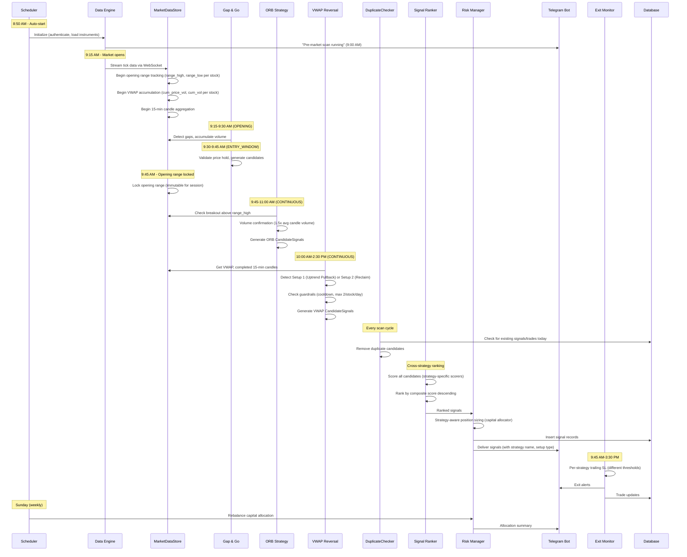
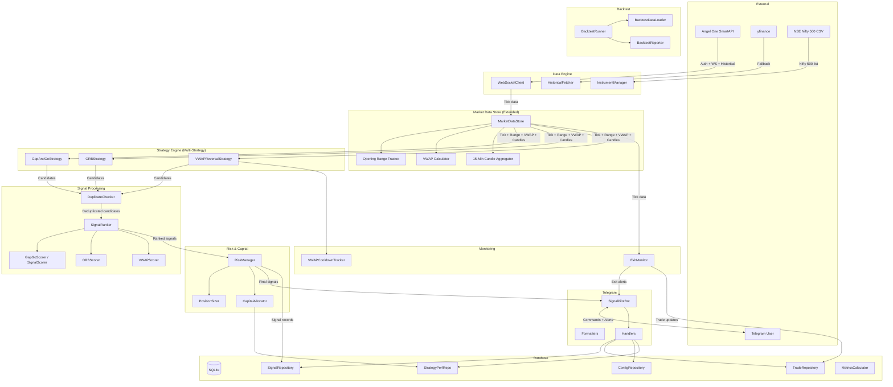

# SignalPilot Phase 2 -- Technical Design Document

## Table of Contents

1. [Overview](#1-overview)
2. [Architecture](#2-architecture)
3. [Project Structure](#3-project-structure)
4. [Components and Interfaces](#4-components-and-interfaces)
5. [Data Models](#5-data-models)
6. [Database Design](#6-database-design)
7. [Configuration Management](#7-configuration-management)
8. [Error Handling](#8-error-handling)
9. [Testing Strategy](#9-testing-strategy)
10. [Migration Plan](#10-migration-plan)

---

## 1. Overview

### 1.1 Purpose

Phase 2 extends SignalPilot from a morning-only Gap & Go tool into a full-day scanning engine by adding two new intraday strategies: Opening Range Breakout (ORB) and VWAP Reversal. Together with the existing Gap & Go strategy, these cover trading windows from 9:15 AM through 2:30 PM IST.

Phase 2 also introduces multi-strategy orchestration, performance-based capital allocation, new Telegram commands (ALLOCATE, STRATEGY, PAUSE, RESUME), database schema changes (new columns and tables), and mandatory backtesting plus paper trading validation before any new strategy goes live.

This design document specifies all technical changes required to implement Phase 2, building on the Phase 1 architecture documented in `.kiro/specs/signalpilot/phase1/design.md`.

### 1.2 Design Goals

- **Backward compatibility**: All Phase 1 data, signals, trades, and user configuration remain intact. Existing Gap & Go behavior is unchanged unless explicitly specified.
- **Extensibility**: The multi-strategy scanning loop and per-strategy scorer pattern make adding Phase 3 strategies (Momentum, Hybrid) a matter of adding new `BaseStrategy` subclasses.
- **Minimal disruption**: Phase 2 modifies existing components (lifecycle, exit monitor, risk manager, formatters) through additive changes -- new parameters, new methods, wider interfaces -- rather than rewrites.
- **Consistency**: All new code follows the same patterns established in Phase 1: `BaseStrategy` subclassing, repository pattern, dependency injection via keyword-only constructor parameters, async-first, IST timezone, structured logging with `contextvars`.

### 1.3 Key Architectural Decisions Summary

| Decision | Choice | Rationale | Requirements |
|----------|--------|-----------|-------------|
| Multi-strategy scan loop | Iterate over a list of `BaseStrategy` instances per cycle | Natural extension of the existing `_scan_loop()` pattern. Each strategy self-selects via `active_phases`. | REQ-P2-014 |
| Per-strategy scorers | Separate `ORBScorer` and `VWAPScorer` classes, composed into `SignalScorer` via strategy dispatch | Each strategy has fundamentally different scoring factors (gap% vs range tightness vs VWAP touch precision). A single scorer with strategy-specific branches would violate SRP. | REQ-P2-005, REQ-P2-011B |
| VWAP + candle state in `MarketDataStore` | Extend the existing store with `_vwap_state`, `_candles_15m`, and `_opening_range` dicts | Keeps all market state co-located and lock-protected. Avoids creating parallel state stores. | REQ-P2-001, REQ-P2-007, REQ-P2-008 |
| VWAP cooldown as in-memory tracker | `VWAPCooldownTracker` class with daily reset, no persistent DB table in hot path | Guardrail checks run on every scan cycle (every second) for 500 stocks. SQLite queries per check would add unacceptable latency. The `vwap_cooldown` table is used only for session recovery. | REQ-P2-011, REQ-P2-021 |
| Per-strategy trailing SL config | `ExitMonitor` accepts a `dict[str, TrailingStopConfig]` mapping strategy name to thresholds | Each strategy has different breakeven/trail triggers (Gap & Go: 2%/4%, ORB: 1.5%/2%, VWAP: 1%/1.5%). A config map is cleaner than subclassing the monitor. | REQ-P2-004, REQ-P2-011A |
| Capital allocator as separate component | New `CapitalAllocator` class injected into `RiskManager` | Capital allocation logic (weekly rebalancing, auto-pause, manual override) is complex enough to warrant its own class. `RiskManager` delegates to it for per-strategy position limits. | REQ-P2-016, REQ-P2-017, REQ-P2-018 |
| Backtest as separate module | `signalpilot/backtest/` with `BacktestRunner`, `BacktestDataLoader`, `BacktestReporter` | Backtesting reuses strategy classes but replaces the live data pipeline with historical replay. Isolation prevents backtest logic from leaking into production code. | REQ-P2-034 |
| Paper trading via status flag | Signals get `status="paper"`, exit monitor tracks them identically | Minimal code change. The existing pipeline handles paper signals end-to-end; only Telegram formatting differs. | REQ-P2-036 |
| Schema migration via `ALTER TABLE ADD COLUMN` | Idempotent migration function in `database.py` | SQLite does not support `ADD COLUMN IF NOT EXISTS`, so migration checks `PRAGMA table_info()` before altering. New tables use `CREATE TABLE IF NOT EXISTS`. | REQ-P2-019, REQ-P2-039 |

### 1.4 Time Coverage After Phase 2

| Time Window | Strategy | Phase |
|---|---|---|
| 9:15-9:30 AM | Gap & Go (OPENING phase -- gap detection, volume accumulation) | Phase 1 |
| 9:30-9:45 AM | Gap & Go (ENTRY_WINDOW phase -- entry validation, signal generation) | Phase 1 |
| 9:45-11:00 AM | Opening Range Breakout (CONTINUOUS phase -- breakout monitoring) | **Phase 2** |
| 10:00 AM-2:30 PM | VWAP Reversal (CONTINUOUS phase -- 15-min candle evaluation) | **Phase 2** |
| 2:30-3:30 PM | Exit monitoring only (WIND_DOWN phase) | Phase 1 |

---

## 2. Architecture

### 2.1 Updated High-Level Architecture

```
+----------------------------------------------------------------------+
|                          SignalPilot Phase 2                          |
|                     (Single Python Process)                          |
+----------------------------------------------------------------------+
|                                                                      |
|  +----------------+    +------------------+    +-----------------+   |
|  |  Data Engine   |--->| Strategy Engine  |--->| Signal Ranker   |   |
|  | (SmartAPI +    |    | (Gap&Go + ORB +  |    | (Cross-strategy |   |
|  |  WebSocket +   |    |  VWAP Reversal)  |    |  ranking)       |   |
|  |  yfinance)     |    +------------------+    +--------+--------+   |
|  +------+---------+                                     |            |
|         |                                               v            |
|         |    +------------------+    +--------------------------+    |
|         |    | Exit Monitor     |<---| Risk Manager             |    |
|         +--->| (Per-strategy    |    | (Capital allocator,      |    |
|              |  trailing SL)    |    |  strategy-aware sizing,  |    |
|              +--------+---------+    |  max 8 positions)        |    |
|                       |              +--------------------------+    |
|                       v                                              |
|              +--------+---------+    +------------------+           |
|              | Telegram Bot     |    | Duplicate Checker |           |
|              | (Phase 2 cmds:   |    | (Cross-strategy   |           |
|              |  PAUSE, RESUME,  |    |  deduplication)   |           |
|              |  ALLOCATE,       |    +------------------+           |
|              |  STRATEGY)       |                                    |
|              +--------+---------+    +------------------+           |
|                       |              | Capital Allocator |           |
|                       v              | (Performance-based|           |
|              +--------+---------+    |  allocation,      |           |
|              | Database Layer   |    |  weekly rebalance) |           |
|              | (SQLite + 2 new  |    +------------------+           |
|              |  tables)         |                                    |
|              +------------------+    +------------------+           |
|                                      | Backtest Module  |           |
|                                      | (Historical      |           |
|                                      |  replay engine)  |           |
|                                      +------------------+           |
+----------------------------------------------------------------------+
```

### 2.2 Updated Data Flow -- Full Trading Day



### 2.3 Updated Component Interaction Diagram



---

## 3. Project Structure

### 3.1 New Files

```
SignalPilot/
|-- signalpilot/
|   |-- strategy/
|   |   |-- orb.py                       # ORBStrategy(BaseStrategy)
|   |   |-- vwap_reversal.py             # VWAPReversalStrategy(BaseStrategy)
|   |
|   |-- ranking/
|   |   |-- orb_scorer.py                # ORB-specific signal scoring
|   |   |-- vwap_scorer.py               # VWAP-specific signal scoring
|   |
|   |-- risk/
|   |   |-- capital_allocator.py         # Performance-based capital allocation
|   |
|   |-- monitor/
|   |   |-- vwap_cooldown.py             # VWAP per-stock signal guardrails
|   |   |-- duplicate_checker.py         # Cross-strategy duplicate prevention
|   |
|   |-- db/
|   |   |-- strategy_performance_repo.py # CRUD for strategy_performance table
|   |
|   |-- backtest/
|   |   |-- __init__.py
|   |   |-- runner.py                    # BacktestRunner: replays historical data
|   |   |-- data_loader.py              # BacktestDataLoader: fetches/caches OHLCV
|   |   |-- reporter.py                 # BacktestReporter: generates validation reports
|
|-- tests/
|   |-- test_strategy/
|   |   |-- test_orb.py                  # Unit tests for ORB strategy
|   |   |-- test_vwap_reversal.py        # Unit tests for VWAP reversal strategy
|   |
|   |-- test_ranking/
|   |   |-- test_orb_scorer.py           # Unit tests for ORB scoring
|   |   |-- test_vwap_scorer.py          # Unit tests for VWAP scoring
|   |
|   |-- test_risk/
|   |   |-- test_capital_allocator.py    # Unit tests for capital allocation
|   |
|   |-- test_monitor/
|   |   |-- test_vwap_cooldown.py        # Unit tests for VWAP cooldown tracker
|   |   |-- test_duplicate_checker.py    # Unit tests for duplicate prevention
|   |
|   |-- test_telegram/
|   |   |-- test_phase2_handlers.py      # Tests for PAUSE, RESUME, ALLOCATE, STRATEGY
|   |
|   |-- test_db/
|   |   |-- test_strategy_performance_repo.py  # Tests for new repo
|   |   |-- test_migration.py            # Tests for schema migration
|   |
|   |-- test_backtest/
|   |   |-- test_runner.py
|   |   |-- test_reporter.py
|   |
|   |-- test_integration/
|   |   |-- test_multi_strategy_scan.py  # 3-strategy scan loop integration
|   |   |-- test_dedup_cross_strategy.py # Cross-strategy duplicate prevention
|   |   |-- test_position_limit_8.py     # Position limit at 8
|   |   |-- test_daily_summary_phase2.py # Per-strategy daily summary
|   |   |-- test_pause_resume_flow.py    # Strategy pause/resume flow
```

### 3.2 Modified Files

| File | Changes |
|------|---------|
| `signalpilot/config.py` | Add ORB, VWAP, allocation, paper mode config fields (REQ-P2-006, REQ-P2-011C, REQ-P2-041) |
| `signalpilot/db/models.py` | Extend `CandidateSignal`, `SignalRecord`, `TradeRecord`, `UserConfig`, `DailySummary` (REQ-P2-032, REQ-P2-033, REQ-P2-023, REQ-P2-029) |
| `signalpilot/db/database.py` | Add migration logic for new columns and tables (REQ-P2-019, REQ-P2-020, REQ-P2-021, REQ-P2-022, REQ-P2-039) |
| `signalpilot/db/signal_repo.py` | Add `has_signal_for_stock_today()`, support new columns in insert/query (REQ-P2-012, REQ-P2-019) |
| `signalpilot/db/trade_repo.py` | Add `strategy` column to insert/query, `get_trades_by_strategy()` (REQ-P2-022) |
| `signalpilot/db/config_repo.py` | Add strategy enabled flag getters/setters (REQ-P2-023) |
| `signalpilot/db/metrics.py` | Add per-strategy metric calculation (REQ-P2-029) |
| `signalpilot/data/market_data_store.py` | Add VWAP state, 15-min candle aggregation, opening range tracking (REQ-P2-001, REQ-P2-007, REQ-P2-008) |
| `signalpilot/ranking/scorer.py` | Add strategy dispatch to per-strategy scorers (REQ-P2-005, REQ-P2-011B, REQ-P2-013) |
| `signalpilot/ranking/ranker.py` | Update `max_signals` default to 8 (REQ-P2-015) |
| `signalpilot/risk/risk_manager.py` | Integrate `CapitalAllocator`, strategy-aware sizing (REQ-P2-015, REQ-P2-016) |
| `signalpilot/monitor/exit_monitor.py` | Per-strategy trailing SL config via `TrailingStopConfig` map (REQ-P2-004, REQ-P2-011A) |
| `signalpilot/scheduler/lifecycle.py` | Multi-strategy scan loop, CONTINUOUS phase support, dedup integration (REQ-P2-014, REQ-P2-031) |
| `signalpilot/scheduler/scheduler.py` | Add weekly rebalancing job (REQ-P2-017) |
| `signalpilot/telegram/handlers.py` | Add PAUSE, RESUME, ALLOCATE, STRATEGY handlers (REQ-P2-024 through REQ-P2-030) |
| `signalpilot/telegram/formatters.py` | Updated signal format, daily summary with strategy breakdown (REQ-P2-028, REQ-P2-029) |
| `signalpilot/telegram/bot.py` | Register new command handlers (REQ-P2-024 through REQ-P2-030) |
| `signalpilot/utils/constants.py` | Add ORB_WINDOW_END, VWAP_SCAN_START time constants (REQ-P2-006, REQ-P2-011C) |
| `tests/conftest.py` | Add Phase 2 sample fixtures (ORB candidates, VWAP candidates) |
| `tests/test_integration/conftest.py` | Update `make_app()` to accept strategy list, add Phase 2 helpers |

---

## 4. Components and Interfaces

### 4.1 MarketDataStore Extensions

The existing `MarketDataStore` gains three new subsystems: opening range tracking, VWAP calculation, and 15-minute candle aggregation. All three are protected by the existing `asyncio.Lock`.

**Requirement coverage:** REQ-P2-001, REQ-P2-007, REQ-P2-008

#### 4.1.1 New Internal Dataclasses

```python
# Added to signalpilot/data/market_data_store.py

@dataclass
class OpeningRange:
    """30-minute opening range for a single stock."""
    range_high: float
    range_low: float
    locked: bool = False  # True after 9:45 AM
    range_size_pct: float = 0.0  # ((high - low) / low) * 100

@dataclass
class VWAPState:
    """Running VWAP accumulator for a single stock."""
    cumulative_price_volume: float = 0.0  # sum(price * volume_delta)
    cumulative_volume: float = 0.0        # sum(volume_delta)
    current_vwap: float = 0.0
    last_cumulative_volume: int = 0       # For computing volume deltas from cumulative ticks

@dataclass
class Candle15Min:
    """A single 15-minute OHLCV candle."""
    symbol: str
    open: float
    high: float
    low: float
    close: float
    volume: int
    start_time: datetime
    end_time: datetime
    is_complete: bool = False
```

#### 4.1.2 Extended MarketDataStore

```python
class MarketDataStore:
    """Async-safe in-memory store for real-time and historical market data.

    Phase 2 additions:
    - Opening range tracking (9:15-9:45 AM high/low per stock)
    - Running VWAP from tick data
    - 15-minute candle aggregation
    """

    def __init__(self) -> None:
        self._ticks: dict[str, TickData] = {}
        self._historical: dict[str, HistoricalReference] = {}
        self._volume_accumulator: dict[str, int] = {}
        # Phase 2 state
        self._opening_ranges: dict[str, OpeningRange] = {}
        self._vwap_state: dict[str, VWAPState] = {}
        self._candles_15m: dict[str, list[Candle15Min]] = {}  # symbol -> list of candles
        self._current_candle: dict[str, Candle15Min] = {}     # symbol -> in-progress candle
        self._lock = asyncio.Lock()

    # --- Existing methods unchanged ---

    # --- Opening Range (REQ-P2-001) ---

    async def update_opening_range(self, symbol: str, price: float) -> None:
        """Update the opening range high/low for a stock during 9:15-9:45 AM.

        Called on each tick during the OPENING and ENTRY_WINDOW phases.
        No-op if the range is already locked.
        """
        async with self._lock:
            rng = self._opening_ranges.get(symbol)
            if rng is None:
                self._opening_ranges[symbol] = OpeningRange(
                    range_high=price, range_low=price,
                )
            elif not rng.locked:
                rng.range_high = max(rng.range_high, price)
                rng.range_low = min(rng.range_low, price)

    async def lock_opening_ranges(self) -> None:
        """Lock all opening ranges at 9:45 AM. Calculate range_size_pct.

        Once locked, ranges are immutable for the rest of the session.
        """
        async with self._lock:
            for rng in self._opening_ranges.values():
                if not rng.locked and rng.range_low > 0:
                    rng.range_size_pct = (
                        (rng.range_high - rng.range_low) / rng.range_low
                    ) * 100
                    rng.locked = True

    async def get_opening_range(self, symbol: str) -> OpeningRange | None:
        """Get the opening range for a symbol. Returns None if no data."""
        async with self._lock:
            return self._opening_ranges.get(symbol)

    # --- VWAP (REQ-P2-007) ---

    async def update_vwap(self, symbol: str, price: float, cumulative_volume: int) -> None:
        """Update running VWAP for a symbol from tick data.

        Uses the cumulative volume from tick data to compute volume deltas.
        VWAP = sum(price * volume_delta) / sum(volume_delta)
        """
        async with self._lock:
            state = self._vwap_state.get(symbol)
            if state is None:
                state = VWAPState(last_cumulative_volume=0)
                self._vwap_state[symbol] = state

            volume_delta = cumulative_volume - state.last_cumulative_volume
            if volume_delta > 0:
                state.cumulative_price_volume += price * volume_delta
                state.cumulative_volume += volume_delta
                state.current_vwap = (
                    state.cumulative_price_volume / state.cumulative_volume
                )
            state.last_cumulative_volume = cumulative_volume

    async def get_vwap(self, symbol: str) -> float | None:
        """Get the current VWAP for a symbol."""
        async with self._lock:
            state = self._vwap_state.get(symbol)
            return state.current_vwap if state and state.cumulative_volume > 0 else None

    async def reset_vwap(self) -> None:
        """Reset all VWAP accumulators. Called at start of each trading day."""
        async with self._lock:
            self._vwap_state.clear()

    # --- 15-Minute Candle Aggregation (REQ-P2-008) ---

    async def update_candle(
        self, symbol: str, price: float, volume: int, timestamp: datetime,
    ) -> Candle15Min | None:
        """Update the in-progress 15-min candle for a symbol.

        Returns the completed candle if a candle period just ended, else None.
        Candle boundaries: 9:15, 9:30, 9:45, 10:00, ..., 15:15.
        """
        async with self._lock:
            bucket_start = self._get_candle_bucket(timestamp)
            bucket_end = bucket_start + timedelta(minutes=15)

            current = self._current_candle.get(symbol)

            # New candle period -- finalize old, start new
            if current is None or current.start_time != bucket_start:
                completed = None
                if current is not None and not current.is_complete:
                    current.is_complete = True
                    current.close = price  # close at last known price
                    if symbol not in self._candles_15m:
                        self._candles_15m[symbol] = []
                    self._candles_15m[symbol].append(current)
                    completed = current

                self._current_candle[symbol] = Candle15Min(
                    symbol=symbol,
                    open=price,
                    high=price,
                    low=price,
                    close=price,
                    volume=volume,
                    start_time=bucket_start,
                    end_time=bucket_end,
                )
                return completed

            # Update existing candle
            current.high = max(current.high, price)
            current.low = min(current.low, price)
            current.close = price
            current.volume = volume
            return None

    async def get_completed_candles(self, symbol: str) -> list[Candle15Min]:
        """Get all completed 15-min candles for a symbol (current session)."""
        async with self._lock:
            return list(self._candles_15m.get(symbol, []))

    async def get_current_candle(self, symbol: str) -> Candle15Min | None:
        """Get the in-progress (partial) 15-min candle for a symbol."""
        async with self._lock:
            return self._current_candle.get(symbol)

    async def get_avg_candle_volume(self, symbol: str) -> float:
        """Get the average volume of completed 15-min candles for the session."""
        async with self._lock:
            candles = self._candles_15m.get(symbol, [])
            if not candles:
                return 0.0
            return sum(c.volume for c in candles) / len(candles)

    @staticmethod
    def _get_candle_bucket(dt: datetime) -> datetime:
        """Snap a datetime to its 15-minute candle bucket start."""
        minute = (dt.minute // 15) * 15
        return dt.replace(minute=minute, second=0, microsecond=0)

    async def clear(self) -> None:
        """Clear all stored data (used for daily reset)."""
        async with self._lock:
            self._ticks.clear()
            self._historical.clear()
            self._volume_accumulator.clear()
            self._opening_ranges.clear()
            self._vwap_state.clear()
            self._candles_15m.clear()
            self._current_candle.clear()
```

### 4.2 ORB Strategy

**File:** `signalpilot/strategy/orb.py`
**Requirement coverage:** REQ-P2-001, REQ-P2-002, REQ-P2-003, REQ-P2-006

```python
"""Opening Range Breakout (ORB) strategy implementation."""

import logging
from datetime import datetime, time

from signalpilot.config import AppConfig
from signalpilot.data.market_data_store import MarketDataStore
from signalpilot.db.models import CandidateSignal, SignalDirection
from signalpilot.strategy.base import BaseStrategy
from signalpilot.utils.constants import IST
from signalpilot.utils.market_calendar import StrategyPhase

logger = logging.getLogger("signalpilot.strategy.orb")


class ORBStrategy(BaseStrategy):
    """Opening Range Breakout strategy.

    Waits for the 30-minute opening range (9:15-9:45 AM) to be established,
    then detects breakouts above the range high with volume confirmation
    during the 9:45 AM - 11:00 AM window.

    Phase behaviour:
    - CONTINUOUS (9:45 AM-2:30 PM): detect breakouts (self-limits to 11:00 AM).
    """

    def __init__(self, config: AppConfig) -> None:
        self._range_min_pct = config.orb_range_min_pct          # 0.5
        self._range_max_pct = config.orb_range_max_pct          # 3.0
        self._volume_multiplier = config.orb_volume_multiplier  # 1.5
        self._gap_exclusion_pct = config.orb_gap_exclusion_pct  # 3.0
        self._target_1_pct = config.orb_target_1_pct            # 1.5
        self._target_2_pct = config.orb_target_2_pct            # 2.5
        self._max_risk_pct = 3.0  # Skip if risk > 3% from entry
        self._signal_window_end = time(
            *map(int, config.orb_signal_window_end.split(":"))
        )  # 11:00

        # Per-session state
        self._signals_generated: set[str] = set()
        self._excluded_stocks: set[str] = set()  # Stocks that gapped 3%+

    @property
    def name(self) -> str:
        return "ORB"

    @property
    def active_phases(self) -> list[StrategyPhase]:
        return [StrategyPhase.CONTINUOUS]

    async def evaluate(
        self,
        market_data: MarketDataStore,
        current_phase: StrategyPhase,
    ) -> list[CandidateSignal]:
        """Evaluate ORB breakout conditions.

        Only generates signals during the 9:45 AM - 11:00 AM window.
        Returns empty list outside this window or when no breakouts detected.
        """
        now = datetime.now(IST)
        if now.time() >= self._signal_window_end:
            return []

        return await self._scan_for_breakouts(market_data, now)

    async def _scan_for_breakouts(
        self, market_data: MarketDataStore, now: datetime,
    ) -> list[CandidateSignal]:
        """Scan all stocks for ORB breakout conditions."""
        signals: list[CandidateSignal] = []
        all_ticks = await market_data.get_all_ticks()

        for symbol, tick in all_ticks.items():
            if symbol in self._signals_generated:
                continue
            if symbol in self._excluded_stocks:
                continue

            opening_range = await market_data.get_opening_range(symbol)
            if opening_range is None or not opening_range.locked:
                continue

            # Filter: range size must be between min and max pct
            if (opening_range.range_size_pct < self._range_min_pct or
                    opening_range.range_size_pct > self._range_max_pct):
                continue

            # Filter: exclude stocks that gapped 3%+ (Gap & Go territory)
            hist = await market_data.get_historical(symbol)
            if hist is not None and hist.previous_close > 0:
                gap_pct = (
                    (tick.open_price - hist.previous_close) / hist.previous_close
                ) * 100
                if gap_pct >= self._gap_exclusion_pct:
                    self._excluded_stocks.add(symbol)
                    continue

            # Check: price breaks above opening range high
            if tick.ltp <= opening_range.range_high:
                continue

            # Volume confirmation: breakout candle volume > 1.5x avg candle volume
            avg_candle_vol = await market_data.get_avg_candle_volume(symbol)
            current_candle = await market_data.get_current_candle(symbol)
            if avg_candle_vol <= 0 or current_candle is None:
                continue
            if current_candle.volume < avg_candle_vol * self._volume_multiplier:
                continue

            # Risk check: SL at range low, risk must be <= 3%
            entry_price = tick.ltp
            stop_loss = opening_range.range_low
            risk_pct = ((entry_price - stop_loss) / entry_price) * 100
            if risk_pct > self._max_risk_pct:
                continue

            target_1 = entry_price * (1 + self._target_1_pct / 100)
            target_2 = entry_price * (1 + self._target_2_pct / 100)

            volume_ratio = (
                current_candle.volume / avg_candle_vol if avg_candle_vol > 0 else 0.0
            )

            signal = CandidateSignal(
                symbol=symbol,
                direction=SignalDirection.BUY,
                strategy_name=self.name,
                entry_price=entry_price,
                stop_loss=stop_loss,
                target_1=target_1,
                target_2=target_2,
                gap_pct=0.0,  # Not applicable for ORB
                volume_ratio=volume_ratio,
                price_distance_from_open_pct=opening_range.range_size_pct,
                reason=(
                    f"ORB breakout above range high {opening_range.range_high:.2f} "
                    f"(range {opening_range.range_size_pct:.1f}%), "
                    f"volume {volume_ratio:.1f}x avg candle volume"
                ),
                generated_at=now,
                setup_type=None,
                strategy_specific_score=None,
            )
            signals.append(signal)
            self._signals_generated.add(symbol)
            logger.info(
                "ORB breakout: %s entry=%.2f range_high=%.2f range_low=%.2f vol_ratio=%.1f",
                symbol, entry_price, opening_range.range_high,
                opening_range.range_low, volume_ratio,
            )

        return signals

    def mark_gap_stock(self, symbol: str) -> None:
        """Mark a stock as having gapped 3%+ (called by Gap & Go strategy).

        ORB will exclude this stock for the session (REQ-P2-002 AC3).
        """
        self._excluded_stocks.add(symbol)

    def reset(self) -> None:
        """Reset all per-session state. Called at start of each trading day."""
        self._signals_generated.clear()
        self._excluded_stocks.clear()
```

### 4.3 VWAP Reversal Strategy

**File:** `signalpilot/strategy/vwap_reversal.py`
**Requirement coverage:** REQ-P2-009, REQ-P2-010, REQ-P2-011, REQ-P2-011C

```python
"""VWAP Reversal strategy implementation."""

import logging
from datetime import datetime, time

from signalpilot.config import AppConfig
from signalpilot.data.market_data_store import Candle15Min, MarketDataStore
from signalpilot.db.models import CandidateSignal, SignalDirection
from signalpilot.monitor.vwap_cooldown import VWAPCooldownTracker
from signalpilot.strategy.base import BaseStrategy
from signalpilot.utils.constants import IST
from signalpilot.utils.market_calendar import StrategyPhase

logger = logging.getLogger("signalpilot.strategy.vwap_reversal")


class VWAPReversalStrategy(BaseStrategy):
    """VWAP Reversal strategy: detects pullback-to-VWAP bounces and
    VWAP reclaim setups on 15-minute candles.

    Phase behaviour:
    - CONTINUOUS (9:45 AM-2:30 PM): evaluate on each completed 15-min candle
      (self-limits to 10:00 AM - 2:30 PM window).
    """

    def __init__(
        self,
        config: AppConfig,
        cooldown_tracker: VWAPCooldownTracker,
    ) -> None:
        self._scan_start = time(
            *map(int, config.vwap_scan_start.split(":"))
        )  # 10:00
        self._scan_end = time(
            *map(int, config.vwap_scan_end.split(":"))
        )  # 14:30
        self._touch_threshold_pct = config.vwap_touch_threshold_pct      # 0.3
        self._reclaim_vol_multiplier = config.vwap_reclaim_volume_multiplier  # 1.5
        self._pullback_vol_multiplier = config.vwap_pullback_volume_multiplier  # 1.0
        self._setup1_sl_below_vwap_pct = config.vwap_setup1_sl_below_vwap_pct  # 0.5
        self._setup1_target1_pct = config.vwap_setup1_target1_pct        # 1.0
        self._setup1_target2_pct = config.vwap_setup1_target2_pct        # 1.5
        self._setup2_target1_pct = config.vwap_setup2_target1_pct        # 1.5
        self._setup2_target2_pct = config.vwap_setup2_target2_pct        # 2.0
        self._cooldown = cooldown_tracker

        # Per-session state
        self._signals_generated: set[str] = set()
        self._last_evaluated_candle: dict[str, datetime] = {}  # symbol -> candle start_time

    @property
    def name(self) -> str:
        return "VWAP Reversal"

    @property
    def active_phases(self) -> list[StrategyPhase]:
        return [StrategyPhase.CONTINUOUS]

    async def evaluate(
        self,
        market_data: MarketDataStore,
        current_phase: StrategyPhase,
    ) -> list[CandidateSignal]:
        """Evaluate VWAP reversal setups on completed 15-min candles.

        Only scans during the 10:00 AM - 2:30 PM window.
        """
        now = datetime.now(IST)
        if now.time() < self._scan_start or now.time() >= self._scan_end:
            return []

        return await self._scan_for_setups(market_data, now)

    async def _scan_for_setups(
        self, market_data: MarketDataStore, now: datetime,
    ) -> list[CandidateSignal]:
        """Scan all stocks for VWAP reversal setups."""
        signals: list[CandidateSignal] = []
        all_ticks = await market_data.get_all_ticks()

        for symbol in all_ticks:
            candles = await market_data.get_completed_candles(symbol)
            if len(candles) < 2:
                continue  # Need at least 2 completed candles for trend context

            latest = candles[-1]

            # Skip if we already evaluated this candle
            last_eval = self._last_evaluated_candle.get(symbol)
            if last_eval == latest.start_time:
                continue
            self._last_evaluated_candle[symbol] = latest.start_time

            vwap = await market_data.get_vwap(symbol)
            if vwap is None or vwap <= 0:
                continue

            # Check guardrails (REQ-P2-011)
            if not self._cooldown.can_signal(symbol, now):
                continue

            avg_vol = await market_data.get_avg_candle_volume(symbol)

            # Check Setup 1: Uptrend Pullback (REQ-P2-009)
            setup1_signal = self._check_uptrend_pullback(
                symbol, candles, latest, vwap, avg_vol, now,
            )
            if setup1_signal is not None:
                signals.append(setup1_signal)
                self._cooldown.record_signal(symbol, now)
                continue  # Only one signal per stock per candle

            # Check Setup 2: VWAP Reclaim (REQ-P2-010)
            setup2_signal = self._check_vwap_reclaim(
                symbol, candles, latest, vwap, avg_vol, now,
            )
            if setup2_signal is not None:
                signals.append(setup2_signal)
                self._cooldown.record_signal(symbol, now)

        return signals

    def _check_uptrend_pullback(
        self,
        symbol: str,
        candles: list[Candle15Min],
        latest: Candle15Min,
        vwap: float,
        avg_vol: float,
        now: datetime,
    ) -> CandidateSignal | None:
        """Check Setup 1: stock was above VWAP, pulled back, bounced above."""
        # Was previously trading above VWAP (at least one earlier candle closed above)
        prior_above = any(c.close > vwap for c in candles[:-1])
        if not prior_above:
            return None

        # Price touched or dipped below VWAP (within touch_threshold_pct)
        touch_proximity = abs(latest.low - vwap) / vwap * 100
        if latest.low > vwap * (1 + self._touch_threshold_pct / 100):
            return None  # Did not touch VWAP

        # Current candle closed back above VWAP
        if latest.close <= vwap:
            return None

        # Volume confirmation: bounce candle volume > avg candle volume
        if avg_vol <= 0 or latest.volume < avg_vol * self._pullback_vol_multiplier:
            return None

        entry_price = latest.close
        stop_loss = vwap * (1 - self._setup1_sl_below_vwap_pct / 100)
        target_1 = entry_price * (1 + self._setup1_target1_pct / 100)
        target_2 = entry_price * (1 + self._setup1_target2_pct / 100)
        volume_ratio = latest.volume / avg_vol if avg_vol > 0 else 0.0

        logger.info(
            "VWAP Setup 1 (Uptrend Pullback): %s entry=%.2f vwap=%.2f touch=%.2f%%",
            symbol, entry_price, vwap, touch_proximity,
        )

        return CandidateSignal(
            symbol=symbol,
            direction=SignalDirection.BUY,
            strategy_name=self.name,
            entry_price=entry_price,
            stop_loss=stop_loss,
            target_1=target_1,
            target_2=target_2,
            gap_pct=0.0,
            volume_ratio=volume_ratio,
            price_distance_from_open_pct=touch_proximity,
            reason=(
                f"VWAP Uptrend Pullback: stock pulled back to VWAP at "
                f"{vwap:.2f}, bounce candle closed at {entry_price:.2f} "
                f"with {volume_ratio:.1f}x avg volume"
            ),
            generated_at=now,
            setup_type="uptrend_pullback",
            strategy_specific_score=None,
        )

    def _check_vwap_reclaim(
        self,
        symbol: str,
        candles: list[Candle15Min],
        latest: Candle15Min,
        vwap: float,
        avg_vol: float,
        now: datetime,
    ) -> CandidateSignal | None:
        """Check Setup 2: stock was below VWAP, reclaimed above with strong volume."""
        # Was previously trading below VWAP
        prior_below = any(c.close < vwap for c in candles[:-1])
        if not prior_below:
            return None

        # Latest candle closed above VWAP
        if latest.close <= vwap:
            return None

        # Strong volume: reclaim candle volume > 1.5x avg
        if avg_vol <= 0 or latest.volume < avg_vol * self._reclaim_vol_multiplier:
            return None

        entry_price = latest.close

        # SL below recent swing low (lowest low of last 3 candles)
        recent_candles = candles[-3:] if len(candles) >= 3 else candles
        swing_low = min(c.low for c in recent_candles)
        stop_loss = swing_low

        target_1 = entry_price * (1 + self._setup2_target1_pct / 100)
        target_2 = entry_price * (1 + self._setup2_target2_pct / 100)
        volume_ratio = latest.volume / avg_vol if avg_vol > 0 else 0.0

        logger.info(
            "VWAP Setup 2 (Reclaim): %s entry=%.2f vwap=%.2f vol_ratio=%.1f -- Higher Risk",
            symbol, entry_price, vwap, volume_ratio,
        )

        return CandidateSignal(
            symbol=symbol,
            direction=SignalDirection.BUY,
            strategy_name=self.name,
            entry_price=entry_price,
            stop_loss=stop_loss,
            target_1=target_1,
            target_2=target_2,
            gap_pct=0.0,
            volume_ratio=volume_ratio,
            price_distance_from_open_pct=0.0,
            reason=(
                f"VWAP Reclaim (Higher Risk): stock crossed above VWAP at "
                f"{vwap:.2f}, reclaim candle at {entry_price:.2f} "
                f"with {volume_ratio:.1f}x avg volume. Swing low SL at {swing_low:.2f}"
            ),
            generated_at=now,
            setup_type="vwap_reclaim",
            strategy_specific_score=None,
        )

    def reset(self) -> None:
        """Reset all per-session state. Called at start of each trading day."""
        self._signals_generated.clear()
        self._last_evaluated_candle.clear()
        self._cooldown.reset()
```

### 4.4 VWAP Cooldown Tracker

**File:** `signalpilot/monitor/vwap_cooldown.py`
**Requirement coverage:** REQ-P2-011, REQ-P2-021

```python
"""VWAP per-stock signal guardrails: max signals per day and cooldown period."""

import logging
from dataclasses import dataclass, field
from datetime import datetime, timedelta

logger = logging.getLogger("signalpilot.monitor.vwap_cooldown")


@dataclass
class _CooldownEntry:
    """Cooldown state for a single stock."""
    signal_count: int = 0
    last_signal_at: datetime | None = None


class VWAPCooldownTracker:
    """Enforces VWAP signal guardrails: max 2 per stock/day, 60-min cooldown.

    State is held in memory and reset daily. For crash recovery, the state
    can be reconstructed from the vwap_cooldown table.
    """

    def __init__(
        self,
        max_signals_per_stock: int = 2,
        cooldown_minutes: int = 60,
    ) -> None:
        self._max_signals = max_signals_per_stock
        self._cooldown = timedelta(minutes=cooldown_minutes)
        self._entries: dict[str, _CooldownEntry] = {}

    def can_signal(self, symbol: str, now: datetime) -> bool:
        """Check if a VWAP signal is allowed for this stock at this time."""
        entry = self._entries.get(symbol)
        if entry is None:
            return True
        if entry.signal_count >= self._max_signals:
            logger.debug("%s: VWAP signal suppressed (count=%d)", symbol, entry.signal_count)
            return False
        if entry.last_signal_at and (now - entry.last_signal_at) < self._cooldown:
            logger.debug(
                "%s: VWAP signal suppressed (cooldown, last=%s)",
                symbol, entry.last_signal_at,
            )
            return False
        return True

    def record_signal(self, symbol: str, now: datetime) -> None:
        """Record that a VWAP signal was generated for this stock."""
        entry = self._entries.get(symbol)
        if entry is None:
            entry = _CooldownEntry()
            self._entries[symbol] = entry
        entry.signal_count += 1
        entry.last_signal_at = now

    def reset(self) -> None:
        """Reset all cooldown state. Called at start of each trading day."""
        self._entries.clear()

    def get_state(self) -> dict[str, tuple[int, datetime | None]]:
        """Export state for persistence to vwap_cooldown table."""
        return {
            sym: (e.signal_count, e.last_signal_at)
            for sym, e in self._entries.items()
        }

    def restore_state(self, state: dict[str, tuple[int, datetime | None]]) -> None:
        """Restore state from vwap_cooldown table (crash recovery)."""
        for sym, (count, last_at) in state.items():
            self._entries[sym] = _CooldownEntry(
                signal_count=count, last_signal_at=last_at,
            )
```

### 4.5 Duplicate Checker

**File:** `signalpilot/monitor/duplicate_checker.py`
**Requirement coverage:** REQ-P2-012

```python
"""Cross-strategy duplicate prevention."""

import logging
from datetime import date

from signalpilot.db.models import CandidateSignal
from signalpilot.db.signal_repo import SignalRepository
from signalpilot.db.trade_repo import TradeRepository

logger = logging.getLogger("signalpilot.monitor.duplicate_checker")


class DuplicateChecker:
    """Prevents duplicate signals for the same stock across all strategies.

    Checks:
    1. Signal already exists for this stock today (any strategy, any status).
    2. Active (un-exited) trade exists for this stock.
    """

    def __init__(
        self,
        signal_repo: SignalRepository,
        trade_repo: TradeRepository,
    ) -> None:
        self._signal_repo = signal_repo
        self._trade_repo = trade_repo

    async def filter_duplicates(
        self,
        candidates: list[CandidateSignal],
        today: date,
    ) -> list[CandidateSignal]:
        """Remove candidates that duplicate existing signals or active trades.

        Executes before scoring/ranking so duplicates never enter the pool.
        """
        if not candidates:
            return []

        # Get all symbols with signals today
        today_signals = await self._signal_repo.get_signals_by_date(today)
        signaled_symbols = {s.symbol for s in today_signals}

        # Get all symbols with active trades
        active_trades = await self._trade_repo.get_active_trades()
        active_symbols = {t.symbol for t in active_trades}

        blocked = signaled_symbols | active_symbols

        filtered = []
        for candidate in candidates:
            if candidate.symbol in blocked:
                logger.info(
                    "Duplicate suppressed: %s (%s) -- existing signal or active trade",
                    candidate.symbol, candidate.strategy_name,
                )
                continue
            filtered.append(candidate)

        return filtered
```

### 4.6 ORB Scorer

**File:** `signalpilot/ranking/orb_scorer.py`
**Requirement coverage:** REQ-P2-005

```python
"""ORB-specific signal strength scoring."""

from signalpilot.db.models import CandidateSignal


class ORBScorer:
    """Calculates composite scores for ORB signals.

    Factors:
    - Breakout candle volume vs average (weight: 40%)
    - Opening range size -- tighter range = higher score (weight: 30%)
    - Distance from breakout level -- closer = higher score (weight: 30%)
    """

    def __init__(
        self,
        volume_weight: float = 0.40,
        range_weight: float = 0.30,
        distance_weight: float = 0.30,
    ) -> None:
        self._volume_weight = volume_weight
        self._range_weight = range_weight
        self._distance_weight = distance_weight

    def score(self, signal: CandidateSignal) -> float:
        """Compute composite score in [0.0, 1.0] for an ORB signal."""
        norm_vol = self._normalize_volume(signal.volume_ratio)
        norm_range = self._normalize_range(signal.price_distance_from_open_pct)
        norm_dist = self._normalize_distance(signal.volume_ratio)  # reuse as proximity

        return (
            norm_vol * self._volume_weight
            + norm_range * self._range_weight
            + norm_dist * self._distance_weight
        )

    @staticmethod
    def _normalize_volume(volume_ratio: float) -> float:
        """Normalize breakout volume ratio. 1.5x -> 0.0, 4.0x+ -> 1.0."""
        return min(max((volume_ratio - 1.5) / 2.5, 0.0), 1.0)

    @staticmethod
    def _normalize_range(range_size_pct: float) -> float:
        """Normalize range tightness. 3% -> 0.0, 0.5% -> 1.0 (tighter = better)."""
        return min(max((3.0 - range_size_pct) / 2.5, 0.0), 1.0)

    @staticmethod
    def _normalize_distance(volume_ratio: float) -> float:
        """Placeholder for distance from breakout level normalization."""
        return min(max((volume_ratio - 1.0) / 3.0, 0.0), 1.0)
```

### 4.7 VWAP Scorer

**File:** `signalpilot/ranking/vwap_scorer.py`
**Requirement coverage:** REQ-P2-011B

```python
"""VWAP Reversal signal strength scoring."""

from signalpilot.db.models import CandidateSignal


class VWAPScorer:
    """Calculates composite scores for VWAP Reversal signals.

    Factors:
    - Bounce/reclaim candle volume vs average (weight: 35%)
    - Precision of VWAP touch -- closer to VWAP = higher score (weight: 35%)
    - Overall day trend alignment (weight: 30%)
    """

    def __init__(
        self,
        volume_weight: float = 0.35,
        touch_weight: float = 0.35,
        trend_weight: float = 0.30,
    ) -> None:
        self._volume_weight = volume_weight
        self._touch_weight = touch_weight
        self._trend_weight = trend_weight

    def score(
        self,
        signal: CandidateSignal,
        candles_above_vwap_ratio: float = 0.5,
    ) -> float:
        """Compute composite score in [0.0, 1.0] for a VWAP signal.

        candles_above_vwap_ratio: fraction of completed candles that closed
        above VWAP (0.0 to 1.0). Higher = stronger uptrend alignment.
        """
        norm_vol = self._normalize_volume(signal.volume_ratio)
        norm_touch = self._normalize_touch(signal.price_distance_from_open_pct)
        norm_trend = min(max(candles_above_vwap_ratio, 0.0), 1.0)

        return (
            norm_vol * self._volume_weight
            + norm_touch * self._touch_weight
            + norm_trend * self._trend_weight
        )

    @staticmethod
    def _normalize_volume(volume_ratio: float) -> float:
        """Normalize bounce volume ratio. 1.0x -> 0.0, 3.0x+ -> 1.0."""
        return min(max((volume_ratio - 1.0) / 2.0, 0.0), 1.0)

    @staticmethod
    def _normalize_touch(touch_proximity_pct: float) -> float:
        """Normalize VWAP touch precision. 0.3% away -> 0.0, 0% (exact) -> 1.0."""
        return min(max((0.3 - touch_proximity_pct) / 0.3, 0.0), 1.0)
```

### 4.8 Updated SignalScorer (Strategy Dispatch)

**File:** `signalpilot/ranking/scorer.py` (modified)
**Requirement coverage:** REQ-P2-005, REQ-P2-011B, REQ-P2-013

```python
"""Multi-factor composite scoring for candidate signals -- Phase 2 update."""

from signalpilot.db.models import CandidateSignal, ScoringWeights
from signalpilot.ranking.orb_scorer import ORBScorer
from signalpilot.ranking.vwap_scorer import VWAPScorer


class SignalScorer:
    """Calculates composite scores for candidate signals.

    Phase 2: dispatches to per-strategy scorers based on strategy_name.
    Gap & Go signals use the original scoring logic.
    ORB signals use ORBScorer.
    VWAP Reversal signals use VWAPScorer.
    """

    def __init__(
        self,
        weights: ScoringWeights,
        orb_scorer: ORBScorer | None = None,
        vwap_scorer: VWAPScorer | None = None,
    ) -> None:
        self._weights = weights
        self._orb_scorer = orb_scorer or ORBScorer()
        self._vwap_scorer = vwap_scorer or VWAPScorer()

    def score(self, signal: CandidateSignal) -> float:
        """Compute a composite score in [0.0, 1.0] for a candidate signal.

        Dispatches to the appropriate per-strategy scorer.
        """
        if signal.strategy_name == "ORB":
            return self._orb_scorer.score(signal)
        if signal.strategy_name == "VWAP Reversal":
            return self._vwap_scorer.score(signal)
        # Default: Gap & Go scoring (Phase 1 behavior preserved)
        return self._score_gap_and_go(signal)

    def _score_gap_and_go(self, signal: CandidateSignal) -> float:
        """Original Phase 1 scoring for Gap & Go signals."""
        norm_gap = self._normalize_gap(signal.gap_pct)
        norm_vol = self._normalize_volume_ratio(signal.volume_ratio)
        norm_dist = self._normalize_price_distance(signal.price_distance_from_open_pct)
        return (
            norm_gap * self._weights.gap_pct_weight
            + norm_vol * self._weights.volume_ratio_weight
            + norm_dist * self._weights.price_distance_weight
        )

    @staticmethod
    def _normalize_gap(gap_pct: float) -> float:
        return min(max((gap_pct - 3.0) / 2.0, 0.0), 1.0)

    @staticmethod
    def _normalize_volume_ratio(volume_ratio: float) -> float:
        return min(max((volume_ratio - 0.5) / 2.5, 0.0), 1.0)

    @staticmethod
    def _normalize_price_distance(distance_pct: float) -> float:
        return min(max(distance_pct / 3.0, 0.0), 1.0)
```

### 4.9 Capital Allocator

**File:** `signalpilot/risk/capital_allocator.py`
**Requirement coverage:** REQ-P2-016, REQ-P2-017, REQ-P2-018

```python
"""Performance-based capital allocation across strategies."""

import logging
from dataclasses import dataclass
from datetime import date, timedelta

logger = logging.getLogger("signalpilot.risk.capital_allocator")

STRATEGY_NAMES = ("Gap & Go", "ORB", "VWAP Reversal")
RESERVE_PCT = 0.20  # 20% reserve for exceptional signals


@dataclass
class StrategyAllocation:
    """Capital allocation for a single strategy."""
    strategy: str
    weight_pct: float       # e.g. 0.38 (38%)
    max_positions: int      # e.g. 3
    capital_amount: float   # e.g. 19000.0
    is_paused: bool = False


class CapitalAllocator:
    """Manages performance-based capital allocation across strategies.

    Allocation formula (REQ-P2-016):
        Strategy weight = (WinRate * AvgWin) - ((1 - WinRate) * AvgLoss)
        Normalized across all strategies.
        20% of capital is reserved as buffer for 5-star signals.

    Weekly rebalancing (REQ-P2-017):
        Every Sunday, recalculate from trailing 30-day performance.

    Auto-pause (REQ-P2-018):
        If a strategy's 30-day win rate < 40% with >= 10 trades, auto-pause.
    """

    def __init__(
        self,
        strategy_performance_repo,
        auto_pause_threshold: float = 40.0,
        auto_pause_min_trades: int = 10,
        lookback_days: int = 30,
    ) -> None:
        self._perf_repo = strategy_performance_repo
        self._auto_pause_threshold = auto_pause_threshold
        self._auto_pause_min_trades = auto_pause_min_trades
        self._lookback_days = lookback_days
        self._allocations: dict[str, StrategyAllocation] = {}
        self._manual_override: bool = False

    async def calculate_allocations(
        self,
        total_capital: float,
        max_positions: int,
        today: date,
    ) -> dict[str, StrategyAllocation]:
        """Calculate capital allocation for all strategies.

        If no historical data exists, uses equal allocation.
        """
        if self._manual_override:
            return self._allocations

        start_date = today - timedelta(days=self._lookback_days)
        weights: dict[str, float] = {}

        for strategy in STRATEGY_NAMES:
            perf = await self._perf_repo.get_performance_summary(
                strategy, start_date, today,
            )
            if perf is None or perf["total_trades"] == 0:
                weights[strategy] = 1.0  # Equal weight if no data
            else:
                win_rate = perf["win_rate"] / 100.0
                avg_win = perf["avg_win"]
                avg_loss = abs(perf["avg_loss"])
                expectancy = (win_rate * avg_win) - ((1 - win_rate) * avg_loss)
                weights[strategy] = max(expectancy, 0.01)  # Floor at 0.01

        total_weight = sum(weights.values())
        available_pct = 1.0 - RESERVE_PCT
        available_positions = max_positions - 1  # 1 position reserved

        self._allocations = {}
        for strategy in STRATEGY_NAMES:
            normalized = (weights[strategy] / total_weight) * available_pct
            positions = max(1, round(available_positions * (weights[strategy] / total_weight)))
            self._allocations[strategy] = StrategyAllocation(
                strategy=strategy,
                weight_pct=normalized,
                max_positions=positions,
                capital_amount=total_capital * normalized,
            )

        return self._allocations

    async def check_auto_pause(self, today: date) -> list[str]:
        """Check if any strategy should be auto-paused. Returns list of paused names."""
        paused: list[str] = []
        start_date = today - timedelta(days=self._lookback_days)

        for strategy in STRATEGY_NAMES:
            perf = await self._perf_repo.get_performance_summary(
                strategy, start_date, today,
            )
            if perf is None:
                continue
            if (perf["total_trades"] >= self._auto_pause_min_trades and
                    perf["win_rate"] < self._auto_pause_threshold):
                alloc = self._allocations.get(strategy)
                if alloc and not alloc.is_paused:
                    alloc.is_paused = True
                    paused.append(strategy)
                    logger.warning(
                        "Auto-pausing %s: win_rate=%.1f%% < %.1f%% (trades=%d)",
                        strategy, perf["win_rate"],
                        self._auto_pause_threshold, perf["total_trades"],
                    )

        return paused

    def set_manual_allocation(
        self,
        allocations: dict[str, float],
        total_capital: float,
        max_positions: int,
    ) -> None:
        """Set manual allocation overrides. Percentages should sum to <= 80%."""
        self._manual_override = True
        total_pct = sum(allocations.values())
        available_positions = max_positions - 1

        for strategy, pct in allocations.items():
            positions = max(1, round(available_positions * (pct / 100.0 / (1 - RESERVE_PCT))))
            self._allocations[strategy] = StrategyAllocation(
                strategy=strategy,
                weight_pct=pct / 100.0,
                max_positions=positions,
                capital_amount=total_capital * pct / 100.0,
            )

    def enable_auto_allocation(self) -> None:
        """Re-enable automatic allocation (after manual override)."""
        self._manual_override = False

    def get_allocation(self, strategy: str) -> StrategyAllocation | None:
        """Get current allocation for a strategy."""
        return self._allocations.get(strategy)

    def get_all_allocations(self) -> dict[str, StrategyAllocation]:
        """Get all current allocations."""
        return dict(self._allocations)
```

### 4.10 Updated ExitMonitor (Per-Strategy Trailing SL)

**File:** `signalpilot/monitor/exit_monitor.py` (modified)
**Requirement coverage:** REQ-P2-004, REQ-P2-011A

The existing `ExitMonitor.__init__` accepts scalar `breakeven_trigger_pct`, `trail_trigger_pct`, and `trail_distance_pct`. For Phase 2, these become per-strategy via a config map.

```python
@dataclass
class TrailingStopConfig:
    """Per-strategy trailing stop loss configuration."""
    breakeven_trigger_pct: float
    trail_trigger_pct: float | None  # None = no trailing, only breakeven
    trail_distance_pct: float | None

# Default configs per strategy
DEFAULT_TRAILING_CONFIGS: dict[str, TrailingStopConfig] = {
    "Gap & Go": TrailingStopConfig(
        breakeven_trigger_pct=2.0,
        trail_trigger_pct=4.0,
        trail_distance_pct=2.0,
    ),
    "ORB": TrailingStopConfig(
        breakeven_trigger_pct=1.5,
        trail_trigger_pct=2.0,
        trail_distance_pct=1.0,
    ),
    "VWAP Reversal": TrailingStopConfig(
        breakeven_trigger_pct=1.0,  # Setup 1 default
        trail_trigger_pct=None,     # VWAP uses breakeven only
        trail_distance_pct=None,
    ),
}


class ExitMonitor:
    """Monitors active trades for exit conditions on every tick cycle.

    Phase 2: per-strategy trailing SL configuration.
    """

    def __init__(
        self,
        get_tick: MarketDataGetter,
        alert_callback: Callable[[ExitAlert], Awaitable[None]],
        trailing_configs: dict[str, TrailingStopConfig] | None = None,
        # Phase 1 backward compat defaults
        breakeven_trigger_pct: float = 2.0,
        trail_trigger_pct: float = 4.0,
        trail_distance_pct: float = 2.0,
    ) -> None:
        self._get_tick = get_tick
        self._alert_callback = alert_callback
        self._trailing_configs = trailing_configs or DEFAULT_TRAILING_CONFIGS
        # Phase 1 fallback
        self._default_config = TrailingStopConfig(
            breakeven_trigger_pct=breakeven_trigger_pct,
            trail_trigger_pct=trail_trigger_pct,
            trail_distance_pct=trail_distance_pct,
        )
        self._active_states: dict[int, TrailingStopState] = {}

    def _get_config_for_trade(self, trade: TradeRecord) -> TrailingStopConfig:
        """Get the trailing SL config for a trade based on its strategy."""
        strategy = getattr(trade, "strategy", None) or "Gap & Go"
        return self._trailing_configs.get(strategy, self._default_config)

    # _update_trailing_stop is updated to use per-trade config:
    def _update_trailing_stop(
        self,
        trade: TradeRecord,
        state: TrailingStopState,
        current_price: float,
    ) -> ExitAlert | None:
        config = self._get_config_for_trade(trade)
        move_pct = self._calc_pnl_pct(trade.entry_price, current_price)

        # Trailing logic
        if config.trail_trigger_pct and move_pct >= config.trail_trigger_pct:
            state.breakeven_triggered = True
            trail_factor = 1.0 - (config.trail_distance_pct or 2.0) / 100.0
            new_sl = current_price * trail_factor
            if new_sl > state.current_sl:
                state.current_sl = new_sl
                state.trailing_active = True
                return ExitAlert(
                    trade=trade, exit_type=None, current_price=current_price,
                    pnl_pct=move_pct, is_alert_only=True, trailing_sl_update=new_sl,
                )

        # Breakeven logic
        elif move_pct >= config.breakeven_trigger_pct and not state.breakeven_triggered:
            state.current_sl = trade.entry_price
            state.breakeven_triggered = True
            return ExitAlert(
                trade=trade, exit_type=None, current_price=current_price,
                pnl_pct=move_pct, is_alert_only=True,
                trailing_sl_update=trade.entry_price,
            )

        return None
```

### 4.11 Updated SignalPilotApp (Multi-Strategy Scan Loop)

**File:** `signalpilot/scheduler/lifecycle.py` (modified)
**Requirement coverage:** REQ-P2-014, REQ-P2-031

Key changes to the constructor and scan loop:

```python
class SignalPilotApp:
    """Main application orchestrator. Phase 2: multi-strategy support."""

    def __init__(
        self,
        *,
        db,
        signal_repo,
        trade_repo,
        config_repo,
        metrics_calculator,
        authenticator,
        instruments,
        market_data,
        historical,
        websocket,
        strategies: list,          # Phase 2: replaces single 'strategy' param
        ranker,
        risk_manager,
        exit_monitor,
        bot,
        scheduler,
        duplicate_checker,         # Phase 2: new
        capital_allocator=None,    # Phase 2: new (optional for backward compat)
        strategy_performance_repo=None,  # Phase 2: new
    ) -> None:
        self._db = db
        self._signal_repo = signal_repo
        self._trade_repo = trade_repo
        self._config_repo = config_repo
        self._metrics = metrics_calculator
        self._authenticator = authenticator
        self._instruments = instruments
        self._market_data = market_data
        self._historical = historical
        self._websocket = websocket
        self._strategies = strategies          # List of BaseStrategy instances
        self._ranker = ranker
        self._risk_manager = risk_manager
        self._exit_monitor = exit_monitor
        self._bot = bot
        self._scheduler = scheduler
        self._duplicate_checker = duplicate_checker
        self._capital_allocator = capital_allocator
        self._strategy_perf_repo = strategy_performance_repo
        self._scanning = False
        self._accepting_signals = True
        self._scan_task: asyncio.Task | None = None
        self._max_consecutive_errors = 10

    async def _scan_loop(self) -> None:
        """Main scanning loop. Phase 2: evaluates multiple strategies."""
        consecutive_errors = 0
        while self._scanning:
            cycle_id = uuid.uuid4().hex[:8]
            try:
                now = datetime.now(IST)
                phase = get_current_phase(now)
                set_context(cycle_id=cycle_id, phase=phase.value)

                if self._accepting_signals:
                    # Phase 2: iterate all strategies, evaluate those active in current phase
                    all_candidates: list[CandidateSignal] = []

                    # Get enabled strategies from user config
                    user_config = await self._config_repo.get_user_config()
                    enabled_flags = self._get_enabled_strategies(user_config)

                    for strategy in self._strategies:
                        if phase not in strategy.active_phases:
                            continue
                        if not enabled_flags.get(strategy.name, True):
                            continue
                        # Check paper mode
                        candidates = await strategy.evaluate(self._market_data, phase)
                        all_candidates.extend(candidates)

                    if all_candidates:
                        # Phase 2: deduplicate across strategies
                        today = now.date()
                        deduped = await self._duplicate_checker.filter_duplicates(
                            all_candidates, today,
                        )

                        if deduped:
                            # Phase 2: cross-strategy ranking
                            ranked = self._ranker.rank(deduped)
                            active_count = await self._trade_repo.get_active_trade_count()
                            final_signals = self._risk_manager.filter_and_size(
                                ranked, user_config, active_count,
                            )
                            for signal in final_signals:
                                record = self._signal_to_record(signal, now)
                                signal_id = await self._signal_repo.insert_signal(record)
                                record.id = signal_id
                                await self._bot.send_signal(signal)

                # Always check exits for active trades
                active_trades = await self._trade_repo.get_active_trades()
                for trade in active_trades:
                    await self._exit_monitor.check_trade(trade)
                await self._expire_stale_signals()
                consecutive_errors = 0

            except Exception:
                consecutive_errors += 1
                logger.exception(
                    "Error in scan loop iteration (%d consecutive)", consecutive_errors
                )
                if consecutive_errors >= self._max_consecutive_errors:
                    self._scanning = False
                    break
            finally:
                reset_context()

            await asyncio.sleep(1)

    @staticmethod
    def _get_enabled_strategies(user_config) -> dict[str, bool]:
        """Get strategy enabled flags from user config."""
        return {
            "Gap & Go": getattr(user_config, "gap_go_enabled", True),
            "ORB": getattr(user_config, "orb_enabled", True),
            "VWAP Reversal": getattr(user_config, "vwap_enabled", True),
        }
```

### 4.12 Updated Telegram Handlers

**File:** `signalpilot/telegram/handlers.py` (additions)
**Requirement coverage:** REQ-P2-024, REQ-P2-025, REQ-P2-026, REQ-P2-027, REQ-P2-030

```python
# New handler functions added to handlers.py

_STRATEGY_MAP = {
    "GAP": ("Gap & Go", "gap_go_enabled"),
    "ORB": ("ORB", "orb_enabled"),
    "VWAP": ("VWAP Reversal", "vwap_enabled"),
}

_PAUSE_PATTERN = re.compile(r"(?i)^pause\s+(gap|orb|vwap)$")
_RESUME_PATTERN = re.compile(r"(?i)^resume\s+(gap|orb|vwap)$")
_ALLOCATE_PATTERN = re.compile(
    r"(?i)^allocate\s+(gap)\s+(\d+)\s+(orb)\s+(\d+)\s+(vwap)\s+(\d+)$"
)


async def handle_pause(config_repo, text: str) -> str:
    """Process the PAUSE command."""
    match = _PAUSE_PATTERN.match(text.strip())
    if not match:
        return "Usage: PAUSE GAP / PAUSE ORB / PAUSE VWAP"

    key = match.group(1).upper()
    strategy_name, config_field = _STRATEGY_MAP[key]

    current = await config_repo.get_strategy_enabled(config_field)
    if not current:
        return f"{strategy_name} is already paused."

    await config_repo.set_strategy_enabled(config_field, False)
    return f"{strategy_name} paused. No signals will be generated from this strategy."


async def handle_resume(config_repo, text: str) -> str:
    """Process the RESUME command."""
    match = _RESUME_PATTERN.match(text.strip())
    if not match:
        return "Usage: RESUME GAP / RESUME ORB / RESUME VWAP"

    key = match.group(1).upper()
    strategy_name, config_field = _STRATEGY_MAP[key]

    current = await config_repo.get_strategy_enabled(config_field)
    if current:
        return f"{strategy_name} is already active."

    await config_repo.set_strategy_enabled(config_field, True)
    return f"{strategy_name} resumed. Signals will be generated when conditions are met."


async def handle_allocate(
    capital_allocator, config_repo, text: str, total_capital: float, max_positions: int,
) -> str:
    """Process the ALLOCATE command."""
    text = text.strip()

    if text.upper() == "ALLOCATE AUTO":
        capital_allocator.enable_auto_allocation()
        return "Automatic capital allocation re-enabled. Next rebalance: Sunday."

    if text.upper() == "ALLOCATE":
        # Show current allocation
        allocs = capital_allocator.get_all_allocations()
        if not allocs:
            return "No allocation data yet. Allocations are calculated after the first trading week."
        lines = ["<b>Current Capital Allocation</b>\n"]
        for name, alloc in allocs.items():
            status = "PAUSED" if alloc.is_paused else "Active"
            lines.append(
                f"  {name}: {alloc.weight_pct * 100:.0f}% "
                f"({alloc.max_positions} positions, {alloc.capital_amount:,.0f}) [{status}]"
            )
        lines.append(f"\n  Reserve: {RESERVE_PCT * 100:.0f}% (1 position buffer)")
        return "\n".join(lines)

    match = _ALLOCATE_PATTERN.match(text)
    if not match:
        return (
            "Usage:\n"
            "  ALLOCATE -- Show current allocation\n"
            "  ALLOCATE GAP 40 ORB 20 VWAP 20 -- Set manual allocation\n"
            "  ALLOCATE AUTO -- Re-enable automatic allocation"
        )

    gap_pct = int(match.group(2))
    orb_pct = int(match.group(4))
    vwap_pct = int(match.group(6))
    total_pct = gap_pct + orb_pct + vwap_pct

    if total_pct > 80:
        return f"Total allocation ({total_pct}%) exceeds 80%. Reserve 20% is required."

    capital_allocator.set_manual_allocation(
        {"Gap & Go": gap_pct, "ORB": orb_pct, "VWAP Reversal": vwap_pct},
        total_capital, max_positions,
    )
    return (
        f"Allocation updated: Gap & Go {gap_pct}%, ORB {orb_pct}%, "
        f"VWAP Reversal {vwap_pct}%, Reserve {100 - total_pct}%.\n"
        f"Automatic rebalancing disabled. Send ALLOCATE AUTO to re-enable."
    )


async def handle_strategy(strategy_performance_repo, today: date) -> str:
    """Process the STRATEGY command."""
    start = today - timedelta(days=30)
    lines = ["<b>Strategy Performance (Last 30 Days)</b>\n"]

    for strategy in ("Gap & Go", "ORB", "VWAP Reversal"):
        perf = await strategy_performance_repo.get_performance_summary(strategy, start, today)
        if perf is None or perf["total_trades"] == 0:
            lines.append(f"  <b>{strategy}</b>: No trades")
            continue
        lines.append(
            f"  <b>{strategy}</b>\n"
            f"    Win Rate: {perf['win_rate']:.0f}% | Trades: {perf['total_trades']}\n"
            f"    Avg Win: {perf['avg_win']:+,.0f} | Avg Loss: {perf['avg_loss']:+,.0f}\n"
            f"    Net P&L: {perf['total_pnl']:+,.0f}"
        )

    # Next rebalance date (next Sunday)
    days_until_sunday = (6 - today.weekday()) % 7
    if days_until_sunday == 0:
        days_until_sunday = 7
    next_sunday = today + timedelta(days=days_until_sunday)
    lines.append(f"\nNext rebalance: {next_sunday}")

    return "\n".join(lines)


async def handle_help() -> str:
    """Process the HELP command -- Phase 2 updated."""
    return (
        "<b>SignalPilot Commands</b>\n"
        "\n"
        "<b>TAKEN</b> - Log the latest signal as a trade\n"
        "<b>STATUS</b> - View active signals and open trades\n"
        "<b>JOURNAL</b> - View trading performance summary\n"
        "<b>CAPITAL &lt;amount&gt;</b> - Update trading capital\n"
        "<b>STRATEGY</b> - View per-strategy performance (30 days)\n"
        "<b>ALLOCATE</b> - View/set capital allocation per strategy\n"
        "<b>PAUSE GAP/ORB/VWAP</b> - Pause a specific strategy\n"
        "<b>RESUME GAP/ORB/VWAP</b> - Resume a paused strategy\n"
        "<b>HELP</b> - Show this help message"
    )
```

---

## 5. Data Models

### 5.1 Modified Dataclasses

**File:** `signalpilot/db/models.py`
**Requirement coverage:** REQ-P2-032, REQ-P2-033, REQ-P2-023, REQ-P2-029

```python
# --- CandidateSignal (REQ-P2-032) ---

@dataclass
class CandidateSignal:
    """A raw signal produced by a strategy before ranking and filtering."""
    symbol: str
    direction: SignalDirection
    strategy_name: str
    entry_price: float
    stop_loss: float
    target_1: float
    target_2: float
    gap_pct: float                          # 0.0 for ORB/VWAP
    volume_ratio: float
    price_distance_from_open_pct: float
    reason: str
    generated_at: datetime
    # Phase 2 additions
    setup_type: str | None = None           # "uptrend_pullback" or "vwap_reclaim" (VWAP only)
    strategy_specific_score: float | None = None


# --- SignalRecord (REQ-P2-019) ---

@dataclass
class SignalRecord:
    """Persistent record for the signals table."""
    id: int | None = None
    date: date = field(default_factory=date.today)
    symbol: str = ""
    strategy: str = ""
    entry_price: float = 0.0
    stop_loss: float = 0.0
    target_1: float = 0.0
    target_2: float = 0.0
    quantity: int = 0
    capital_required: float = 0.0
    signal_strength: int = 0
    gap_pct: float = 0.0
    volume_ratio: float = 0.0
    reason: str = ""
    created_at: datetime | None = None
    expires_at: datetime | None = None
    status: str = "sent"
    # Phase 2 additions
    setup_type: str | None = None
    strategy_specific_score: float | None = None


# --- TradeRecord (REQ-P2-033) ---

@dataclass
class TradeRecord:
    """Persistent record for the trades table."""
    id: int | None = None
    signal_id: int = 0
    date: date = field(default_factory=date.today)
    symbol: str = ""
    entry_price: float = 0.0
    exit_price: float | None = None
    stop_loss: float = 0.0
    target_1: float = 0.0
    target_2: float = 0.0
    quantity: int = 0
    pnl_amount: float | None = None
    pnl_pct: float | None = None
    exit_reason: str | None = None
    taken_at: datetime | None = None
    exited_at: datetime | None = None
    # Phase 2 addition
    strategy: str = "gap_go"


# --- UserConfig (REQ-P2-023) ---

@dataclass
class UserConfig:
    """Persistent record for the user_config table."""
    id: int | None = None
    telegram_chat_id: str = ""
    total_capital: float = 50000.0
    max_positions: int = 8          # Phase 2: updated default from 5 to 8
    created_at: datetime | None = None
    updated_at: datetime | None = None
    # Phase 2 additions
    gap_go_enabled: bool = True
    orb_enabled: bool = True
    vwap_enabled: bool = True


# --- DailySummary (REQ-P2-029) ---

@dataclass
class StrategyDaySummary:
    """Per-strategy metrics for the daily summary."""
    strategy: str
    signals_sent: int
    trades_taken: int
    total_pnl: float


@dataclass
class DailySummary:
    """End-of-day summary sent at 3:30 PM."""
    date: date
    signals_sent: int
    trades_taken: int
    wins: int
    losses: int
    total_pnl: float
    cumulative_pnl: float
    trades: list[TradeRecord] = field(default_factory=list)
    # Phase 2 addition
    strategy_breakdown: dict[str, StrategyDaySummary] = field(default_factory=dict)


# --- New: StrategyPerformanceRecord (REQ-P2-020) ---

@dataclass
class StrategyPerformanceRecord:
    """Persistent record for the strategy_performance table."""
    id: int | None = None
    strategy: str = ""
    date: date = field(default_factory=date.today)
    signals_generated: int = 0
    signals_taken: int = 0
    wins: int = 0
    losses: int = 0
    total_pnl: float = 0.0
    win_rate: float = 0.0
    avg_win: float = 0.0
    avg_loss: float = 0.0
    expectancy: float = 0.0
    capital_weight_pct: float = 0.0
```

---

## 6. Database Design

### 6.1 Migration SQL

**File:** `signalpilot/db/database.py` (modified)
**Requirement coverage:** REQ-P2-019, REQ-P2-020, REQ-P2-021, REQ-P2-022, REQ-P2-023, REQ-P2-039

```python
PHASE2_MIGRATION_SQL = """\
-- Phase 2 migration: add columns to existing tables and create new tables.
-- All changes are idempotent.

-- signals table: new columns
-- setup_type: for VWAP setup classification (nullable)
-- strategy_specific_score: per-strategy scoring (nullable)
-- Note: SQLite does not support ADD COLUMN IF NOT EXISTS.
-- Migration function checks PRAGMA table_info() before altering.

-- trades table: new column
-- strategy: which strategy produced this trade (default 'gap_go')

-- user_config table: new columns
-- gap_go_enabled, orb_enabled, vwap_enabled: per-strategy enable flags

-- New table: strategy_performance
CREATE TABLE IF NOT EXISTS strategy_performance (
    id                  INTEGER PRIMARY KEY AUTOINCREMENT,
    strategy            TEXT    NOT NULL,
    date                TEXT    NOT NULL,
    signals_generated   INTEGER NOT NULL DEFAULT 0,
    signals_taken       INTEGER NOT NULL DEFAULT 0,
    wins                INTEGER NOT NULL DEFAULT 0,
    losses              INTEGER NOT NULL DEFAULT 0,
    total_pnl           REAL    NOT NULL DEFAULT 0.0,
    win_rate            REAL    NOT NULL DEFAULT 0.0,
    avg_win             REAL    NOT NULL DEFAULT 0.0,
    avg_loss            REAL    NOT NULL DEFAULT 0.0,
    expectancy          REAL    NOT NULL DEFAULT 0.0,
    capital_weight_pct  REAL    NOT NULL DEFAULT 0.0
);

CREATE INDEX IF NOT EXISTS idx_strat_perf_strategy ON strategy_performance(strategy);
CREATE INDEX IF NOT EXISTS idx_strat_perf_date ON strategy_performance(date);
CREATE UNIQUE INDEX IF NOT EXISTS idx_strat_perf_strategy_date
    ON strategy_performance(strategy, date);

-- New table: vwap_cooldown
CREATE TABLE IF NOT EXISTS vwap_cooldown (
    id                  INTEGER PRIMARY KEY AUTOINCREMENT,
    symbol              TEXT    NOT NULL,
    last_signal_at      TEXT    NOT NULL,
    signal_count_today  INTEGER NOT NULL DEFAULT 0
);

CREATE INDEX IF NOT EXISTS idx_vwap_cooldown_symbol ON vwap_cooldown(symbol);
"""


async def _run_phase2_migration(conn: aiosqlite.Connection) -> None:
    """Run idempotent Phase 2 schema migration.

    Adds new columns to existing tables (checking first if they exist)
    and creates new tables.
    """
    # Helper: get existing column names for a table
    async def _get_columns(table: str) -> set[str]:
        cursor = await conn.execute(f"PRAGMA table_info({table})")
        rows = await cursor.fetchall()
        return {row[1] for row in rows}

    # --- signals table: add setup_type, strategy_specific_score ---
    sig_cols = await _get_columns("signals")
    if "setup_type" not in sig_cols:
        await conn.execute("ALTER TABLE signals ADD COLUMN setup_type TEXT")
    if "strategy_specific_score" not in sig_cols:
        await conn.execute("ALTER TABLE signals ADD COLUMN strategy_specific_score REAL")

    # --- trades table: add strategy ---
    trade_cols = await _get_columns("trades")
    if "strategy" not in trade_cols:
        await conn.execute(
            "ALTER TABLE trades ADD COLUMN strategy TEXT NOT NULL DEFAULT 'gap_go'"
        )

    # --- user_config table: add per-strategy enabled flags ---
    cfg_cols = await _get_columns("user_config")
    if "gap_go_enabled" not in cfg_cols:
        await conn.execute(
            "ALTER TABLE user_config ADD COLUMN gap_go_enabled INTEGER NOT NULL DEFAULT 1"
        )
    if "orb_enabled" not in cfg_cols:
        await conn.execute(
            "ALTER TABLE user_config ADD COLUMN orb_enabled INTEGER NOT NULL DEFAULT 1"
        )
    if "vwap_enabled" not in cfg_cols:
        await conn.execute(
            "ALTER TABLE user_config ADD COLUMN vwap_enabled INTEGER NOT NULL DEFAULT 1"
        )

    # --- Create new tables (IF NOT EXISTS is built into the SQL) ---
    await conn.executescript(PHASE2_MIGRATION_SQL)
    await conn.commit()
```

The `DatabaseManager._create_tables()` method is updated to call `_run_phase2_migration()` after the Phase 1 schema:

```python
async def _create_tables(self) -> None:
    """Create all tables defined in the schema."""
    await self.connection.executescript(SCHEMA_SQL)
    await _run_phase2_migration(self.connection)
    await self.connection.commit()
```

### 6.2 Strategy Performance Repository

**File:** `signalpilot/db/strategy_performance_repo.py`
**Requirement coverage:** REQ-P2-020

```python
"""Repository for strategy_performance table."""

from datetime import date

import aiosqlite

from signalpilot.db.models import StrategyPerformanceRecord


class StrategyPerformanceRepository:
    """CRUD operations for the strategy_performance table."""

    def __init__(self, connection: aiosqlite.Connection) -> None:
        self._conn = connection

    async def upsert_daily(self, record: StrategyPerformanceRecord) -> None:
        """Insert or update a strategy performance record for a given date."""
        await self._conn.execute(
            """
            INSERT INTO strategy_performance
                (strategy, date, signals_generated, signals_taken,
                 wins, losses, total_pnl, win_rate, avg_win, avg_loss,
                 expectancy, capital_weight_pct)
            VALUES (?, ?, ?, ?, ?, ?, ?, ?, ?, ?, ?, ?)
            ON CONFLICT(strategy, date) DO UPDATE SET
                signals_generated = excluded.signals_generated,
                signals_taken = excluded.signals_taken,
                wins = excluded.wins,
                losses = excluded.losses,
                total_pnl = excluded.total_pnl,
                win_rate = excluded.win_rate,
                avg_win = excluded.avg_win,
                avg_loss = excluded.avg_loss,
                expectancy = excluded.expectancy,
                capital_weight_pct = excluded.capital_weight_pct
            """,
            (
                record.strategy, record.date.isoformat(),
                record.signals_generated, record.signals_taken,
                record.wins, record.losses, record.total_pnl,
                record.win_rate, record.avg_win, record.avg_loss,
                record.expectancy, record.capital_weight_pct,
            ),
        )
        await self._conn.commit()

    async def get_performance_summary(
        self, strategy: str, start_date: date, end_date: date,
    ) -> dict | None:
        """Get aggregated performance for a strategy over a date range."""
        cursor = await self._conn.execute(
            """
            SELECT
                COUNT(*) as days,
                COALESCE(SUM(signals_generated), 0) as total_signals,
                COALESCE(SUM(signals_taken), 0) as total_trades,
                COALESCE(SUM(wins), 0) as total_wins,
                COALESCE(SUM(losses), 0) as total_losses,
                COALESCE(SUM(total_pnl), 0.0) as total_pnl,
                AVG(CASE WHEN avg_win > 0 THEN avg_win END) as avg_win,
                AVG(CASE WHEN avg_loss < 0 THEN avg_loss END) as avg_loss
            FROM strategy_performance
            WHERE strategy = ? AND date BETWEEN ? AND ?
            """,
            (strategy, start_date.isoformat(), end_date.isoformat()),
        )
        row = await cursor.fetchone()
        if row is None or row[0] == 0:
            return None

        total_trades = row[2]
        total_wins = row[3]
        win_rate = (total_wins / total_trades * 100) if total_trades > 0 else 0.0

        return {
            "days": row[0],
            "total_signals": row[1],
            "total_trades": total_trades,
            "total_wins": total_wins,
            "total_losses": row[4],
            "total_pnl": row[5],
            "win_rate": win_rate,
            "avg_win": row[6] or 0.0,
            "avg_loss": row[7] or 0.0,
        }

    async def get_by_date_range(
        self, strategy: str, start_date: date, end_date: date,
    ) -> list[StrategyPerformanceRecord]:
        """Get daily performance records for a strategy within a date range."""
        cursor = await self._conn.execute(
            """
            SELECT * FROM strategy_performance
            WHERE strategy = ? AND date BETWEEN ? AND ?
            ORDER BY date
            """,
            (strategy, start_date.isoformat(), end_date.isoformat()),
        )
        rows = await cursor.fetchall()
        return [self._row_to_record(row) for row in rows]

    @staticmethod
    def _row_to_record(row: aiosqlite.Row) -> StrategyPerformanceRecord:
        return StrategyPerformanceRecord(
            id=row["id"],
            strategy=row["strategy"],
            date=date.fromisoformat(row["date"]),
            signals_generated=row["signals_generated"],
            signals_taken=row["signals_taken"],
            wins=row["wins"],
            losses=row["losses"],
            total_pnl=row["total_pnl"],
            win_rate=row["win_rate"],
            avg_win=row["avg_win"],
            avg_loss=row["avg_loss"],
            expectancy=row["expectancy"],
            capital_weight_pct=row["capital_weight_pct"],
        )
```

---

## 7. Configuration Management

### 7.1 New AppConfig Fields

**File:** `signalpilot/config.py` (additions)
**Requirement coverage:** REQ-P2-006, REQ-P2-011C, REQ-P2-015, REQ-P2-041

```python
class AppConfig(BaseSettings):
    # ... existing Phase 1 fields ...

    # Risk management defaults (Phase 2 update)
    default_max_positions: int = Field(default=8, description="Max simultaneous positions (Phase 2: 8)")

    # --- ORB Strategy Parameters (REQ-P2-006) ---
    orb_range_min_pct: float = Field(default=0.5, description="Minimum opening range size %")
    orb_range_max_pct: float = Field(default=3.0, description="Maximum opening range size %")
    orb_volume_multiplier: float = Field(default=1.5, description="Breakout volume threshold multiplier")
    orb_signal_window_end: str = Field(default="11:00", description="ORB signal window end time (HH:MM)")
    orb_target_1_pct: float = Field(default=1.5, description="ORB Target 1 %")
    orb_target_2_pct: float = Field(default=2.5, description="ORB Target 2 %")
    orb_breakeven_trigger_pct: float = Field(default=1.5, description="ORB breakeven trigger %")
    orb_trail_trigger_pct: float = Field(default=2.0, description="ORB trail trigger %")
    orb_trail_distance_pct: float = Field(default=1.0, description="ORB trail distance %")
    orb_gap_exclusion_pct: float = Field(default=3.0, description="Exclude stocks gapping above this %")

    # ORB scoring weights (REQ-P2-006)
    orb_scoring_volume_weight: float = Field(default=0.40)
    orb_scoring_range_weight: float = Field(default=0.30)
    orb_scoring_distance_weight: float = Field(default=0.30)

    # --- VWAP Strategy Parameters (REQ-P2-011C) ---
    vwap_scan_start: str = Field(default="10:00", description="VWAP scan start time")
    vwap_scan_end: str = Field(default="14:30", description="VWAP scan end time")
    vwap_touch_threshold_pct: float = Field(default=0.3, description="VWAP touch proximity %")
    vwap_reclaim_volume_multiplier: float = Field(default=1.5, description="Reclaim volume threshold")
    vwap_pullback_volume_multiplier: float = Field(default=1.0, description="Pullback volume threshold")
    vwap_max_signals_per_stock: int = Field(default=2, description="Max VWAP signals per stock/day")
    vwap_cooldown_minutes: int = Field(default=60, description="VWAP cooldown between signals")
    vwap_setup1_sl_below_vwap_pct: float = Field(default=0.5, description="Setup 1 SL below VWAP %")
    vwap_setup1_target1_pct: float = Field(default=1.0, description="Setup 1 Target 1 %")
    vwap_setup1_target2_pct: float = Field(default=1.5, description="Setup 1 Target 2 %")
    vwap_setup2_target1_pct: float = Field(default=1.5, description="Setup 2 Target 1 %")
    vwap_setup2_target2_pct: float = Field(default=2.0, description="Setup 2 Target 2 %")
    vwap_setup1_breakeven_trigger_pct: float = Field(default=1.0, description="Setup 1 breakeven %")
    vwap_setup2_breakeven_trigger_pct: float = Field(default=1.5, description="Setup 2 breakeven %")

    # VWAP scoring weights (REQ-P2-011C)
    vwap_scoring_volume_weight: float = Field(default=0.35)
    vwap_scoring_touch_weight: float = Field(default=0.35)
    vwap_scoring_trend_weight: float = Field(default=0.30)

    # --- Paper Trading (REQ-P2-036) ---
    orb_paper_mode: bool = Field(default=True, description="ORB paper trading mode")
    vwap_paper_mode: bool = Field(default=True, description="VWAP paper trading mode")

    # --- Validation (REQ-P2-041) ---
    @model_validator(mode="after")
    def validate_scoring_weights(self) -> "AppConfig":
        """Validate that scoring weights sum to 1.0 for each strategy."""
        orb_sum = self.orb_scoring_volume_weight + self.orb_scoring_range_weight + self.orb_scoring_distance_weight
        if abs(orb_sum - 1.0) > 0.01:
            raise ValueError(f"ORB scoring weights must sum to 1.0, got {orb_sum}")

        vwap_sum = self.vwap_scoring_volume_weight + self.vwap_scoring_touch_weight + self.vwap_scoring_trend_weight
        if abs(vwap_sum - 1.0) > 0.01:
            raise ValueError(f"VWAP scoring weights must sum to 1.0, got {vwap_sum}")

        gap_sum = self.scoring_gap_weight + self.scoring_volume_weight + self.scoring_price_distance_weight
        if abs(gap_sum - 1.0) > 0.01:
            raise ValueError(f"Gap & Go scoring weights must sum to 1.0, got {gap_sum}")

        return self
```

### 7.2 New Constants

**File:** `signalpilot/utils/constants.py` (additions)

```python
# Phase 2 time constants
ORB_WINDOW_END = time(11, 0)        # ORB signals stop at 11:00 AM
VWAP_SCAN_START = time(10, 0)       # VWAP scanning starts at 10:00 AM
OPENING_RANGE_LOCK = time(9, 45)    # Opening range locked at 9:45 AM

# Phase 2 signal management
MAX_SIGNALS_PER_BATCH = 8           # Updated from 5 to 8
```

---

## 8. Error Handling

### 8.1 Strategy-Specific Error Scenarios

| Scenario | Component | Handling | Requirement |
|----------|-----------|----------|-------------|
| Opening range not locked at 9:45 (no ticks for a stock) | ORBStrategy | Skip that stock for ORB evaluation. Log warning. | REQ-P2-001 |
| VWAP denominator is zero (no volume) | MarketDataStore | Return `None` from `get_vwap()`. Strategy skips the stock. | REQ-P2-007 |
| 15-min candle has no ticks in a period | MarketDataStore | Previous candle closes with last known price. New candle starts with next tick. | REQ-P2-008 |
| Duplicate checker DB query fails | DuplicateChecker | Log error, allow all candidates through (fail-open). | REQ-P2-012 |
| Capital allocator has no historical data | CapitalAllocator | Use equal allocation (1/3 each). Log info. | REQ-P2-016 |
| VWAP cooldown check fails | VWAPCooldownTracker | Allow the signal (fail-open). Log warning. | REQ-P2-011 |
| Strategy scorer returns NaN or negative | SignalScorer | Clamp score to [0.0, 1.0]. Log warning. | REQ-P2-005, REQ-P2-011B |
| Schema migration fails | DatabaseManager | Log error and refuse to start (critical failure). | REQ-P2-039 |
| Paper trading signal delivery fails | Telegram Bot | Retry via existing `@with_retry` decorator. | REQ-P2-036 |
| Weekly rebalancing fails | CapitalAllocator | Keep previous week's allocation. Log error. Send Telegram alert. | REQ-P2-017 |

### 8.2 Logging Context (REQ-P2-042)

All Phase 2 components use the existing `set_context()` / `log_context()` from `signalpilot/utils/log_context.py`. New context fields added:

```python
# In log_context.py: add 'strategy' and 'setup_type' context vars
_strategy: ContextVar[str | None] = ContextVar("strategy", default=None)
_setup_type: ContextVar[str | None] = ContextVar("setup_type", default=None)

# Update _ALL_VARS dict
_ALL_VARS["strategy"] = _strategy
_ALL_VARS["setup_type"] = _setup_type
```

Usage in strategy evaluate methods:

```python
set_context(strategy="ORB", symbol=symbol)
logger.info("ORB breakout detected: range_high=%.2f, breakout_price=%.2f, volume_ratio=%.1f",
            range_high, tick.ltp, volume_ratio)
```

---

## 9. Testing Strategy

### 9.1 Unit Test Coverage (REQ-P2-040)

| Test Module | What It Tests | Key Assertions |
|-------------|---------------|----------------|
| `test_strategy/test_orb.py` | ORB range calc, breakout detection, entry conditions, SL/target calc | Range lock at 9:45; breakout above high with volume; SL at range low; skip if gap 3%+; skip if range < 0.5% or > 3%; no signals after 11:00 |
| `test_strategy/test_vwap_reversal.py` | VWAP calc, Setup 1 & 2, guardrails, cooldown | Setup 1: prior above + pullback + bounce; Setup 2: prior below + reclaim + strong volume; Higher Risk label; max 2/stock/day; 60-min cooldown; no signals after 14:30 |
| `test_ranking/test_orb_scorer.py` | ORB scoring formula | Volume, range, distance normalization; weights sum to 1.0; output in [0,1] |
| `test_ranking/test_vwap_scorer.py` | VWAP scoring formula | Volume, touch precision, trend alignment; weights sum to 1.0; output in [0,1] |
| `test_risk/test_capital_allocator.py` | Weight calc, rebalancing, auto-pause | Equal weights with no history; weighted by expectancy; auto-pause at < 40% win rate; manual override; ALLOCATE AUTO re-enable |
| `test_monitor/test_vwap_cooldown.py` | Cooldown logic | can_signal True initially; False after max signals; False within cooldown; True after cooldown expires; reset clears all |
| `test_monitor/test_duplicate_checker.py` | Duplicate prevention | Same stock same day blocked; active trade blocked; different stocks pass; empty list returns empty |
| `test_telegram/test_phase2_handlers.py` | PAUSE, RESUME, ALLOCATE, STRATEGY | Each command's happy path and error paths; invalid input; already paused/active |
| `test_db/test_strategy_performance_repo.py` | CRUD for strategy_performance | Upsert, query by date range, aggregation |
| `test_db/test_migration.py` | Schema migration | New columns exist; new tables exist; idempotency (run twice); existing data preserved |

### 9.2 Integration Test Coverage

| Test Module | Scenario |
|-------------|----------|
| `test_multi_strategy_scan.py` | Full scan loop with all 3 strategies active; correct phase-based evaluation |
| `test_dedup_cross_strategy.py` | Gap & Go signal for stock A, ORB should not signal stock A on same day |
| `test_position_limit_8.py` | With 8 active trades, no new signals; with 7, one new signal allowed |
| `test_daily_summary_phase2.py` | Daily summary includes per-strategy breakdown |
| `test_pause_resume_flow.py` | PAUSE ORB -> scan loop skips ORB -> RESUME ORB -> ORB evaluates again |

### 9.3 Key Test Fixtures (additions to conftest.py)

```python
@pytest.fixture
def sample_orb_candidate():
    """A valid ORB CandidateSignal."""
    return CandidateSignal(
        symbol="INFY",
        direction=SignalDirection.BUY,
        strategy_name="ORB",
        entry_price=1520.0,
        stop_loss=1490.0,
        target_1=1542.80,  # +1.5%
        target_2=1558.00,  # +2.5%
        gap_pct=0.0,
        volume_ratio=2.0,
        price_distance_from_open_pct=1.5,
        reason="ORB breakout above range high 1515.00",
        generated_at=datetime(2025, 1, 15, 9, 50, tzinfo=IST),
        setup_type=None,
        strategy_specific_score=None,
    )


@pytest.fixture
def sample_vwap_candidate():
    """A valid VWAP Reversal CandidateSignal (Setup 1)."""
    return CandidateSignal(
        symbol="TCS",
        direction=SignalDirection.BUY,
        strategy_name="VWAP Reversal",
        entry_price=3520.0,
        stop_loss=3502.40,  # VWAP - 0.5%
        target_1=3555.20,   # +1%
        target_2=3572.80,   # +1.5%
        gap_pct=0.0,
        volume_ratio=1.3,
        price_distance_from_open_pct=0.1,
        reason="VWAP Uptrend Pullback at VWAP 3518.00",
        generated_at=datetime(2025, 1, 15, 10, 30, tzinfo=IST),
        setup_type="uptrend_pullback",
        strategy_specific_score=None,
    )
```

---

## 10. Migration Plan

### 10.1 Deployment Sequence

1. **Schema migration** (automatic on first startup): New columns added to `signals`, `trades`, `user_config`. New tables `strategy_performance` and `vwap_cooldown` created. All changes are idempotent -- running multiple times is safe.

2. **Phase 1 backward compatibility**: All existing Phase 1 data remains valid. New columns have defaults (`strategy DEFAULT 'gap_go'`, enabled flags DEFAULT 1). Gap & Go behavior is identical unless the user explicitly pauses it.

3. **Paper trading first** (REQ-P2-036): ORB and VWAP strategies launch in paper mode (`orb_paper_mode=True`, `vwap_paper_mode=True`). Paper signals are marked with `status="paper"` and prefixed with "PAPER TRADE" in Telegram.

4. **2-week validation** (REQ-P2-037): After 2 weeks of paper trading, compare paper results to backtest expectations. If within 10% variance, flip paper mode flags to False.

5. **Go live**: Set `orb_paper_mode=False` and `vwap_paper_mode=False` in `.env`.

### 10.2 Rollback

If Phase 2 causes issues:
- Set `orb_enabled=0` and `vwap_enabled=0` in `user_config` (via PAUSE command) to revert to Gap & Go only.
- The new database columns and tables are harmless -- they do not affect Phase 1 queries.
- No data migration or deletion is needed for rollback.

### 10.3 Development Phases

| Week | Deliverable | Components |
|------|------------|------------|
| Week 5 | ORB strategy + backtesting | `orb.py`, `orb_scorer.py`, opening range in `market_data_store.py`, ORB config fields, ORB tests, backtest module |
| Week 6 | VWAP Reversal + backtesting | `vwap_reversal.py`, `vwap_scorer.py`, VWAP + candle state in `market_data_store.py`, `vwap_cooldown.py`, VWAP config fields, VWAP tests |
| Week 7 | Multi-strategy integration | `duplicate_checker.py`, `capital_allocator.py`, `strategy_performance_repo.py`, updated lifecycle, updated ranker/scorer dispatch, updated formatters, new Telegram commands, schema migration, integration tests |
| Week 8 | Paper trading begins | Paper mode flags enabled, signals tagged as "paper", Telegram "PAPER TRADE" prefix |
| Weeks 9-10 | Paper trading validation | Compare paper results to backtest expectations. Generate paper trading report. |
| Week 10 | Go live (if validated) | Flip paper mode flags to False |

---

*Document End -- Phase 2 Design v1.0*
*Prerequisite: Phase 1 (Gap & Go) complete and running live*
*Requirements reference: `.kiro/specs/signalpilot/phase2/requirements.md`*
