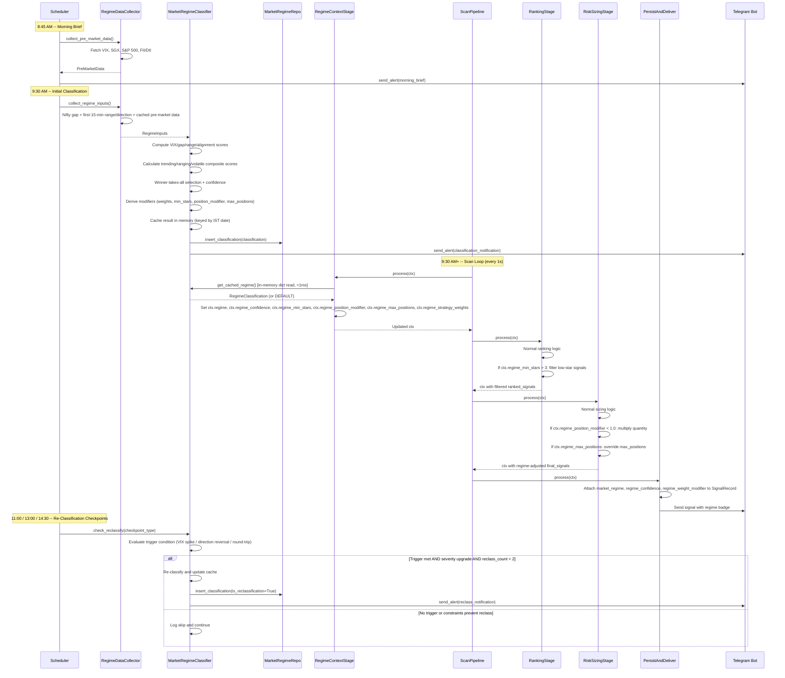
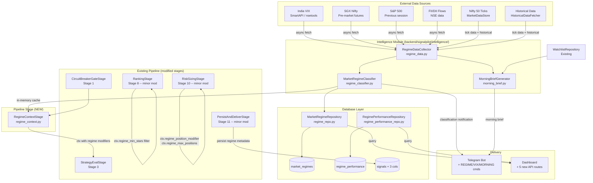

# SignalPilot Phase 4: Market Regime Detection -- Technical Design Document

## Table of Contents

1. [Overview](#1-overview)
2. [Architecture](#2-architecture)
3. [Components and Interfaces](#3-components-and-interfaces)
4. [Data Models](#4-data-models)
5. [Database Design](#5-database-design)
6. [Configuration Management](#6-configuration-management)
7. [Error Handling](#7-error-handling)
8. [Testing Strategy](#8-testing-strategy)
9. [Key Technical Decisions](#9-key-technical-decisions)
10. [Requirement Traceability Matrix](#10-requirement-traceability-matrix)

---

## 1. Overview

### 1.1 Purpose

Market Regime Detection adds contextual market intelligence to SignalPilot by classifying each trading day into one of three regimes -- TRENDING, RANGING, or VOLATILE -- at 9:30 AM IST (15 minutes after market open). Currently, all three strategies (Gap & Go, ORB, VWAP Reversal) run at equal weight regardless of market conditions. This creates a blind spot where approximately 30% of trading days produce signals in the wrong strategy, leading to avoidable losses.

The feature integrates as a single new pipeline stage (`RegimeContextStage`) inserted between `CircuitBreakerGateStage` (stage 1) and `StrategyEvalStage` (stage 2). The stage reads a cached classification result from `MarketRegimeClassifier` and sets six modifier fields on `ScanContext`. All expensive work (data collection, classification) happens in scheduler jobs outside the 1-second scan loop. The pipeline stage is a pure in-memory cache read, costing less than 1ms per cycle.

Three existing stages (`RankingStage`, `RiskSizingStage`, `PersistAndDeliverStage`) receive small additive reads of the new context fields. Neutral defaults ensure zero behavioral change when the feature is disabled via the `regime_enabled` kill switch, and a shadow mode allows the feature to classify and log without adjusting weights for initial validation.

This design document specifies all technical changes required to implement Market Regime Detection, building on the Phase 1-4 architecture.

### 1.2 Design Goals

- **Scan loop safety**: The `RegimeContextStage` performs only an in-memory dict lookup (<1ms). All data fetching and classification happen in scheduler jobs, never in the pipeline cycle.
- **Backward compatibility**: All existing signal generation, ranking, risk sizing, and delivery behavior remains unchanged when `regime_enabled` is `False` or when the stage is absent, due to neutral default values on `ScanContext`.
- **Shadow mode**: `regime_shadow_mode` allows classification and logging without applying weight adjustments, enabling accuracy validation before live activation.
- **Graceful degradation**: The classification algorithm handles missing data inputs by defaulting unavailable components to their neutral score (0.0), still producing a valid classification from whatever data is available.
- **Minimal disruption**: One new pipeline stage, two new database tables, three new nullable columns on `signals`, six new components under `backend/signalpilot/intelligence/`. No existing stage constructors or argument lists are modified.
- **Consistency**: All new code follows established patterns: repository pattern, dependency injection via `create_app()`, async-first, IST timezone via `datetime.now(IST)`, structured logging with `contextvars`.

### 1.3 Key Architectural Decisions Summary

| Decision | Choice | Rationale | Requirements |
|----------|--------|-----------|-------------|
| Pipeline stage placement | After CircuitBreakerGateStage (1), before StrategyEvalStage (2) | Regime context must be available to all downstream stages. Circuit breaker takes priority -- if tripped, regime does not matter. | REQ-MRD-019 |
| Classification timing | 9:30 AM scheduler job, cached in memory | Classification needs the first-15-minute candle data (9:15-9:30). Caching means the pipeline stage is a constant-time read. | REQ-MRD-008, REQ-MRD-014, REQ-MRD-053 |
| Re-classification rules | Severity upgrades only, max 2 per day | Prevents flip-flopping between regimes, which would cause inconsistent signal behavior within a session. | REQ-MRD-024 |
| Shadow mode default | Enabled (`True`) at deployment | Allows 2 weeks of classification logging to validate accuracy before applying weight adjustments live. | REQ-MRD-045 |
| Feature kill switch | Single `regime_enabled` boolean in AppConfig | Allows instant feature deactivation without code changes. Pipeline stage returns context unchanged when disabled. | REQ-MRD-046 |
| Weight layering | `final_weight = CapitalAllocator_weight * regime_adjustment` | Regime weights complement the existing long-term performance-based allocator rather than replacing it. | REQ-MRD-048 |
| New module location | `backend/signalpilot/intelligence/` | Reuses the directory established by News Sentiment Filter. Keeps the feature isolated from existing strategy, pipeline, and data modules. | REQ-MRD-022 |
| Data source fallbacks | Each input defaults to neutral (0.0) on failure | Classification must always produce a result. VIX + gap + range alone are sufficient for a minimum viable classification. | REQ-MRD-007 |

---

## 2. Architecture

### 2.1 High-Level Architecture

```
+-------------------------------------------------------------------------+
|                  SignalPilot -- Market Regime Detection                   |
|                      (Single Python Process)                             |
+-------------------------------------------------------------------------+
|                                                                          |
|  Existing Pipeline (12 signal stages + 1 always stage)                   |
|  +-------------------------------------------------------------------+  |
|  | 1. CircuitBreakerGate                                              |  |
|  | *2. RegimeContextStage* <-- NEW (in-memory cache read, <1ms)       |  |
|  | 3. StrategyEval        8. Ranking (minor: min-stars filter)        |  |
|  | 4. GapStockMarking     9. NewsSentiment                           |  |
|  | 5. Deduplication       10. RiskSizing (minor: position modifier)   |  |
|  | 6. Confidence          11. PersistAndDeliver (minor: regime meta)  |  |
|  | 7. CompositeScoring    12. Diagnostic                             |  |
|  |       13. AdaptiveFilter                                           |  |
|  +-------------------------------------------------------------------+  |
|                                                                          |
|  New Intelligence Module                                                 |
|  +-------------------------------------------------------------------+  |
|  | RegimeDataCollector   | Fetch VIX, Nifty gap/range, SGX, S&P,     |  |
|  |                       | FII/DII from external sources              |  |
|  | MarketRegimeClassifier| Classification algorithm + in-memory cache  |  |
|  | MorningBriefGenerator | Compose 8:45 AM pre-market brief           |  |
|  +-------------------------------------------------------------------+  |
|                                                                          |
|  New Database Layer                                                      |
|  +-------------------------------------------------------------------+  |
|  | market_regimes table  | Daily classification history with inputs   |  |
|  | regime_performance    | Strategy performance by regime (EOD)       |  |
|  | signals table         | +3 nullable columns for regime metadata    |  |
|  | MarketRegimeRepo      | CRUD for market_regimes table              |  |
|  | RegimePerformanceRepo | CRUD for regime_performance table          |  |
|  +-------------------------------------------------------------------+  |
|                                                                          |
|  Scheduler Jobs (outside scan loop)                                      |
|  +-------------------------------------------------------------------+  |
|  | 8:45 AM  | Morning brief (global cues + regime prediction)        |  |
|  | 9:30 AM  | Initial regime classification                          |  |
|  | 11:00 AM | Re-classification checkpoint (VIX spike check)         |  |
|  | 1:00 PM  | Re-classification checkpoint (direction reversal)      |  |
|  | 2:30 PM  | Re-classification checkpoint (round-trip check)        |  |
|  +-------------------------------------------------------------------+  |
|                                                                          |
|  Telegram Commands: REGIME, REGIME HISTORY, REGIME OVERRIDE, VIX,        |
|                     MORNING                                              |
|  Dashboard API: /api/v1/regime/current, /history, /performance,          |
|                 /override, /api/v1/morning-brief                         |
+-------------------------------------------------------------------------+
```

### 2.2 Data Flow -- Regime Classification and Pipeline Integration



### 2.3 Component Interaction Diagram



### 2.4 Updated Pipeline Stage Order

Market Regime Detection introduces one new stage (stage 2) and shifts all subsequent stages by one position:

| # | Stage | Change |
|---|-------|--------|
| 1 | CircuitBreakerGateStage | Unchanged |
| **2** | **RegimeContextStage** | **NEW** -- reads cached regime, sets 6 context fields |
| 3 | StrategyEvalStage | Was stage 2 |
| 4 | GapStockMarkingStage | Was stage 3 |
| 5 | DeduplicationStage | Was stage 4 |
| 6 | ConfidenceStage | Was stage 5 |
| 7 | CompositeScoringStage | Was stage 6 |
| 8 | AdaptiveFilterStage | Was stage 7 |
| 9 | RankingStage | Was stage 8 (enhanced: min-stars filter) |
| 10 | NewsSentimentStage | Was stage 9 |
| 11 | RiskSizingStage | Was stage 10 (enhanced: position modifier + max positions override) |
| 12 | PersistAndDeliverStage | Was stage 11 (enhanced: regime metadata persistence + signal badge) |
| 13 | DiagnosticStage | Was stage 12 |

**Always stage** (unchanged): `ExitMonitoringStage`

---

## 3. Components and Interfaces

### 3.1 RegimeDataCollector (`backend/signalpilot/intelligence/regime_data.py`)

Responsible for fetching all regime classification inputs from external sources. All fetching is async and happens in scheduler jobs, never in the scan loop.

```python
from __future__ import annotations

from dataclasses import dataclass, field
from datetime import datetime


@dataclass
class RegimeInputs:
    """All inputs needed for regime classification."""

    india_vix: float | None = None
    nifty_gap_pct: float | None = None
    nifty_first_15_range_pct: float | None = None
    nifty_first_15_direction: str | None = None  # 'UP', 'DOWN', 'FLAT'
    prev_day_range_pct: float | None = None
    fii_net_crores: float | None = None
    dii_net_crores: float | None = None
    sgx_direction: str | None = None  # 'UP', 'DOWN', 'FLAT'
    sp500_change_pct: float | None = None
    collected_at: datetime | None = None


@dataclass
class PreMarketData:
    """Pre-market data collected at 8:45 AM for the morning brief."""

    india_vix: float | None = None
    sp500_change_pct: float | None = None
    nasdaq_change_pct: float | None = None
    sgx_direction: str | None = None
    sgx_change_pct: float | None = None
    nikkei_change_pct: float | None = None
    hang_seng_change_pct: float | None = None
    fii_net_crores: float | None = None
    dii_net_crores: float | None = None
    collected_at: datetime | None = None


class RegimeDataCollector:
    """Async data collector for regime classification inputs.

    Fetches VIX, Nifty gap/range, global cues, and FII/DII flows.
    All fetching is async via aiohttp. Results are cached for the
    current session to avoid repeated API calls.
    """

    def __init__(self, market_data, config) -> None:
        self._market_data = market_data  # MarketDataStore
        self._config = config  # AppConfig
        self._session_cache: dict[str, object] = {}
        self._pre_market_data: PreMarketData | None = None

    async def collect_pre_market_data(self) -> PreMarketData:
        """Fetch pre-market data at 8:45 AM for the morning brief.

        Sources: India VIX (SmartAPI/nsetools), S&P 500 change (yfinance/scrape),
        SGX Nifty direction, Nikkei/Hang Seng, FII/DII (NSE).
        All sources have fallback to neutral values on failure.

        Returns PreMarketData and caches it for use by the 9:30 AM classification.
        """

    async def collect_regime_inputs(self) -> RegimeInputs:
        """Collect all inputs for regime classification at 9:30 AM.

        Combines:
        - Cached pre-market data (VIX, SGX, S&P, FII/DII from 8:45 AM)
        - Fresh Nifty 50 data from MarketDataStore:
            - Opening gap: (today_open - yesterday_close) / yesterday_close * 100
            - First-15-min range: (high - low) / open * 100 of 9:15-9:30 candle
            - First-15-min direction: 'UP' if close > open, 'DOWN' if close < open
        - Previous day range from HistoricalDataFetcher

        Each individual data source failure is caught, logged at WARNING level,
        and the corresponding input is set to None (handled as 0.0 score by classifier).
        """

    async def fetch_current_vix(self) -> float | None:
        """Fetch the current India VIX value.

        Primary: SmartAPI VIX token lookup.
        Fallback 1: nsetools library.
        Fallback 2: NSE India VIX page scraping via aiohttp.
        Returns None if all sources fail.
        """

    async def fetch_global_cues(self) -> dict:
        """Fetch SGX Nifty direction and S&P 500 change.

        Uses yfinance or web scraping for S&P 500 previous session data.
        Uses SGX Nifty futures data for pre-market direction.
        Returns dict with 'sgx_direction', 'sp500_change_pct', etc.
        """

    async def fetch_fii_dii(self) -> tuple[float | None, float | None]:
        """Fetch previous day's FII and DII net flows in crores.

        Source: NSE FII/DII data page or public API.
        Returns (fii_net_crores, dii_net_crores), or (None, None) on failure.
        """

    def get_cached_pre_market_data(self) -> PreMarketData | None:
        """Return cached pre-market data (collected at 8:45 AM)."""
        return self._pre_market_data

    async def get_current_nifty_data(self) -> dict:
        """Get current Nifty 50 data from MarketDataStore for re-classification.

        Returns dict with 'ltp', 'open', 'high', 'low', 'change_pct'.
        Used by re-classification checkpoints to evaluate triggers.
        """
```

**Design rationale**: `RegimeDataCollector` abstracts all external data sources behind a single interface. Each method has independent error handling so that failure of one source (e.g., SGX data unavailable) does not prevent classification from proceeding with available inputs. The collector caches pre-market data at 8:45 AM and reuses it at 9:30 AM, avoiding duplicate API calls.

### 3.2 MarketRegimeClassifier (`backend/signalpilot/intelligence/regime_classifier.py`)

The core classification engine. Implements the weighted composite scoring algorithm and manages the in-memory cache.

```python
from __future__ import annotations

import json
import logging
from datetime import date, datetime

from signalpilot.db.models import RegimeClassification
from signalpilot.intelligence.regime_data import RegimeDataCollector, RegimeInputs
from signalpilot.utils.constants import IST

logger = logging.getLogger(__name__)

# Severity ordering for re-classification: only upgrades allowed
_SEVERITY_ORDER = {"TRENDING": 0, "RANGING": 1, "VOLATILE": 2}


class MarketRegimeClassifier:
    """Classifies the market regime and caches the result in memory.

    The classifier runs once at 9:30 AM via a scheduler job. Re-classification
    checkpoints at 11:00 AM, 1:00 PM, and 2:30 PM evaluate trigger conditions
    and may upgrade the severity.

    The in-memory cache is a dict keyed by IST date, holding the latest
    RegimeClassification for that day. The pipeline stage reads this cache
    in <1ms per cycle.
    """

    def __init__(
        self,
        data_collector: RegimeDataCollector,
        regime_repo,           # MarketRegimeRepository
        config,                # AppConfig
    ) -> None:
        self._data_collector = data_collector
        self._regime_repo = regime_repo
        self._config = config
        self._cache: dict[date, RegimeClassification] = {}
        self._reclass_count: dict[date, int] = {}  # track re-classifications per day
        self._morning_vix: dict[date, float] = {}   # track morning VIX for spike detection

    def get_cached_regime(self, for_date: date | None = None) -> RegimeClassification | None:
        """Return the cached regime classification for the given date.

        If for_date is None, uses today's IST date.
        Returns None if no classification has been performed yet.
        Pipeline stage calls this method -- must be <1ms.
        """
        target = for_date or datetime.now(IST).date()
        return self._cache.get(target)

    async def classify(self) -> RegimeClassification:
        """Run the initial 9:30 AM classification.

        1. Collect regime inputs from data collector
        2. Compute component scores (VIX, gap, range, alignment)
        3. Compute composite regime scores (trending, ranging, volatile)
        4. Select winner-takes-all regime with confidence
        5. Derive modifiers (strategy weights, min stars, position modifier, max positions)
        6. Cache result in memory
        7. Persist to market_regimes table
        8. Return the classification

        This method costs ~50-200ms (pure math, no network I/O).
        """

    async def check_reclassify(self, checkpoint: str) -> RegimeClassification | None:
        """Evaluate re-classification at a checkpoint.

        checkpoint: '11:00' | '13:00' | '14:30'

        Trigger conditions:
        - 11:00 AM: VIX spiked >15% from morning value
        - 1:00 PM:  Nifty reversed direction from morning classification
        - 2:30 PM:  Nifty within 0.3% of open (round-trip)

        Rules:
        - Only upgrade severity (TRENDING->VOLATILE, RANGING->VOLATILE, TRENDING->RANGING)
        - Max 2 re-classifications per day
        - Each re-classification updates the in-memory cache immediately

        Returns the new RegimeClassification if re-classified, else None.
        """

    def apply_override(self, regime: str) -> RegimeClassification:
        """Apply a manual regime override.

        Sets the cached regime to the specified value with confidence=1.0.
        Recalculates all derived modifiers.
        Resets at the next re-classification checkpoint.
        """

    def reset_daily(self) -> None:
        """Reset daily state at session start (called by start_scanning).

        Clears re-classification count for the new day.
        Does NOT clear the cache -- stale entries from previous days
        are harmless because the pipeline always queries today's date.
        """

    # -- Internal classification methods --

    @staticmethod
    def _compute_vix_score(vix: float | None) -> float:
        """Map VIX level to score in [-0.5, 1.0].

        VIX < 12:  -0.5 (very calm, ranging likely)
        12-14:      0.0 (normal)
        14-18:      0.3 (slightly elevated)
        18-22:      0.6 (high, volatile likely)
        >= 22:      1.0 (very high, defensive mode)

        Returns 0.0 if VIX is None (neutral fallback).
        """

    @staticmethod
    def _compute_gap_score(nifty_gap_pct: float | None) -> float:
        """Map Nifty gap percentage to score in [-0.5, 1.0].

        |gap| > 1.5%:  1.0 (big gap, trending day)
        0.8-1.5%:      0.6 (moderate gap)
        0.3-0.8%:      0.2 (small gap)
        <= 0.3%:      -0.5 (no gap, ranging likely)

        Returns 0.0 if gap_pct is None.
        """

    @staticmethod
    def _compute_range_score(first_15_range_pct: float | None) -> float:
        """Map first-15-min range percentage to score in [-0.5, 1.0].

        > 1.0%:   1.0 (wide range, volatile)
        0.5-1.0%: 0.5 (moderate range, trending)
        0.2-0.5%: 0.0 (normal)
        <= 0.2%: -0.5 (tight range, ranging)

        Returns 0.0 if range_pct is None.
        """

    @staticmethod
    def _compute_alignment(
        nifty_gap_pct: float | None,
        first_15_direction: str | None,
        sgx_direction: str | None,
        sp500_change_pct: float | None,
    ) -> float:
        """Compute directional alignment score in [0.0, 1.0].

        Evaluates 4 directional signals:
        - Nifty gap: +1 if gap > 0.3%, -1 if < -0.3%, else 0
        - First-15-min: +1 if UP, -1 if DOWN, else 0
        - SGX Nifty: +1 if UP, -1 if DOWN, else 0
        - S&P 500: +1 if change > 0.3%, -1 if < -0.3%, else 0

        alignment = abs(sum(directions)) / 4
        1.0 = full agreement, 0.0 = completely mixed

        Missing inputs default to 0 (neutral), denominator stays 4.
        """

    def _classify_from_scores(
        self,
        vix_score: float,
        gap_score: float,
        range_score: float,
        alignment: float,
        inputs: RegimeInputs,
        is_reclassification: bool = False,
        previous_regime: str | None = None,
    ) -> RegimeClassification:
        """Compute composite regime scores and select the winner.

        trending_score  = (gap_score * 0.35) + (alignment * 0.30) + (range_score * 0.20) + ((1 - vix_score) * 0.15)
        ranging_score   = ((-gap_score) * 0.35) + ((-range_score) * 0.30) + ((1 - vix_score) * 0.35)
        volatile_score  = (vix_score * 0.40) + (range_score * 0.30) + ((1 - alignment) * 0.30)

        Winner-takes-all: regime = max score.
        Confidence = selected_score / sum(abs(all_scores)), clamped to [0.0, 1.0], default 0.33.

        Then derives modifiers from _get_regime_modifiers().
        """

    def _get_regime_modifiers(
        self, regime: str, confidence: float
    ) -> dict:
        """Derive strategy weights, min stars, position modifier, max positions.

        Uses configurable weight matrices from AppConfig with the following defaults:

        TRENDING (high conf > 0.55): Gap&Go 45%, ORB 35%, VWAP 20%, min_stars=3, modifier=1.0, max_pos=8
        TRENDING (low conf):         Gap&Go 38%, ORB 35%, VWAP 27%, min_stars=3, modifier=1.0, max_pos=8
        RANGING (high conf):         Gap&Go 20%, ORB 30%, VWAP 50%, min_stars=3, modifier=0.85, max_pos=6
        RANGING (low conf):          Gap&Go 28%, ORB 33%, VWAP 39%, min_stars=4, modifier=0.85, max_pos=6
        VOLATILE (high conf):        Gap&Go 25%, ORB 25%, VWAP 25%, min_stars=5, modifier=0.65, max_pos=4
        VOLATILE (low conf):         Gap&Go 30%, ORB 30%, VWAP 30%, min_stars=4, modifier=0.65, max_pos=4
        DEFAULT:                     Gap&Go 33%, ORB 33%, VWAP 34%, min_stars=3, modifier=1.0, max_pos=None

        Returns dict with keys: strategy_weights, min_star_rating, position_size_modifier, max_positions.
        """
```

**Design rationale**: The classifier is stateless except for the in-memory cache. The cache is a simple `dict[date, RegimeClassification]` that allows O(1) lookup by the pipeline stage. The `_SEVERITY_ORDER` mapping enforces the monotonic upgrade rule for re-classifications. All configuration thresholds and weight matrices are read from `AppConfig`, allowing tuning without code changes.

### 3.3 RegimeContextStage (`backend/signalpilot/pipeline/stages/regime_context.py`)

The pipeline stage that bridges the classifier and the scan loop. Near-zero cost per cycle.

```python
from __future__ import annotations

import logging

from signalpilot.pipeline.context import ScanContext

logger = logging.getLogger(__name__)


class RegimeContextStage:
    """Read cached regime classification and set modifiers on ScanContext.

    Position: After CircuitBreakerGateStage (1), before StrategyEvalStage (3).

    This stage reads the in-memory cache from MarketRegimeClassifier.
    If no classification exists yet (before 9:30 AM), it sets DEFAULT
    values (all neutral). In shadow mode, it sets regime and confidence
    for logging but leaves all modifier fields at their neutral defaults.

    Cost: <1ms per cycle (dict lookup + 6 attribute assignments).
    """

    def __init__(self, regime_classifier, config) -> None:
        self._classifier = regime_classifier  # MarketRegimeClassifier
        self._config = config  # AppConfig

    @property
    def name(self) -> str:
        return "RegimeContext"

    async def process(self, ctx: ScanContext) -> ScanContext:
        # Kill switch: if regime detection is disabled, return context unchanged
        if not getattr(self._config, "regime_enabled", True):
            return ctx

        # Read cached regime (O(1) dict lookup)
        classification = self._classifier.get_cached_regime()

        if classification is None:
            # No classification yet (before 9:30 AM) -- use DEFAULT values
            # All ScanContext fields already have neutral defaults, so no action needed
            return ctx

        # Set regime identification fields (always set, even in shadow mode)
        ctx.regime = classification.regime
        ctx.regime_confidence = classification.confidence

        # In shadow mode: classify and log, but do not apply modifiers
        if getattr(self._config, "regime_shadow_mode", False):
            logger.debug(
                "Shadow mode: regime=%s confidence=%.2f (modifiers not applied)",
                classification.regime,
                classification.confidence,
            )
            return ctx

        # Apply regime modifiers to context
        ctx.regime_min_stars = classification.min_star_rating
        ctx.regime_position_modifier = classification.position_size_modifier
        ctx.regime_max_positions = classification.max_positions
        ctx.regime_strategy_weights = classification.strategy_weights

        return ctx
```

### 3.4 MorningBriefGenerator (`backend/signalpilot/intelligence/morning_brief.py`)

Composes the 8:45 AM pre-market morning brief message.

```python
from __future__ import annotations

import logging
from datetime import datetime

from signalpilot.intelligence.regime_data import PreMarketData
from signalpilot.utils.constants import IST

logger = logging.getLogger(__name__)


class MorningBriefGenerator:
    """Generate the pre-market morning brief Telegram message.

    Combines global cues (S&P 500, Nasdaq, Asian markets, SGX Nifty),
    India context (VIX, FII/DII), regime prediction, and watchlist alerts.
    """

    def __init__(self, data_collector, watchlist_repo, config) -> None:
        self._data_collector = data_collector  # RegimeDataCollector
        self._watchlist_repo = watchlist_repo  # WatchlistRepository
        self._config = config  # AppConfig
        self._last_brief: str | None = None  # cached for MORNING command

    async def generate(self) -> str:
        """Generate the morning brief message.

        1. Fetch pre-market data via RegimeDataCollector.collect_pre_market_data()
        2. Build global cues section
        3. Build India context section
        4. Compute pre-market regime prediction
        5. Query watchlist for active entries
        6. Format all sections into the brief message

        Returns formatted HTML string for Telegram delivery.
        Caches the result for the MORNING re-send command.
        """

    def get_cached_brief(self) -> str | None:
        """Return the cached morning brief for the MORNING command."""
        return self._last_brief

    def _predict_regime(self, data: PreMarketData) -> tuple[str, str]:
        """Predict likely regime from pre-market data.

        Uses available pre-market inputs (VIX, SGX direction, S&P change)
        to make a preliminary prediction with reasoning.

        Returns (predicted_regime, reasoning_text).
        """

    def _format_brief(
        self,
        data: PreMarketData,
        regime_prediction: str,
        reasoning: str,
        watchlist_entries: list,
    ) -> str:
        """Format the morning brief into the Telegram message.

        Format:
        ━━━━━━━━━━━━━━━━━━━━━━
        SIGNALPILOT -- MORNING BRIEF
        <date>
        ━━━━━━━━━━━━━━━━━━━━━━

        GLOBAL CUES
            S&P 500: <change%> | Nasdaq: <change%>
            Nikkei: <change%> | Hang Seng: <change%>
            SGX Nifty: <direction> (<change%>)

        INDIA CONTEXT
            India VIX: <value> (<interpretation>)
            FII (yesterday): <net_crores>
            DII (yesterday): <net_crores>

        REGIME PREDICTION: Likely <REGIME> DAY
            Reasoning: <reasoning_text>

        WATCHLIST ALERTS (if any)
            <symbol> (watched since <date>)

        ━━━━━━━━━━━━━━━━━━━━━━
        Classification at 9:30 AM. First signals expected 9:30-9:45 AM.
        """
```

### 3.5 Existing Stage Modifications

#### 3.5.1 RankingStage (`backend/signalpilot/pipeline/stages/ranking.py`)

**Change**: Add 2-3 lines after existing ranking logic to filter signals below `ctx.regime_min_stars`.

```python
# After existing: ctx.ranked_signals = self._ranker.rank(...)
# NEW: Apply regime minimum star threshold
if ctx.regime_min_stars and ctx.regime_min_stars > 3:
    pre_filter_count = len(ctx.ranked_signals)
    ctx.ranked_signals = [
        s for s in ctx.ranked_signals
        if s.signal_strength >= ctx.regime_min_stars
    ]
    if pre_filter_count > len(ctx.ranked_signals):
        logger.info(
            "Regime min-stars filter: %d -> %d signals (threshold: %d stars)",
            pre_filter_count, len(ctx.ranked_signals), ctx.regime_min_stars,
        )
```

**Impact**: When `regime_min_stars` is 3 (default), the condition `> 3` is False and the filter is a complete no-op. No behavioral change unless a regime actively raises the threshold.

#### 3.5.2 RiskSizingStage (`backend/signalpilot/pipeline/stages/risk_sizing.py`)

**Change**: Add regime modifier and max positions override to the existing `filter_and_size` call.

```python
async def process(self, ctx: ScanContext) -> ScanContext:
    if not ctx.ranked_signals:
        return ctx
    ctx.active_trade_count = await self._trade_repo.get_active_trade_count()

    # NEW: Override max_positions if regime specifies it
    effective_config = ctx.user_config
    if ctx.regime_max_positions is not None and ctx.user_config is not None:
        from signalpilot.db.models import UserConfig
        # Create a shallow copy with overridden max_positions
        effective_config = UserConfig(
            id=ctx.user_config.id,
            telegram_chat_id=ctx.user_config.telegram_chat_id,
            total_capital=ctx.user_config.total_capital,
            max_positions=ctx.regime_max_positions,
            gap_go_enabled=ctx.user_config.gap_go_enabled,
            orb_enabled=ctx.user_config.orb_enabled,
            vwap_enabled=ctx.user_config.vwap_enabled,
            circuit_breaker_limit=ctx.user_config.circuit_breaker_limit,
            confidence_boost_enabled=ctx.user_config.confidence_boost_enabled,
            adaptive_learning_enabled=ctx.user_config.adaptive_learning_enabled,
            auto_rebalance_enabled=ctx.user_config.auto_rebalance_enabled,
            adaptation_mode=ctx.user_config.adaptation_mode,
        )

    ctx.final_signals = self._risk_manager.filter_and_size(
        ctx.ranked_signals,
        effective_config,
        ctx.active_trade_count,
        confirmation_map=ctx.confirmation_map,
    )

    # NEW: Apply regime position size modifier
    if ctx.regime_position_modifier is not None and ctx.regime_position_modifier < 1.0:
        for signal in ctx.final_signals:
            original_qty = signal.quantity
            adjusted_qty = int(original_qty * ctx.regime_position_modifier)
            if adjusted_qty < 1:
                adjusted_qty = 1  # Ensure at least 1 share
            signal = FinalSignal(
                ranked_signal=signal.ranked_signal,
                quantity=adjusted_qty,
                capital_required=adjusted_qty * signal.ranked_signal.candidate.entry_price,
                expires_at=signal.expires_at,
            )
        logger.info(
            "Regime position modifier %.2f applied to %d signals",
            ctx.regime_position_modifier, len(ctx.final_signals),
        )

    return ctx
```

**Note on FinalSignal immutability**: `FinalSignal` is a dataclass. Since it is not frozen, we can create replacement instances with the adjusted quantity. An alternative approach is to make `quantity` and `capital_required` mutable and modify in-place. The choice is an implementation detail -- both approaches work. The implementation should use whichever is more consistent with the existing codebase's mutation patterns (currently, `FinalSignal` fields are assigned once in `RiskManager.filter_and_size()` and not modified afterward, so replacement is cleaner).

**Impact**: When `regime_max_positions` is `None` and `regime_position_modifier` is `1.0` (defaults), neither modification activates. Identical to pre-feature behavior.

#### 3.5.3 PersistAndDeliverStage (`backend/signalpilot/pipeline/stages/persist_and_deliver.py`)

**Change**: Add 3 lines to attach regime metadata to `SignalRecord` before DB insert.

```python
# In the for-signal loop, after existing record creation:
# NEW: Attach regime metadata
if ctx.regime is not None:
    record.market_regime = ctx.regime
    record.regime_confidence = ctx.regime_confidence
    record.regime_weight_modifier = ctx.regime_position_modifier
```

Also update the `send_signal` call to include regime information for the signal badge:

```python
await self._bot.send_signal(
    signal,
    is_paper=is_paper,
    signal_id=signal_id,
    # ... existing params ...
    # NEW: regime badge data
    market_regime=ctx.regime,
    regime_confidence=ctx.regime_confidence,
)
```

**Impact**: When `ctx.regime` is `None`, the condition is False and no metadata is attached. All regime columns remain `NULL`. Identical to pre-feature behavior.

### 3.6 Scheduler Jobs

Five new cron jobs in `MarketScheduler.configure_jobs()`:

```python
# Phase 4: Market Regime Detection jobs
regime_jobs = [
    ("morning_brief",          8, 45, "send_morning_brief"),
    ("regime_classify",        9, 30, "classify_regime"),
    ("regime_reclass_11",     11,  0, "check_regime_reclassify_11"),
    ("regime_reclass_13",     13,  0, "check_regime_reclassify_13"),
    ("regime_reclass_1430",   14, 30, "check_regime_reclassify_1430"),
]
for job_id, hour, minute, method_name in regime_jobs:
    if hasattr(app, method_name):
        callback = getattr(app, method_name)
        guarded = _trading_day_guard(callback)
        self._scheduler.add_job(
            guarded,
            CronTrigger(
                day_of_week="mon-fri", hour=hour, minute=minute, timezone=IST,
            ),
            id=job_id,
            replace_existing=True,
        )
```

**Timeline compatibility with existing jobs**:

| Time | Existing Job | New Job | Conflict? |
|------|-------------|---------|-----------|
| 8:30 AM | pre_market_news | -- | No |
| 8:45 AM | -- | morning_brief | No |
| 9:00 AM | pre_market_alert | -- | No |
| 9:15 AM | start_scanning | -- | No |
| 9:30 AM | -- | regime_classify | No |
| 9:45 AM | lock_opening_ranges | -- | No |
| 11:00 AM | -- | regime_reclass_11 | No |
| 11:15 AM | news_cache_refresh_1 | -- | No |
| 1:00 PM | -- | regime_reclass_13 | No |
| 1:15 PM | news_cache_refresh_2 | -- | No |
| 2:30 PM | stop_new_signals | regime_reclass_1430 | Same time -- both run. Regime reclass runs first (registered first), then stop_new_signals. No conflict since they are independent. |

### 3.7 New Lifecycle Methods on SignalPilotApp

Added to `backend/signalpilot/scheduler/lifecycle.py`:

```python
async def send_morning_brief(self) -> None:
    """Send pre-market morning brief (called at 8:45 AM)."""
    set_context(job_name="send_morning_brief")
    try:
        if not self._app_config or not getattr(self._app_config, "regime_enabled", False):
            logger.info("Regime detection disabled, skipping morning brief")
            return
        if self._morning_brief_generator is None:
            logger.warning("Skipping morning brief: generator not configured")
            return
        try:
            message = await self._morning_brief_generator.generate()
            if self._bot and message:
                await self._bot.send_alert(message)
            logger.info("Morning brief sent")
        except Exception:
            logger.exception("Morning brief generation failed")
    finally:
        reset_context()

async def classify_regime(self) -> None:
    """Run initial regime classification (called at 9:30 AM)."""
    set_context(job_name="classify_regime")
    try:
        if not self._app_config or not getattr(self._app_config, "regime_enabled", False):
            logger.info("Regime detection disabled, skipping classification")
            return
        if self._regime_classifier is None:
            logger.warning("Skipping regime classification: classifier not configured")
            return
        try:
            classification = await self._regime_classifier.classify()
            # Send notification
            if self._bot:
                msg = self._format_classification_notification(classification)
                await self._bot.send_alert(msg)
            logger.info(
                "Regime classified: %s (confidence: %.2f)",
                classification.regime, classification.confidence,
            )
        except Exception:
            logger.exception("Regime classification failed; pipeline will use DEFAULT regime")
    finally:
        reset_context()

async def check_regime_reclassify_11(self) -> None:
    """11:00 AM re-classification checkpoint: VIX spike check."""
    await self._check_regime_reclassify("11:00")

async def check_regime_reclassify_13(self) -> None:
    """1:00 PM re-classification checkpoint: direction reversal check."""
    await self._check_regime_reclassify("13:00")

async def check_regime_reclassify_1430(self) -> None:
    """2:30 PM re-classification checkpoint: round-trip check."""
    await self._check_regime_reclassify("14:30")

async def _check_regime_reclassify(self, checkpoint: str) -> None:
    """Common re-classification checkpoint handler."""
    set_context(job_name=f"regime_reclass_{checkpoint.replace(':', '')}")
    try:
        if not self._app_config or not getattr(self._app_config, "regime_enabled", False):
            return
        if self._regime_classifier is None:
            return
        try:
            new_classification = await self._regime_classifier.check_reclassify(checkpoint)
            if new_classification is not None and self._bot:
                msg = self._format_reclass_notification(new_classification)
                await self._bot.send_alert(msg)
        except Exception:
            logger.exception("Regime re-classification check failed at %s", checkpoint)
    finally:
        reset_context()
```

### 3.8 Telegram Commands

Five new commands registered in `SignalPilotBot.start()`:

| Command | Regex Pattern | Handler |
|---------|--------------|---------|
| `REGIME` | `(?i)^regime$` | `_handle_regime` -> `handle_regime_command()` |
| `REGIME HISTORY` | `(?i)^regime\s+history$` | `_handle_regime_history` -> `handle_regime_history_command()` |
| `REGIME OVERRIDE <REGIME>` | `(?i)^regime\s+override\s+(trending\|ranging\|volatile)$` | `_handle_regime_override` -> `handle_regime_override_command()` |
| `VIX` | `(?i)^vix$` | `_handle_vix` -> `handle_vix_command()` |
| `MORNING` | `(?i)^morning$` | `_handle_morning` -> `handle_morning_command()` |

Handler functions in `backend/signalpilot/telegram/handlers.py`:

```python
async def handle_regime_command(regime_classifier) -> str:
    """Handle the REGIME command -- show current regime classification."""
    classification = regime_classifier.get_cached_regime()
    if classification is None:
        return (
            "No regime classification yet today.\n"
            "Classification will run at 9:30 AM IST.\n"
            "Current mode: DEFAULT (equal weights)"
        )
    return format_regime_display(classification)

async def handle_regime_history_command(regime_repo, regime_perf_repo) -> str:
    """Handle REGIME HISTORY -- show last 20 days' regimes with performance."""
    history = await regime_repo.get_regime_history(20)
    if not history:
        return "No regime history available yet."
    performance = await regime_perf_repo.get_performance_summary(20)
    return format_regime_history(history, performance)

async def handle_regime_override_command(regime_classifier, regime_text: str) -> str:
    """Handle REGIME OVERRIDE <REGIME> -- manually override classification."""
    parts = regime_text.strip().upper().split()
    if len(parts) < 3:
        return "Usage: REGIME OVERRIDE TRENDING|RANGING|VOLATILE"
    regime = parts[2]
    if regime not in ("TRENDING", "RANGING", "VOLATILE"):
        return f"Invalid regime: {regime}. Valid options: TRENDING, RANGING, VOLATILE"
    classification = regime_classifier.apply_override(regime)
    return (
        f"Regime manually overridden to {regime}.\n\n"
        f"{format_regime_modifiers(classification)}\n\n"
        "Override will reset at the next re-classification checkpoint."
    )

async def handle_vix_command(data_collector) -> str:
    """Handle the VIX command -- show current India VIX."""
    data = data_collector.get_cached_pre_market_data()
    if data is None or data.india_vix is None:
        return "India VIX data not available. Try again after 8:45 AM."
    vix = data.india_vix
    score = MarketRegimeClassifier._compute_vix_score(vix)
    interpretation = _vix_interpretation(vix)
    return (
        f"<b>India VIX: {vix:.1f}</b>\n"
        f"Score: {score:+.1f}\n"
        f"Interpretation: {interpretation}"
    )

async def handle_morning_command(morning_brief_generator) -> str:
    """Handle the MORNING command -- re-send today's morning brief."""
    brief = morning_brief_generator.get_cached_brief()
    if brief is None:
        return "Morning brief not generated yet. It will be available after 8:45 AM."
    return brief
```

### 3.9 Telegram Notification Formatters

Added to `backend/signalpilot/telegram/formatters.py`:

```python
def format_regime_display(classification: RegimeClassification) -> str:
    """Format the REGIME command response showing full classification details."""
    shadow_note = ""
    # (shadow mode note added by caller if applicable)
    return (
        f"<b>MARKET REGIME -- {classification.regime}</b>\n"
        f"Confidence: {classification.confidence:.0%}\n"
        f"Classified at: {classification.classified_at.strftime('%I:%M %p')}\n"
        f"{shadow_note}\n"
        f"<b>INPUTS</b>\n"
        f"  India VIX: {classification.india_vix or 'N/A'}\n"
        f"  Nifty Gap: {_fmt_pct(classification.nifty_gap_pct)}\n"
        f"  15-min Range: {_fmt_pct(classification.nifty_first_15_range_pct)}\n"
        f"  15-min Direction: {classification.nifty_first_15_direction or 'N/A'}\n"
        f"  Alignment: {_fmt_float(classification.directional_alignment)}\n"
        f"  SGX Nifty: {classification.sgx_direction or 'N/A'}\n"
        f"  S&P 500: {_fmt_pct(classification.sp500_change_pct)}\n"
        f"  FII: {_fmt_crores(classification.fii_net_crores)}\n"
        f"  DII: {_fmt_crores(classification.dii_net_crores)}\n"
        f"\n"
        f"<b>SCORES</b>\n"
        f"  Trending:  {classification.trending_score:.3f}\n"
        f"  Ranging:   {classification.ranging_score:.3f}\n"
        f"  Volatile:  {classification.volatile_score:.3f}\n"
        f"\n"
        f"{format_regime_modifiers(classification)}"
    )


def format_regime_modifiers(classification: RegimeClassification) -> str:
    """Format the regime modifier section."""
    weights = classification.strategy_weights or {}
    return (
        f"<b>ACTIVE ADJUSTMENTS</b>\n"
        f"  Gap & Go: {weights.get('gap_go', 33):.0f}%\n"
        f"  ORB: {weights.get('orb', 33):.0f}%\n"
        f"  VWAP Reversal: {weights.get('vwap', 34):.0f}%\n"
        f"  Min Rating: {classification.min_star_rating} stars\n"
        f"  Position Modifier: {classification.position_size_modifier:.2f}x\n"
        f"  Max Positions: {classification.max_positions or 'default'}"
    )


def format_classification_notification(classification: RegimeClassification) -> str:
    """Format the 9:30 AM classification Telegram notification."""
    # Full notification with regime, inputs, adjustments
    # See REQ-MRD-037 for exact format


def format_reclass_notification(
    classification: RegimeClassification,
    previous_regime: str,
    trigger_reason: str,
) -> str:
    """Format a re-classification notification."""
    # See REQ-MRD-038 for exact format -- includes previous/new regime,
    # trigger reason, updated adjustments, and "existing positions not affected" note
```

### 3.10 Dashboard API Endpoints

New route module: `backend/signalpilot/dashboard/routes/regime.py`

```python
from fastapi import APIRouter, Request, HTTPException
from pydantic import BaseModel

router = APIRouter()


class RegimeOverrideRequest(BaseModel):
    regime: str  # "TRENDING", "RANGING", "VOLATILE"


@router.get("/current")
async def get_current_regime(request: Request):
    """GET /api/v1/regime/current -- Current regime classification.

    Returns:
        JSON with regime, confidence, scores, inputs, modifiers.
        If no classification: regime=null with DEFAULT modifiers.
    """


@router.get("/history")
async def get_regime_history(request: Request, days: int = 30):
    """GET /api/v1/regime/history -- Regime history for last N days.

    Returns:
        List of daily regime records (final classification per day).
    """


@router.get("/performance")
async def get_regime_performance(request: Request, days: int = 30):
    """GET /api/v1/regime/performance -- Strategy performance by regime.

    Returns:
        Aggregated win rate, signals, P&L by regime and strategy.
    """


@router.post("/override")
async def override_regime(request: Request, body: RegimeOverrideRequest):
    """POST /api/v1/regime/override -- Manual regime override.

    Validates regime name, updates in-memory cache, returns updated classification.
    Returns 400 if invalid regime name.
    """


# Morning brief endpoint
morning_router = APIRouter()

@morning_router.get("/")
async def get_morning_brief(request: Request):
    """GET /api/v1/morning-brief -- Today's morning brief data.

    Returns:
        JSON with global cues, India context, regime prediction, watchlist alerts.
        If not generated yet: generated=false with empty sections.
    """
```

Registered in `backend/signalpilot/dashboard/app.py`:

```python
from signalpilot.dashboard.routes import regime

app.include_router(regime.router, prefix="/api/v1/regime", tags=["regime"])
app.include_router(regime.morning_router, prefix="/api/v1/morning-brief", tags=["morning-brief"])
```

---

## 4. Data Models

### 4.1 RegimeClassification Dataclass

Added to `backend/signalpilot/db/models.py`:

```python
@dataclass
class RegimeClassification:
    """Classification result from MarketRegimeClassifier.

    Represents a single regime classification with all inputs, scores,
    derived modifiers, and metadata. Used as the in-memory cache value,
    the pipeline stage source, and the persistence payload.
    """

    regime: str                              # "TRENDING", "RANGING", "VOLATILE"
    confidence: float                        # 0.0-1.0
    trending_score: float = 0.0
    ranging_score: float = 0.0
    volatile_score: float = 0.0
    # Raw inputs
    india_vix: float | None = None
    nifty_gap_pct: float | None = None
    nifty_first_15_range_pct: float | None = None
    nifty_first_15_direction: str | None = None  # 'UP', 'DOWN', 'FLAT'
    directional_alignment: float | None = None
    sp500_change_pct: float | None = None
    sgx_direction: str | None = None             # 'UP', 'DOWN', 'FLAT'
    fii_net_crores: float | None = None
    dii_net_crores: float | None = None
    prev_day_range_pct: float | None = None
    # Derived modifiers
    strategy_weights: dict[str, float] = field(default_factory=dict)
    min_star_rating: int = 3
    max_positions: int | None = None
    position_size_modifier: float = 1.0
    # Metadata
    is_reclassification: bool = False
    previous_regime: str | None = None
    classified_at: datetime = field(default_factory=lambda: datetime.now(IST))
```

### 4.2 RegimePerformanceRecord Dataclass

Added to `backend/signalpilot/db/models.py`:

```python
@dataclass
class RegimePerformanceRecord:
    """Daily strategy performance under a specific regime.

    Populated by the end-of-day summary job (15:30 IST) and queried
    by the REGIME HISTORY command and dashboard API.
    """

    id: int | None = None
    regime_date: date = field(default_factory=lambda: datetime.now(IST).date())
    regime: str = ""                    # "TRENDING", "RANGING", "VOLATILE"
    strategy: str = ""                  # "Gap & Go", "ORB", "VWAP Reversal"
    signals_generated: int = 0
    signals_taken: int = 0
    wins: int = 0
    losses: int = 0
    pnl: float = 0.0
    win_rate: float | None = None
    created_at: datetime | None = None
```

### 4.3 SignalRecord Extension

Three new optional fields added to the existing `SignalRecord` in `backend/signalpilot/db/models.py`:

```python
@dataclass
class SignalRecord:
    # ... existing fields ...
    # Phase 4: News Sentiment Filter fields
    news_sentiment_score: float | None = None
    news_sentiment_label: str | None = None
    news_top_headline: str | None = None
    news_action: str | None = None
    original_star_rating: int | None = None
    # Phase 4: Market Regime Detection fields (NEW)
    market_regime: str | None = None              # 'TRENDING', 'RANGING', 'VOLATILE'
    regime_confidence: float | None = None
    regime_weight_modifier: float | None = None
```

### 4.4 ScanContext Extension

Six new optional fields added to `ScanContext` in `backend/signalpilot/pipeline/context.py`:

```python
@dataclass
class ScanContext:
    # ... existing fields ...

    # Set by RegimeContextStage (Phase 4: Market Regime Detection)
    regime: str | None = None                        # "TRENDING", "RANGING", "VOLATILE", or None
    regime_confidence: float = 0.0                   # 0.0-1.0
    regime_min_stars: int = 3                        # Minimum star threshold (3 = no filter)
    regime_position_modifier: float = 1.0            # 0.65x-1.0x multiplier (1.0 = no change)
    regime_max_positions: int | None = None           # Override (None = use config default)
    regime_strategy_weights: dict | None = None       # {"gap_go": 0.45, "orb": 0.35, "vwap": 0.20}
```

**Default value analysis**: Every default is chosen to be a no-op:
- `regime=None` -> downstream stages check `if ctx.regime is not None` before applying
- `regime_min_stars=3` -> RankingStage checks `> 3` which is False at default
- `regime_position_modifier=1.0` -> RiskSizingStage checks `< 1.0` which is False at default
- `regime_max_positions=None` -> RiskSizingStage checks `is not None` which is False at default
- `regime_strategy_weights=None` -> CapitalAllocator checks `is not None` which is False at default

### 4.5 Updated `__all__` in models.py

```python
__all__ = [
    # ... existing exports ...
    # Phase 4: Market Regime Detection
    "RegimeClassification",
    "RegimePerformanceRecord",
]
```

---

## 5. Database Design

### 5.1 New Table: `market_regimes`

Stores every regime classification (initial + re-classifications) with all inputs and derived values.

```sql
CREATE TABLE IF NOT EXISTS market_regimes (
    id                       INTEGER PRIMARY KEY AUTOINCREMENT,
    regime_date              TEXT    NOT NULL,    -- 'YYYY-MM-DD'
    classification_time      TEXT    NOT NULL,    -- 'HH:MM:SS' (IST)
    regime                   TEXT    NOT NULL,    -- 'TRENDING', 'RANGING', 'VOLATILE'
    confidence               REAL    NOT NULL,
    trending_score           REAL,
    ranging_score            REAL,
    volatile_score           REAL,
    india_vix                REAL,
    nifty_gap_pct            REAL,
    nifty_first_15_range_pct REAL,
    nifty_first_15_direction TEXT,
    directional_alignment    REAL,
    sp500_change_pct         REAL,
    sgx_direction            TEXT,
    fii_net_crores           REAL,
    dii_net_crores           REAL,
    is_reclassification      INTEGER NOT NULL DEFAULT 0,
    previous_regime          TEXT,
    strategy_weights_json    TEXT,    -- JSON: {"gap_go": 0.45, "orb": 0.35, "vwap": 0.20}
    min_star_rating          INTEGER,
    max_positions            INTEGER,
    position_size_modifier   REAL,
    created_at               TEXT    NOT NULL     -- ISO datetime (IST)
);

CREATE INDEX IF NOT EXISTS idx_regime_date ON market_regimes(regime_date);
```

### 5.2 New Table: `regime_performance`

Populated daily by the end-of-day summary job. Tracks strategy performance per regime.

```sql
CREATE TABLE IF NOT EXISTS regime_performance (
    id                INTEGER PRIMARY KEY AUTOINCREMENT,
    regime_date       TEXT    NOT NULL,    -- 'YYYY-MM-DD'
    regime            TEXT    NOT NULL,    -- 'TRENDING', 'RANGING', 'VOLATILE'
    strategy          TEXT    NOT NULL,    -- 'Gap & Go', 'ORB', 'VWAP Reversal'
    signals_generated INTEGER NOT NULL DEFAULT 0,
    signals_taken     INTEGER NOT NULL DEFAULT 0,
    wins              INTEGER NOT NULL DEFAULT 0,
    losses            INTEGER NOT NULL DEFAULT 0,
    pnl               REAL    NOT NULL DEFAULT 0.0,
    win_rate          REAL,
    created_at        TEXT    NOT NULL     -- ISO datetime (IST)
);

CREATE INDEX IF NOT EXISTS idx_regime_perf ON regime_performance(regime, strategy);
CREATE INDEX IF NOT EXISTS idx_regime_perf_date ON regime_performance(regime_date);
```

### 5.3 Signals Table Column Additions

Three nullable columns added via idempotent migration:

```sql
ALTER TABLE signals ADD COLUMN market_regime TEXT;
ALTER TABLE signals ADD COLUMN regime_confidence REAL;
ALTER TABLE signals ADD COLUMN regime_weight_modifier REAL;
```

### 5.4 Migration Method

Added to `DatabaseManager` in `backend/signalpilot/db/database.py`:

```python
async def _run_regime_detection_migration(self) -> None:
    """Market Regime Detection idempotent migration.

    Creates two new tables (market_regimes, regime_performance) with indexes,
    and adds three nullable columns to the signals table.
    Uses PRAGMA table_info() to check column existence before ALTER TABLE.
    """
    conn = self.connection

    async def _has_column(table: str, column: str) -> bool:
        cursor = await conn.execute(f"PRAGMA table_info({table})")
        rows = await cursor.fetchall()
        return any(row["name"] == column for row in rows)

    # -- New tables ---------------------------------------------------
    await conn.executescript("""
        CREATE TABLE IF NOT EXISTS market_regimes (
            id                       INTEGER PRIMARY KEY AUTOINCREMENT,
            regime_date              TEXT    NOT NULL,
            classification_time      TEXT    NOT NULL,
            regime                   TEXT    NOT NULL,
            confidence               REAL    NOT NULL,
            trending_score           REAL,
            ranging_score            REAL,
            volatile_score           REAL,
            india_vix                REAL,
            nifty_gap_pct            REAL,
            nifty_first_15_range_pct REAL,
            nifty_first_15_direction TEXT,
            directional_alignment    REAL,
            sp500_change_pct         REAL,
            sgx_direction            TEXT,
            fii_net_crores           REAL,
            dii_net_crores           REAL,
            is_reclassification      INTEGER NOT NULL DEFAULT 0,
            previous_regime          TEXT,
            strategy_weights_json    TEXT,
            min_star_rating          INTEGER,
            max_positions            INTEGER,
            position_size_modifier   REAL,
            created_at               TEXT    NOT NULL
        );

        CREATE INDEX IF NOT EXISTS idx_regime_date
            ON market_regimes(regime_date);

        CREATE TABLE IF NOT EXISTS regime_performance (
            id                INTEGER PRIMARY KEY AUTOINCREMENT,
            regime_date       TEXT    NOT NULL,
            regime            TEXT    NOT NULL,
            strategy          TEXT    NOT NULL,
            signals_generated INTEGER NOT NULL DEFAULT 0,
            signals_taken     INTEGER NOT NULL DEFAULT 0,
            wins              INTEGER NOT NULL DEFAULT 0,
            losses            INTEGER NOT NULL DEFAULT 0,
            pnl               REAL    NOT NULL DEFAULT 0.0,
            win_rate          REAL,
            created_at        TEXT    NOT NULL
        );

        CREATE INDEX IF NOT EXISTS idx_regime_perf
            ON regime_performance(regime, strategy);
        CREATE INDEX IF NOT EXISTS idx_regime_perf_date
            ON regime_performance(regime_date);
    """)

    # -- Extend signals table with regime columns --------------------
    if not await _has_column("signals", "market_regime"):
        await conn.execute(
            "ALTER TABLE signals ADD COLUMN market_regime TEXT"
        )
    if not await _has_column("signals", "regime_confidence"):
        await conn.execute(
            "ALTER TABLE signals ADD COLUMN regime_confidence REAL"
        )
    if not await _has_column("signals", "regime_weight_modifier"):
        await conn.execute(
            "ALTER TABLE signals ADD COLUMN regime_weight_modifier REAL"
        )

    await conn.commit()
    logger.info("Market Regime Detection migration complete")
```

Called from `_create_tables()`:

```python
async def _create_tables(self) -> None:
    await self.connection.executescript(SCHEMA_SQL)
    await self.connection.commit()
    await self._run_phase2_migration()
    await self._run_phase3_migration()
    await self._run_phase4_migration()
    await self._run_news_sentiment_migration()
    await self._run_regime_detection_migration()  # NEW
```

### 5.5 MarketRegimeRepository (`backend/signalpilot/db/regime_repo.py`)

```python
from __future__ import annotations

import json
import logging
from datetime import date, datetime

import aiosqlite

from signalpilot.utils.constants import IST

logger = logging.getLogger(__name__)


class MarketRegimeRepository:
    """Repository for the market_regimes table."""

    def __init__(self, connection: aiosqlite.Connection) -> None:
        self._conn = connection

    async def insert_classification(self, classification) -> int:
        """Insert a regime classification record. Returns the inserted row id."""
        cursor = await self._conn.execute(
            """
            INSERT INTO market_regimes (
                regime_date, classification_time, regime, confidence,
                trending_score, ranging_score, volatile_score,
                india_vix, nifty_gap_pct, nifty_first_15_range_pct,
                nifty_first_15_direction, directional_alignment,
                sp500_change_pct, sgx_direction, fii_net_crores, dii_net_crores,
                is_reclassification, previous_regime,
                strategy_weights_json, min_star_rating, max_positions,
                position_size_modifier, created_at
            ) VALUES (?, ?, ?, ?, ?, ?, ?, ?, ?, ?, ?, ?, ?, ?, ?, ?, ?, ?, ?, ?, ?, ?, ?)
            """,
            (
                classification.classified_at.date().isoformat(),
                classification.classified_at.strftime("%H:%M:%S"),
                classification.regime,
                classification.confidence,
                classification.trending_score,
                classification.ranging_score,
                classification.volatile_score,
                classification.india_vix,
                classification.nifty_gap_pct,
                classification.nifty_first_15_range_pct,
                classification.nifty_first_15_direction,
                classification.directional_alignment,
                classification.sp500_change_pct,
                classification.sgx_direction,
                classification.fii_net_crores,
                classification.dii_net_crores,
                1 if classification.is_reclassification else 0,
                classification.previous_regime,
                json.dumps(classification.strategy_weights),
                classification.min_star_rating,
                classification.max_positions,
                classification.position_size_modifier,
                classification.classified_at.isoformat(),
            ),
        )
        await self._conn.commit()
        return cursor.lastrowid

    async def get_today_classifications(self) -> list[dict]:
        """Return all classifications for today, ordered by time ascending."""
        today = datetime.now(IST).date().isoformat()
        cursor = await self._conn.execute(
            "SELECT * FROM market_regimes WHERE regime_date = ? ORDER BY classification_time ASC",
            (today,),
        )
        rows = await cursor.fetchall()
        return [dict(row) for row in rows]

    async def get_regime_history(self, days: int = 20) -> list[dict]:
        """Return the latest classification per day for the last N days.

        Uses a subquery to get the max classification_time per day,
        returning only the final (most recent) classification for each day.
        """
        cursor = await self._conn.execute(
            """
            SELECT m.* FROM market_regimes m
            INNER JOIN (
                SELECT regime_date, MAX(classification_time) as max_time
                FROM market_regimes
                GROUP BY regime_date
            ) latest ON m.regime_date = latest.regime_date
                    AND m.classification_time = latest.max_time
            ORDER BY m.regime_date DESC
            LIMIT ?
            """,
            (days,),
        )
        rows = await cursor.fetchall()
        return [dict(row) for row in rows]
```

### 5.6 RegimePerformanceRepository (`backend/signalpilot/db/regime_performance_repo.py`)

```python
from __future__ import annotations

import logging
from datetime import date, datetime

import aiosqlite

from signalpilot.utils.constants import IST

logger = logging.getLogger(__name__)


class RegimePerformanceRepository:
    """Repository for the regime_performance table."""

    def __init__(self, connection: aiosqlite.Connection) -> None:
        self._conn = connection

    async def insert_daily_performance(
        self,
        regime_date: date,
        regime: str,
        strategy: str,
        signals_generated: int,
        signals_taken: int,
        wins: int,
        losses: int,
        pnl: float,
    ) -> int:
        """Insert a daily performance record for a strategy under a regime."""
        win_rate = (wins / signals_taken * 100) if signals_taken > 0 else None
        now = datetime.now(IST).isoformat()
        cursor = await self._conn.execute(
            """
            INSERT INTO regime_performance (
                regime_date, regime, strategy,
                signals_generated, signals_taken, wins, losses, pnl, win_rate,
                created_at
            ) VALUES (?, ?, ?, ?, ?, ?, ?, ?, ?, ?)
            """,
            (
                regime_date.isoformat(), regime, strategy,
                signals_generated, signals_taken, wins, losses, pnl, win_rate,
                now,
            ),
        )
        await self._conn.commit()
        return cursor.lastrowid

    async def get_performance_by_regime(self, regime: str, days: int = 30) -> list[dict]:
        """Return aggregated performance for a specific regime."""
        cursor = await self._conn.execute(
            """
            SELECT strategy,
                   SUM(signals_generated) as total_signals,
                   SUM(signals_taken) as total_taken,
                   SUM(wins) as total_wins,
                   SUM(losses) as total_losses,
                   SUM(pnl) as total_pnl,
                   CASE WHEN SUM(signals_taken) > 0
                        THEN CAST(SUM(wins) AS REAL) / SUM(signals_taken) * 100
                        ELSE NULL END as agg_win_rate
            FROM regime_performance
            WHERE regime = ?
              AND regime_date >= date('now', ? || ' days')
            GROUP BY strategy
            """,
            (regime, f"-{days}"),
        )
        rows = await cursor.fetchall()
        return [dict(row) for row in rows]

    async def get_performance_summary(self, days: int = 30) -> list[dict]:
        """Return performance summary grouped by regime and strategy."""
        cursor = await self._conn.execute(
            """
            SELECT regime, strategy,
                   SUM(signals_generated) as total_signals,
                   SUM(signals_taken) as total_taken,
                   SUM(wins) as total_wins,
                   SUM(losses) as total_losses,
                   SUM(pnl) as total_pnl,
                   CASE WHEN SUM(signals_taken) > 0
                        THEN CAST(SUM(wins) AS REAL) / SUM(signals_taken) * 100
                        ELSE NULL END as agg_win_rate
            FROM regime_performance
            WHERE regime_date >= date('now', ? || ' days')
            GROUP BY regime, strategy
            ORDER BY regime, strategy
            """,
            (f"-{days}",),
        )
        rows = await cursor.fetchall()
        return [dict(row) for row in rows]
```

---

## 6. Configuration Management

### 6.1 AppConfig Extensions

Added to `backend/signalpilot/config.py`:

```python
class AppConfig(BaseSettings):
    # ... existing fields ...

    # Phase 4: Market Regime Detection
    regime_enabled: bool = Field(default=True, description="Kill switch for regime detection feature")
    regime_shadow_mode: bool = Field(default=True, description="Classify and log but do not adjust weights")
    regime_confidence_threshold: float = Field(default=0.55, description="High vs low confidence boundary")
    regime_max_reclassifications: int = Field(default=2, description="Max re-classifications per day")
    regime_vix_spike_threshold: float = Field(default=0.15, description="15% VIX spike triggers re-classification")
    regime_roundtrip_threshold: float = Field(default=0.003, description="0.3% of open for round-trip RANGING detection")

    # Strategy weights per regime (JSON strings in .env, parsed to dicts)
    regime_trending_weights_high: str = Field(
        default='{"gap_go": 45, "orb": 35, "vwap": 20}',
        description="Strategy weights for TRENDING regime with high confidence",
    )
    regime_trending_weights_low: str = Field(
        default='{"gap_go": 38, "orb": 35, "vwap": 27}',
        description="Strategy weights for TRENDING regime with low confidence",
    )
    regime_ranging_weights_high: str = Field(
        default='{"gap_go": 20, "orb": 30, "vwap": 50}',
        description="Strategy weights for RANGING regime with high confidence",
    )
    regime_ranging_weights_low: str = Field(
        default='{"gap_go": 28, "orb": 33, "vwap": 39}',
        description="Strategy weights for RANGING regime with low confidence",
    )
    regime_volatile_weights_high: str = Field(
        default='{"gap_go": 25, "orb": 25, "vwap": 25}',
        description="Strategy weights for VOLATILE regime with high confidence",
    )
    regime_volatile_weights_low: str = Field(
        default='{"gap_go": 30, "orb": 30, "vwap": 30}',
        description="Strategy weights for VOLATILE regime with low confidence",
    )

    # Position modifiers per regime
    regime_trending_position_modifier: float = Field(default=1.0, description="Position size modifier for TRENDING")
    regime_ranging_position_modifier: float = Field(default=0.85, description="Position size modifier for RANGING")
    regime_volatile_position_modifier: float = Field(default=0.65, description="Position size modifier for VOLATILE")

    # Max positions per regime
    regime_trending_max_positions: int = Field(default=8, description="Max positions for TRENDING")
    regime_ranging_max_positions: int = Field(default=6, description="Max positions for RANGING")
    regime_volatile_max_positions: int = Field(default=4, description="Max positions for VOLATILE")

    # Min star ratings per regime (keyed by confidence level)
    regime_trending_min_stars: int = Field(default=3, description="Min stars for TRENDING (any confidence)")
    regime_ranging_high_min_stars: int = Field(default=3, description="Min stars for RANGING (high confidence)")
    regime_ranging_low_min_stars: int = Field(default=4, description="Min stars for RANGING (low confidence)")
    regime_volatile_high_min_stars: int = Field(default=5, description="Min stars for VOLATILE (high confidence)")
    regime_volatile_low_min_stars: int = Field(default=4, description="Min stars for VOLATILE (low confidence)")
```

### 6.2 Environment Variable Mapping

```bash
# .env additions for Market Regime Detection
REGIME_ENABLED=true
REGIME_SHADOW_MODE=true  # Set to false after 2 weeks of validation
REGIME_CONFIDENCE_THRESHOLD=0.55
REGIME_MAX_RECLASSIFICATIONS=2
REGIME_VIX_SPIKE_THRESHOLD=0.15
REGIME_ROUNDTRIP_THRESHOLD=0.003

# Strategy weights (JSON strings)
REGIME_TRENDING_WEIGHTS_HIGH={"gap_go": 45, "orb": 35, "vwap": 20}
REGIME_TRENDING_WEIGHTS_LOW={"gap_go": 38, "orb": 35, "vwap": 27}
REGIME_RANGING_WEIGHTS_HIGH={"gap_go": 20, "orb": 30, "vwap": 50}
REGIME_RANGING_WEIGHTS_LOW={"gap_go": 28, "orb": 33, "vwap": 39}
REGIME_VOLATILE_WEIGHTS_HIGH={"gap_go": 25, "orb": 25, "vwap": 25}
REGIME_VOLATILE_WEIGHTS_LOW={"gap_go": 30, "orb": 30, "vwap": 30}

# Position modifiers
REGIME_TRENDING_POSITION_MODIFIER=1.0
REGIME_RANGING_POSITION_MODIFIER=0.85
REGIME_VOLATILE_POSITION_MODIFIER=0.65

# Max positions
REGIME_TRENDING_MAX_POSITIONS=8
REGIME_RANGING_MAX_POSITIONS=6
REGIME_VOLATILE_MAX_POSITIONS=4
```

---

## 7. Error Handling

### 7.1 Data Collection Failures

| Failure Scenario | Handling | Impact on Classification |
|-----------------|----------|------------------------|
| India VIX unavailable (all sources) | Log WARNING, set `india_vix=None` | VIX score defaults to 0.0 (neutral). Classification proceeds with gap + range + alignment. |
| Nifty 50 tick data unavailable | Log WARNING, set `nifty_gap_pct=None`, `nifty_first_15_range_pct=None` | Gap and range scores default to 0.0. Reduced confidence. |
| SGX Nifty unavailable | Log WARNING, set `sgx_direction=None` | Alignment score reduces (one of four signals neutral). |
| S&P 500 data unavailable | Log WARNING, set `sp500_change_pct=None` | Alignment score reduces. |
| FII/DII data unavailable | Log WARNING, set `fii_net_crores=None`, `dii_net_crores=None` | Not used in core classification formula (used in morning brief only). |
| All data sources fail | Log ERROR, return DEFAULT regime | System operates with equal weights. No regression from pre-feature behavior. |

### 7.2 Classification Failures

| Failure Scenario | Handling | Impact |
|-----------------|----------|--------|
| `classify()` raises exception | Log EXCEPTION, pipeline uses DEFAULT regime (all neutral defaults on ScanContext) | Same behavior as pre-feature. |
| `check_reclassify()` raises exception | Log EXCEPTION, current cached regime remains active | No mid-day regime change; morning classification continues to apply. |
| Zero-division in confidence calculation | Confidence defaults to 0.33 when all scores sum to zero | Treated as low confidence, conservative modifiers applied. |

### 7.3 Pipeline Stage Failures

| Failure Scenario | Handling | Impact |
|-----------------|----------|--------|
| `RegimeContextStage.process()` raises exception | The `ScanPipeline.run()` exception handler in `_scan_loop()` catches it, increments `consecutive_errors` | Pipeline aborts for this cycle but ScanContext defaults mean the next cycle runs with no regime modifiers (neutral). |
| Classifier cache returns stale data from previous day | `get_cached_regime()` always uses today's IST date as key, so previous-day data is not returned | No impact -- returns `None` (DEFAULT) until today's classification runs. |

### 7.4 Scheduler Job Failures

| Failure Scenario | Handling | Impact |
|-----------------|----------|--------|
| Morning brief generation fails | Log EXCEPTION, brief not sent | User misses pre-market context but classification at 9:30 AM is unaffected. |
| 9:30 AM classification fails | Log EXCEPTION, pipeline uses DEFAULT regime | No regime-based adjustments for the day. System operates identically to pre-feature. |
| Re-classification checkpoint fails | Log EXCEPTION, morning classification remains active | Conservative behavior -- morning regime continues. |

### 7.5 Telegram Command Failures

All Telegram command handlers follow the existing pattern of catching exceptions at the bot level and sending user-friendly error messages. The `REGIME`, `VIX`, and `MORNING` commands return informative messages when data is unavailable (e.g., "VIX data not available. Try again after 8:45 AM.").

### 7.6 Database Failures

Repository methods use the existing `aiosqlite` connection shared with all other repositories. If the database is unavailable:
- Classification still works (in-memory cache) but is not persisted
- Regime history queries return empty results
- The existing database error handling in `DatabaseManager` applies

---

## 8. Testing Strategy

### 8.1 Unit Tests

**Test directory**: `tests/test_intelligence/`

#### 8.1.1 RegimeDataCollector Tests (`test_regime_data.py`)

| Test | Description | Requirements |
|------|-------------|-------------|
| `test_fetch_vix_primary_source` | Verify VIX fetch from SmartAPI returns float | REQ-MRD-001 |
| `test_fetch_vix_fallback_nsetools` | Verify fallback to nsetools when SmartAPI fails | REQ-MRD-001 |
| `test_fetch_vix_all_sources_fail` | Verify returns None and logs WARNING when all fail | REQ-MRD-001 |
| `test_nifty_gap_calculation` | Verify `(open - prev_close) / prev_close * 100` | REQ-MRD-002 |
| `test_nifty_gap_missing_data` | Verify returns None when tick data unavailable | REQ-MRD-002 |
| `test_first_15_range_calculation` | Verify `(high - low) / open * 100` for 9:15-9:30 candle | REQ-MRD-003 |
| `test_first_15_direction_up` | Verify 'UP' when close > open | REQ-MRD-003 |
| `test_first_15_direction_down` | Verify 'DOWN' when close < open | REQ-MRD-003 |
| `test_first_15_direction_flat` | Verify 'FLAT' when close == open (within 0.01%) | REQ-MRD-003 |
| `test_prev_day_range` | Verify `(high - low) / close * 100` calculation | REQ-MRD-004 |
| `test_fii_dii_fetch` | Verify FII/DII data fetch returns crore values | REQ-MRD-005 |
| `test_fii_dii_unavailable` | Verify returns (None, None) on failure | REQ-MRD-005 |
| `test_global_cues_fetch` | Verify SGX direction and S&P change fetch | REQ-MRD-006 |
| `test_global_cues_unavailable` | Verify defaults to neutral on failure | REQ-MRD-006 |
| `test_collect_regime_inputs_all_available` | Verify complete RegimeInputs with all sources | REQ-MRD-001-006 |
| `test_collect_regime_inputs_partial_failure` | Verify graceful degradation with some sources failed | REQ-MRD-007 |

#### 8.1.2 MarketRegimeClassifier Tests (`test_regime_classifier.py`)

| Test | Description | Requirements |
|------|-------------|-------------|
| `test_vix_score_below_12` | Verify score -0.5 | REQ-MRD-009 |
| `test_vix_score_12_to_14` | Verify score 0.0 | REQ-MRD-009 |
| `test_vix_score_14_to_18` | Verify score 0.3 | REQ-MRD-009 |
| `test_vix_score_18_to_22` | Verify score 0.6 | REQ-MRD-009 |
| `test_vix_score_above_22` | Verify score 1.0 | REQ-MRD-009 |
| `test_vix_score_none` | Verify score 0.0 (neutral fallback) | REQ-MRD-009 |
| `test_gap_score_big_gap` | Verify score 1.0 for > 1.5% | REQ-MRD-010 |
| `test_gap_score_moderate` | Verify score 0.6 for 0.8-1.5% | REQ-MRD-010 |
| `test_gap_score_small` | Verify score 0.2 for 0.3-0.8% | REQ-MRD-010 |
| `test_gap_score_no_gap` | Verify score -0.5 for <= 0.3% | REQ-MRD-010 |
| `test_range_score_wide` | Verify score 1.0 for > 1.0% | REQ-MRD-011 |
| `test_range_score_moderate` | Verify score 0.5 for 0.5-1.0% | REQ-MRD-011 |
| `test_range_score_normal` | Verify score 0.0 for 0.2-0.5% | REQ-MRD-011 |
| `test_range_score_tight` | Verify score -0.5 for <= 0.2% | REQ-MRD-011 |
| `test_alignment_full_agreement` | Verify 1.0 when all 4 directions agree | REQ-MRD-012 |
| `test_alignment_partial` | Verify intermediate values for mixed signals | REQ-MRD-012 |
| `test_alignment_no_agreement` | Verify 0.0 when fully mixed | REQ-MRD-012 |
| `test_alignment_missing_inputs` | Verify missing defaults to 0, denominator stays 4 | REQ-MRD-012 |
| `test_classify_trending_high_confidence` | Big gap + full alignment + moderate VIX -> TRENDING with conf > 0.55 | REQ-MRD-008, REQ-MRD-013 |
| `test_classify_ranging_high_confidence` | No gap + tight range + low VIX -> RANGING with conf > 0.55 | REQ-MRD-008, REQ-MRD-013 |
| `test_classify_volatile_high_confidence` | High VIX + wide range + low alignment -> VOLATILE with conf > 0.55 | REQ-MRD-008, REQ-MRD-013 |
| `test_classify_default_no_data` | All inputs None -> DEFAULT (treated as TRENDING/RANGING at 0.33 conf) | REQ-MRD-014 |
| `test_confidence_calculation` | Verify selected_score / sum(abs) formula | REQ-MRD-008 |
| `test_confidence_zero_scores` | Verify 0.33 fallback when all scores zero | REQ-MRD-008 |
| `test_in_memory_cache_write_read` | Verify classify() caches and get_cached_regime() retrieves | REQ-MRD-014 |
| `test_cache_keyed_by_date` | Verify stale entries from previous day not returned | REQ-MRD-014 |
| `test_modifiers_trending_high` | Verify weights, min_stars=3, modifier=1.0, max_pos=8 | REQ-MRD-015, REQ-MRD-016, REQ-MRD-017, REQ-MRD-018 |
| `test_modifiers_volatile_high` | Verify weights, min_stars=5, modifier=0.65, max_pos=4 | REQ-MRD-015, REQ-MRD-016, REQ-MRD-017, REQ-MRD-018 |
| `test_reclass_severity_upgrade` | TRENDING -> VOLATILE allowed | REQ-MRD-024 |
| `test_reclass_severity_downgrade_blocked` | VOLATILE -> TRENDING blocked | REQ-MRD-024 |
| `test_reclass_max_2_per_day` | Third re-classification attempt is skipped | REQ-MRD-024 |
| `test_reclass_vix_spike_trigger` | VIX +16% triggers re-classification | REQ-MRD-023 |
| `test_reclass_direction_reversal` | Nifty reversal triggers re-classification | REQ-MRD-023 |
| `test_reclass_roundtrip_ranging` | Nifty within 0.3% of open -> RANGING | REQ-MRD-023 |
| `test_apply_override` | Manual override sets cache with confidence 1.0 | REQ-MRD-034 |

#### 8.1.3 RegimeContextStage Tests (`test_regime_context_stage.py`)

| Test | Description | Requirements |
|------|-------------|-------------|
| `test_sets_all_six_context_fields` | Verify all ctx fields set from cached classification | REQ-MRD-019, REQ-MRD-020 |
| `test_default_when_no_classification` | Verify ctx fields unchanged (neutral defaults) before 9:30 AM | REQ-MRD-019 |
| `test_shadow_mode_neutral_modifiers` | Verify regime/confidence set but modifiers neutral in shadow mode | REQ-MRD-045 |
| `test_feature_disabled_passthrough` | Verify ctx returned unchanged when regime_enabled=False | REQ-MRD-046 |
| `test_execution_time_under_1ms` | Benchmark stage execution | REQ-MRD-053 |

#### 8.1.4 RankingStage Min-Stars Filter Tests (`test_ranking_regime.py`)

| Test | Description | Requirements |
|------|-------------|-------------|
| `test_min_stars_3_no_filter` | Verify no filtering when threshold is 3 (default) | REQ-MRD-016 |
| `test_min_stars_4_filters_below` | Verify signals with < 4 stars removed | REQ-MRD-016 |
| `test_min_stars_5_filters_below` | Verify only 5-star signals pass | REQ-MRD-016 |
| `test_min_stars_empty_after_filter` | Verify empty list returned when all signals below threshold | REQ-MRD-016 |

#### 8.1.5 RiskSizingStage Modifier Tests (`test_risk_sizing_regime.py`)

| Test | Description | Requirements |
|------|-------------|-------------|
| `test_position_modifier_1_0_no_change` | Verify 1.0 modifier is no-op | REQ-MRD-017 |
| `test_position_modifier_0_85` | Verify 15% reduction applied | REQ-MRD-017 |
| `test_position_modifier_0_65` | Verify 35% reduction applied | REQ-MRD-017 |
| `test_max_positions_override` | Verify regime max_positions used instead of config | REQ-MRD-018 |
| `test_max_positions_none_uses_config` | Verify config value used when override is None | REQ-MRD-018 |

#### 8.1.6 Repository Tests (`test_regime_repo.py`, `test_regime_perf_repo.py`)

| Test | Description | Requirements |
|------|-------------|-------------|
| `test_insert_classification` | Verify insert and returned ID | REQ-MRD-030 |
| `test_get_today_classifications` | Verify all today's records returned in time order | REQ-MRD-030 |
| `test_get_regime_history` | Verify latest per day, limited to N days | REQ-MRD-030 |
| `test_insert_daily_performance` | Verify insert with win rate calculation | REQ-MRD-031 |
| `test_get_performance_by_regime` | Verify aggregation by regime and strategy | REQ-MRD-031 |
| `test_get_performance_summary` | Verify grouped summary for dashboard | REQ-MRD-031 |

### 8.2 Integration Tests

**Test directory**: `tests/test_integration/`

| Test | Description | Requirements |
|------|-------------|-------------|
| `test_pipeline_trending_regime` | Full pipeline cycle with TRENDING regime: strategy weights, min stars=3, normal sizing | REQ-MRD-052 |
| `test_pipeline_volatile_regime` | Full pipeline with VOLATILE: min_stars=5, position sizes 35% reduced | REQ-MRD-052 |
| `test_pipeline_no_classification` | Pipeline before 9:30 AM: all stages behave like pre-feature | REQ-MRD-052 |
| `test_pipeline_shadow_mode` | Classification logged but modifiers neutral | REQ-MRD-052 |
| `test_reclassification_mid_day` | Regime upgrades TRENDING->VOLATILE, next signals reflect updated modifiers | REQ-MRD-052 |
| `test_regime_override_picked_up` | Override via apply_override() reflected in next pipeline cycle | REQ-MRD-052 |
| `test_signal_record_regime_metadata` | Verify signals table has market_regime, regime_confidence, regime_weight_modifier | REQ-MRD-052 |
| `test_regime_classification_persisted` | Verify market_regimes table has classification record | REQ-MRD-052 |

### 8.3 Test Fixtures

New fixtures in `tests/conftest.py`:

```python
@pytest.fixture
def sample_regime_inputs():
    """Standard regime inputs for a trending day."""
    return RegimeInputs(
        india_vix=14.2,
        nifty_gap_pct=1.2,
        nifty_first_15_range_pct=0.6,
        nifty_first_15_direction="UP",
        prev_day_range_pct=1.5,
        fii_net_crores=-1200.0,
        dii_net_crores=1800.0,
        sgx_direction="UP",
        sp500_change_pct=0.85,
    )


@pytest.fixture
def sample_regime_classification():
    """Standard TRENDING classification for test use."""
    return RegimeClassification(
        regime="TRENDING",
        confidence=0.72,
        trending_score=0.55,
        ranging_score=-0.15,
        volatile_score=0.20,
        india_vix=14.2,
        nifty_gap_pct=1.2,
        nifty_first_15_range_pct=0.6,
        nifty_first_15_direction="UP",
        directional_alignment=0.75,
        sp500_change_pct=0.85,
        sgx_direction="UP",
        strategy_weights={"gap_go": 45, "orb": 35, "vwap": 20},
        min_star_rating=3,
        max_positions=8,
        position_size_modifier=1.0,
    )
```

### 8.4 Async Test Pattern

All tests use `async def` with the project's `asyncio_mode="auto"` configuration. Repository tests use the shared in-memory SQLite `db` fixture from `conftest.py`. The `DatabaseManager._run_regime_detection_migration()` is called in the fixture setup to ensure the new tables exist.

---

## 9. Key Technical Decisions

### 9.1 Pipeline Stage Placement: After CircuitBreakerGate, Before StrategyEval

**Decision**: Insert `RegimeContextStage` at position 2 in the pipeline.

**Rationale**:
- After `CircuitBreakerGateStage` (1): If the circuit breaker is tripped, regime does not matter -- signals are already blocked. No point loading regime data if signals will not be generated.
- Before `StrategyEvalStage` (3): Regime context must be available from the very first strategy evaluation. All downstream stages can read `ctx.regime_strategy_weights`, `ctx.regime_min_stars`, etc.
- The stage is near-zero cost (<1ms): it reads a Python dict and sets 6 dataclass attributes. This adds negligible overhead to the 1-second scan loop.

**Alternatives considered**:
- Placing after StrategyEvalStage: Would require strategies to know about regime weights themselves, increasing coupling.
- Placing as the very first stage: Would run before circuit breaker check, wasting effort when breaker is tripped.

### 9.2 In-Memory Cache vs. Database Cache

**Decision**: Cache the classification result in a Python dict on the `MarketRegimeClassifier` instance.

**Rationale**:
- The pipeline stage runs every second. A SQLite query every second adds ~1-5ms of overhead per cycle. An in-memory dict lookup takes <0.01ms.
- The classification is computed once (or at most 3 times) per day. The cache is trivially small (one `RegimeClassification` instance per day).
- The database is used for persistence and history queries, not for pipeline reads.

### 9.3 Severity-Only Re-Classification Upgrades

**Decision**: Re-classification can only upgrade severity (TRENDING->VOLATILE), never downgrade (VOLATILE->TRENDING).

**Rationale**:
- Prevents flip-flopping: If the system classified as VOLATILE at 11:00 AM and conditions improve by 1:00 PM, downgrading to TRENDING could cause whiplash for the user and inconsistent signal behavior.
- Safety-first: Once the system detects elevated risk, it is safer to maintain defensive posture for the remainder of the session.
- Maximum 2 re-classifications per day provides an upper bound on changes.

### 9.4 Shadow Mode as Default

**Decision**: Deploy with `regime_shadow_mode=True` by default.

**Rationale**:
- The classification algorithm is new and unvalidated. Shadow mode allows 2 weeks of logging to compare morning predictions with end-of-day actual outcomes.
- In shadow mode, `ctx.regime` and `ctx.regime_confidence` are set (for logging and persistence) but all modifiers remain neutral. This means signals still carry regime metadata but behavior is unchanged.
- After validation, toggling `REGIME_SHADOW_MODE=false` in `.env` activates weight adjustments on the next restart.

### 9.5 Regime Weight Layering (Multiplicative, Not Replacement)

**Decision**: Regime weights multiply the existing `CapitalAllocator` weights: `final_weight = allocator_weight * regime_weight / 100`.

**Rationale**:
- The `CapitalAllocator` represents long-term performance adjustment (30-day trailing window). The regime represents short-term context adjustment (today's conditions).
- If a strategy has been performing poorly (allocator reduces its weight) AND the regime also disfavors it, the two effects compound. This is the correct behavior.
- If regime weights replaced allocator weights, a struggling strategy could get a boost on a favorable regime day despite poor track record.

### 9.6 UserConfig Max Positions Override via Shallow Copy

**Decision**: In `RiskSizingStage`, override `max_positions` by creating a shallow copy of `UserConfig` with the regime value, rather than mutating the original.

**Rationale**:
- `UserConfig` represents the user's persistent configuration. Mutating it in-place would leak the regime override to other components.
- The shallow copy is lightweight (one dataclass construction) and only used for the `filter_and_size` call within a single pipeline cycle.
- After the cycle, the copy is garbage collected.

### 9.7 Regime Strategy Weights as JSON Strings in Config

**Decision**: Store weight matrices as JSON strings in `.env` and parse them in `AppConfig`.

**Rationale**:
- `pydantic-settings` supports string fields loaded from environment variables. JSON strings are a pragmatic way to represent dict-like configuration in `.env` files.
- Alternative: One field per strategy per regime (e.g., `REGIME_TRENDING_HIGH_GAP_GO_WEIGHT=45`) would create 18+ individual config fields, making `.env` unwieldy.
- The JSON approach keeps the configuration compact while still being fully tunable.

---

## 10. Requirement Traceability Matrix

| Requirement | Design Section | Component | Test |
|-------------|---------------|-----------|------|
| REQ-MRD-001 (VIX Fetch) | 3.1 RegimeDataCollector | `fetch_current_vix()` | `test_fetch_vix_*` |
| REQ-MRD-002 (Nifty Gap) | 3.1 RegimeDataCollector | `collect_regime_inputs()` | `test_nifty_gap_*` |
| REQ-MRD-003 (First-15-Min Range) | 3.1 RegimeDataCollector | `collect_regime_inputs()` | `test_first_15_*` |
| REQ-MRD-004 (Prev Day Range) | 3.1 RegimeDataCollector | `collect_regime_inputs()` | `test_prev_day_range` |
| REQ-MRD-005 (FII/DII) | 3.1 RegimeDataCollector | `fetch_fii_dii()` | `test_fii_dii_*` |
| REQ-MRD-006 (Global Cues) | 3.1 RegimeDataCollector | `fetch_global_cues()` | `test_global_cues_*` |
| REQ-MRD-007 (Graceful Degradation) | 3.1, 7.1 | RegimeDataCollector + Classifier | `test_collect_*_partial_failure` |
| REQ-MRD-008 (Composite Score) | 3.2 MarketRegimeClassifier | `_classify_from_scores()` | `test_classify_*` |
| REQ-MRD-009 (VIX Score) | 3.2 MarketRegimeClassifier | `_compute_vix_score()` | `test_vix_score_*` |
| REQ-MRD-010 (Gap Score) | 3.2 MarketRegimeClassifier | `_compute_gap_score()` | `test_gap_score_*` |
| REQ-MRD-011 (Range Score) | 3.2 MarketRegimeClassifier | `_compute_range_score()` | `test_range_score_*` |
| REQ-MRD-012 (Alignment) | 3.2 MarketRegimeClassifier | `_compute_alignment()` | `test_alignment_*` |
| REQ-MRD-013 (Result Structure) | 4.1 RegimeClassification | Dataclass definition | `test_classify_*` (verify all fields) |
| REQ-MRD-014 (In-Memory Cache) | 3.2 MarketRegimeClassifier | `get_cached_regime()`, `_cache` dict | `test_in_memory_cache_*` |
| REQ-MRD-015 (Strategy Weights) | 3.2, 6.1 | `_get_regime_modifiers()` + AppConfig | `test_modifiers_*` |
| REQ-MRD-016 (Min Star Rating) | 3.5.1 RankingStage | Min-stars filter addition | `test_min_stars_*` |
| REQ-MRD-017 (Position Modifier) | 3.5.2 RiskSizingStage | Position modifier multiplication | `test_position_modifier_*` |
| REQ-MRD-018 (Max Positions) | 3.5.2 RiskSizingStage | Max positions override | `test_max_positions_*` |
| REQ-MRD-019 (RegimeContextStage) | 3.3 RegimeContextStage | Pipeline stage implementation | `test_sets_all_six_*`, `test_default_*` |
| REQ-MRD-020 (ScanContext Extension) | 4.4 | ScanContext dataclass fields | `test_default_when_no_*` |
| REQ-MRD-021 (PersistAndDeliver) | 3.5.3 PersistAndDeliverStage | Regime metadata attachment | `test_signal_record_regime_*` |
| REQ-MRD-022 (Pipeline Wiring) | 3.7, create_app() | `RegimeContextStage` in signal_stages | `test_pipeline_*` |
| REQ-MRD-023 (Re-Classification Checkpoints) | 3.2, 3.6 | `check_reclassify()`, scheduler jobs | `test_reclass_*_trigger` |
| REQ-MRD-024 (Re-Classification Rules) | 3.2, 9.3 | Severity check + max count | `test_reclass_severity_*`, `test_reclass_max_*` |
| REQ-MRD-025 (Morning Brief) | 3.4 MorningBriefGenerator | `generate()` | Integration tests |
| REQ-MRD-026 (Watchlist Integration) | 3.4 MorningBriefGenerator | WatchlistRepo query in `generate()` | Integration tests |
| REQ-MRD-027 (market_regimes Table) | 5.1, 5.4 | DDL + migration | `test_insert_classification` |
| REQ-MRD-028 (regime_performance Table) | 5.2, 5.4 | DDL + migration | `test_insert_daily_performance` |
| REQ-MRD-029 (Signals Column Additions) | 5.3, 5.4 | Migration ALTER TABLE | `test_signal_record_regime_metadata` |
| REQ-MRD-030 (MarketRegimeRepository) | 5.5 | Repository implementation | `test_regime_repo_*` |
| REQ-MRD-031 (RegimePerformanceRepo) | 5.6 | Repository implementation | `test_regime_perf_repo_*` |
| REQ-MRD-032 (REGIME Command) | 3.8 | `handle_regime_command()` | Telegram handler tests |
| REQ-MRD-033 (REGIME HISTORY) | 3.8 | `handle_regime_history_command()` | Telegram handler tests |
| REQ-MRD-034 (REGIME OVERRIDE) | 3.8 | `handle_regime_override_command()` | `test_apply_override` |
| REQ-MRD-035 (VIX Command) | 3.8 | `handle_vix_command()` | Telegram handler tests |
| REQ-MRD-036 (MORNING Command) | 3.8 | `handle_morning_command()` | Telegram handler tests |
| REQ-MRD-037 (Classification Notification) | 3.9 | `format_classification_notification()` | Formatter tests |
| REQ-MRD-038 (Re-Classification Notification) | 3.9 | `format_reclass_notification()` | Formatter tests |
| REQ-MRD-039 (Current Regime API) | 3.10 | `GET /api/v1/regime/current` | API route tests |
| REQ-MRD-040 (Regime History API) | 3.10 | `GET /api/v1/regime/history` | API route tests |
| REQ-MRD-041 (Regime Performance API) | 3.10 | `GET /api/v1/regime/performance` | API route tests |
| REQ-MRD-042 (Regime Override API) | 3.10 | `POST /api/v1/regime/override` | API route tests |
| REQ-MRD-043 (Morning Brief API) | 3.10 | `GET /api/v1/morning-brief` | API route tests |
| REQ-MRD-044 (AppConfig Params) | 6.1 | AppConfig field definitions | Config validation tests |
| REQ-MRD-045 (Shadow Mode) | 3.3, 6.1, 9.4 | RegimeContextStage shadow branch | `test_shadow_mode_*` |
| REQ-MRD-046 (Kill Switch) | 3.3, 6.1 | RegimeContextStage disabled branch | `test_feature_disabled_*` |
| REQ-MRD-047 (Signal Regime Badge) | 3.9 | `format_signal_message()` enhancement | Formatter tests |
| REQ-MRD-048 (Weight Layering) | 3.5.2, 9.5 | Multiplicative weight application | Integration tests |
| REQ-MRD-049 (RegimeClassification) | 4.1 | Dataclass definition | All classifier tests |
| REQ-MRD-050 (RegimePerformanceRecord) | 4.2 | Dataclass definition | Repo tests |
| REQ-MRD-051 (Unit Test Coverage) | 8.1 | All unit test sections | -- |
| REQ-MRD-052 (Integration Tests) | 8.2 | All integration test rows | -- |
| REQ-MRD-053 (Pipeline Overhead) | 3.3, 9.1 | <1ms design constraint | `test_execution_time_*` |

---

## Appendix A: Component Wiring in create_app()

```python
async def create_app(config: AppConfig) -> SignalPilotApp:
    # ... existing setup ...

    # --- Phase 4: Market Regime Detection ---
    from signalpilot.db.regime_repo import MarketRegimeRepository
    from signalpilot.db.regime_performance_repo import RegimePerformanceRepository
    from signalpilot.intelligence.regime_data import RegimeDataCollector
    from signalpilot.intelligence.regime_classifier import MarketRegimeClassifier
    from signalpilot.intelligence.morning_brief import MorningBriefGenerator

    regime_repo = MarketRegimeRepository(connection)
    regime_performance_repo = RegimePerformanceRepository(connection)

    regime_data_collector = RegimeDataCollector(market_data, config)
    regime_classifier = MarketRegimeClassifier(
        regime_data_collector, regime_repo, config,
    )
    morning_brief_generator = MorningBriefGenerator(
        regime_data_collector, watchlist_repo, config,
    )

    # ... existing bot setup ...
    # Add regime_classifier to bot constructor for REGIME/VIX/MORNING commands
    bot = SignalPilotBot(
        # ... existing params ...
        regime_classifier=regime_classifier,
        morning_brief_generator=morning_brief_generator,
        regime_data_collector=regime_data_collector,
    )

    # ... existing app construction ...
    app = SignalPilotApp(
        # ... existing params ...
        # Phase 4: Market Regime Detection
        regime_classifier=regime_classifier,
        regime_repo=regime_repo,
        regime_performance_repo=regime_performance_repo,
        morning_brief_generator=morning_brief_generator,
        regime_data_collector=regime_data_collector,
    )
```

## Appendix B: Updated _build_pipeline()

```python
def _build_pipeline(self) -> ScanPipeline:
    """Construct the composable scan pipeline from injected components."""
    from signalpilot.pipeline.stages.regime_context import RegimeContextStage

    signal_stages = [
        CircuitBreakerGateStage(self._circuit_breaker),
        RegimeContextStage(self._regime_classifier, self._app_config),  # NEW
        StrategyEvalStage(self._strategies, self._config_repo, self._market_data),
        GapStockMarkingStage(),
        DeduplicationStage(self._duplicate_checker),
        ConfidenceStage(self._confidence_detector),
        CompositeScoringStage(self._composite_scorer),
        AdaptiveFilterStage(self._adaptive_manager),
        RankingStage(self._ranker),
        NewsSentimentStage(
            self._news_sentiment_service,
            self._earnings_repo,
            self._app_config,
        ),
        RiskSizingStage(self._risk_manager, self._trade_repo),
        PersistAndDeliverStage(
            self._signal_repo,
            self._hybrid_score_repo,
            self._bot,
            self._adaptive_manager,
            self._app_config,
        ),
        DiagnosticStage(self._websocket),
    ]
    always_stages = [
        ExitMonitoringStage(self._trade_repo, self._exit_monitor, self._signal_repo),
    ]
    return ScanPipeline(signal_stages=signal_stages, always_stages=always_stages)
```

## Appendix C: File Summary

| File | Action | Description |
|------|--------|-------------|
| `backend/signalpilot/intelligence/regime_data.py` | NEW | RegimeDataCollector, RegimeInputs, PreMarketData |
| `backend/signalpilot/intelligence/regime_classifier.py` | NEW | MarketRegimeClassifier |
| `backend/signalpilot/intelligence/morning_brief.py` | NEW | MorningBriefGenerator |
| `backend/signalpilot/pipeline/stages/regime_context.py` | NEW | RegimeContextStage |
| `backend/signalpilot/db/regime_repo.py` | NEW | MarketRegimeRepository |
| `backend/signalpilot/db/regime_performance_repo.py` | NEW | RegimePerformanceRepository |
| `backend/signalpilot/dashboard/routes/regime.py` | NEW | Dashboard API routes |
| `backend/signalpilot/pipeline/context.py` | MODIFY | Add 6 regime fields to ScanContext |
| `backend/signalpilot/db/models.py` | MODIFY | Add RegimeClassification, RegimePerformanceRecord, extend SignalRecord |
| `backend/signalpilot/config.py` | MODIFY | Add regime config parameters to AppConfig |
| `backend/signalpilot/db/database.py` | MODIFY | Add `_run_regime_detection_migration()` |
| `backend/signalpilot/pipeline/stages/ranking.py` | MODIFY | Add min-stars filter (2-3 lines) |
| `backend/signalpilot/pipeline/stages/risk_sizing.py` | MODIFY | Add position modifier + max positions override |
| `backend/signalpilot/pipeline/stages/persist_and_deliver.py` | MODIFY | Attach regime metadata to SignalRecord (3 lines) |
| `backend/signalpilot/scheduler/lifecycle.py` | MODIFY | Add 5 lifecycle methods, extend constructor |
| `backend/signalpilot/scheduler/scheduler.py` | MODIFY | Add 5 regime scheduler jobs |
| `backend/signalpilot/main.py` | MODIFY | Wire regime components in create_app() |
| `backend/signalpilot/telegram/bot.py` | MODIFY | Add 5 command handlers |
| `backend/signalpilot/telegram/handlers.py` | MODIFY | Add regime command handler functions |
| `backend/signalpilot/telegram/formatters.py` | MODIFY | Add regime display/notification formatters |
| `backend/signalpilot/dashboard/app.py` | MODIFY | Register regime router |

---

*Document Version: 1.0 -- February 28, 2026*
*Based on: requirements.md v1.0 and PRD_Phase4_Market_Regime_Detection.md v2.0*
