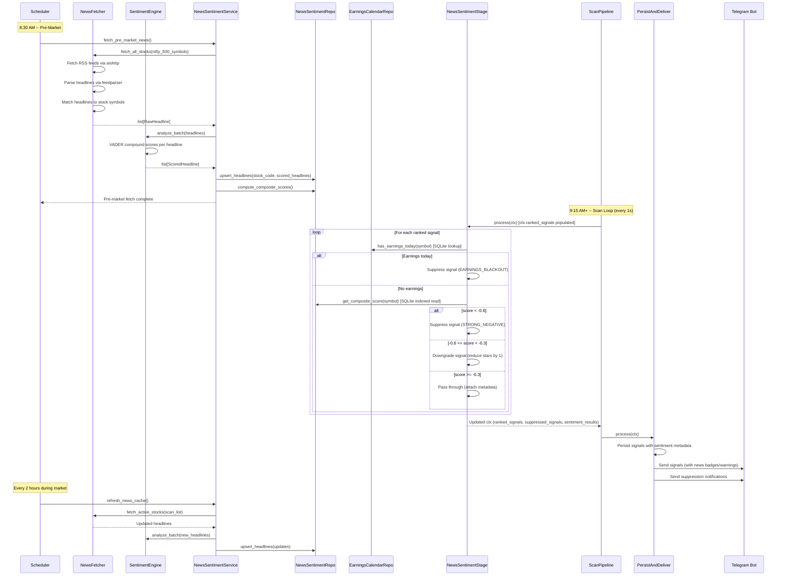
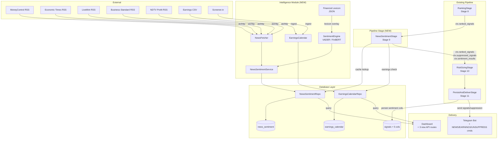

# SignalPilot Phase 4: News Sentiment Filter -- Technical Design Document

## Table of Contents

1. [Overview](#1-overview)
2. [Architecture](#2-architecture)
3. [Components and Interfaces](#3-components-and-interfaces)
4. [Data Models](#4-data-models)
5. [Database Design](#5-database-design)
6. [Configuration Management](#6-configuration-management)
7. [Error Handling](#7-error-handling)
8. [Testing Strategy](#8-testing-strategy)
9. [Key Technical Decisions](#9-key-technical-decisions)

---

## 1. Overview

### 1.1 Purpose

The News Sentiment Filter adds a pre-delivery intelligence layer to SignalPilot that checks recent news sentiment for each ranked signal before it reaches the user. Currently, SignalPilot's three strategies (Gap & Go, ORB, VWAP Reversal) are purely technical -- they analyze price, volume, and VWAP patterns but are blind to fundamental and news-driven events. This creates dangerous scenarios where the system generates buy signals on stocks undergoing SEBI investigations, fraud allegations, earnings misses, or other material negative events.

The filter integrates as a single new pipeline stage (`NewsSentimentStage`) between `RankingStage` (stage 8) and `RiskSizingStage` (stage 9), ensuring that capital is never allocated to signals that will be blocked, and that sentiment metadata is available for persistence and formatting.

This design document specifies all technical changes required to implement the News Sentiment Filter, building on the Phase 1-4 architecture documented in previous design documents.

### 1.2 Design Goals

- **Scan loop safety**: All news fetching and sentiment inference happen outside the 1-second scan loop. The pipeline stage performs only fast SQLite cache lookups (<10ms per signal cycle), never network I/O.
- **Backward compatibility**: All existing signal generation, ranking, risk sizing, and delivery behavior remains unchanged when the feature is disabled via the `news_enabled` kill switch.
- **Extensibility**: The sentiment engine is abstracted behind a common interface, allowing VADER and FinBERT to be swapped via configuration without code changes.
- **Minimal disruption**: The feature adds one new pipeline stage, two new database tables, five new nullable columns on the signals table, and six new components under `backend/signalpilot/intelligence/`. No existing stage constructors or argument lists are modified.
- **Consistency**: All new code follows established patterns: repository pattern, dependency injection via `create_app()`, async-first, IST timezone via `datetime.now(IST)`, structured logging with `contextvars`.

### 1.3 Key Architectural Decisions Summary

| Decision | Choice | Rationale | Requirements |
|----------|--------|-----------|-------------|
| Pipeline stage placement | After RankingStage (8), before RiskSizingStage (9) | Capital should not be allocated to signals that will be blocked. Sentiment metadata must be available before persistence. | REQ-NSF-014 |
| Sentiment engine default | VADER with financial lexicon overlay | VADER is <1MB, requires no GPU, runs in <1ms per headline. FinBERT (~420MB) is optional for higher accuracy. | REQ-NSF-005, REQ-NSF-006 |
| Cache-only pipeline reads | SQLite indexed lookups in pipeline; all fetching in scheduler jobs | The 1-second scan loop cannot tolerate network I/O. Pre-market fetch at 8:30 AM and 2-hour refresh ensure cache is warm. | REQ-NSF-028, REQ-NSF-026 |
| Composite scoring formula | Recency-weighted average of per-headline compound scores | Recent headlines should have more influence. Exponential decay with half-life of 6 hours balances freshness vs. stability. | REQ-NSF-009 |
| Five sentiment labels | STRONG_NEGATIVE, MILD_NEGATIVE, NEUTRAL, POSITIVE, NO_NEWS | Maps directly to three pipeline actions (suppress, downgrade, pass-through) with clear threshold boundaries. | REQ-NSF-009 |
| News source strategy | RSS feeds from five Tier 1 Indian financial news sites | Free, no API keys required, comprehensive coverage of NSE stocks. Parsed via `feedparser` with `aiohttp` for async fetch. | REQ-NSF-001 |
| Earnings blackout priority | Earnings day suppression overrides all sentiment labels | Earnings volatility is unpredictable regardless of news sentiment. Safety-first approach. | REQ-NSF-037 |
| Feature kill switch | Single `news_enabled` boolean in AppConfig | Allows instant feature deactivation without code changes. Pipeline stage returns context unchanged when disabled. | REQ-NSF-041 |
| New module location | `backend/signalpilot/intelligence/` | Keeps news sentiment isolated from existing strategy, pipeline, and data modules. Clean separation of concerns. | REQ-NSF-014 |

### 1.4 Signal Action Matrix

| Sentiment Label | Composite Score Range | Pipeline Action | Star Rating Change | Telegram Display |
|---|---|---|---|---|
| STRONG_NEGATIVE | score < -0.6 | Suppress (remove from ranked_signals) | N/A (signal removed) | Suppression notification |
| MILD_NEGATIVE | -0.6 <= score < -0.3 | Downgrade (reduce stars by 1) | -1 star (min 1) | Warning block + headline |
| NEUTRAL | -0.3 <= score <= 0.3 | Pass through | No change | No change |
| POSITIVE | score > 0.3 | Pass through | No change | Positive badge |
| NO_NEWS | No cached data | Pass through | No change | "No recent news" note |
| EARNINGS_BLACKOUT | N/A (earnings today) | Suppress (highest priority) | N/A (signal removed) | Suppression notification |

---

## 2. Architecture

### 2.1 High-Level Architecture

```
+------------------------------------------------------------------------+
|                    SignalPilot -- News Sentiment Filter                  |
|                       (Single Python Process)                           |
+------------------------------------------------------------------------+
|                                                                         |
|  Existing Pipeline (11 signal stages + 1 always stage)                  |
|  +------------------------------------------------------------------+  |
|  | 1. CircuitBreakerGate  7. AdaptiveFilter                         |  |
|  | 2. StrategyEval        8. Ranking                                |  |
|  | 3. GapStockMarking     *9. NewsSentiment* <-- NEW (cache lookup)  |  |
|  | 4. Deduplication       10. RiskSizing                            |  |
|  | 5. Confidence          11. PersistAndDeliver (enhanced)           |  |
|  | 6. CompositeScoring    12. Diagnostic                            |  |
|  +------------------------------------------------------------------+  |
|                                                                         |
|  New Intelligence Module                                                |
|  +------------------------------------------------------------------+  |
|  | NewsFetcher          | RSS feed fetching via aiohttp + feedparser |  |
|  | SentimentEngine      | VADER (default) or FinBERT analysis       |  |
|  | NewsSentimentService | Orchestrates fetch + analyze + cache       |  |
|  | EarningsCalendar     | Earnings date ingestion + blackout check   |  |
|  +------------------------------------------------------------------+  |
|                                                                         |
|  New Database Layer                                                     |
|  +------------------------------------------------------------------+  |
|  | news_sentiment table | Cached headline-level sentiment data      |  |
|  | earnings_calendar    | Upcoming earnings dates for Nifty 500     |  |
|  | signals table        | +5 nullable columns for sentiment meta    |  |
|  | NewsSentimentRepo    | CRUD for news_sentiment table             |  |
|  | EarningsCalendarRepo | CRUD for earnings_calendar table          |  |
|  +------------------------------------------------------------------+  |
|                                                                         |
|  Scheduler Jobs (outside scan loop)                                     |
|  +------------------------------------------------------------------+  |
|  | 8:30 AM  | Pre-market bulk news fetch + sentiment analysis       |  |
|  | Every 2h | Cache refresh during market hours                     |  |
|  | 15:30    | Cache purge (entries > 48 hours old)                   |  |
|  | Sunday   | Weekly earnings calendar refresh                      |  |
|  +------------------------------------------------------------------+  |
|                                                                         |
+------------------------------------------------------------------------+
```

### 2.2 Data Flow -- News Sentiment Pipeline Integration



### 2.3 Component Interaction Diagram



### 2.4 Updated Pipeline Stage Order

The News Sentiment Filter introduces one new stage (stage 9) and shifts subsequent stages by one position:

| # | Stage | Change |
|---|-------|--------|
| 1 | CircuitBreakerGateStage | Unchanged |
| 2 | StrategyEvalStage | Unchanged |
| 3 | GapStockMarkingStage | Unchanged |
| 4 | DeduplicationStage | Unchanged |
| 5 | ConfidenceStage | Unchanged |
| 6 | CompositeScoringStage | Unchanged |
| 7 | AdaptiveFilterStage | Unchanged |
| 8 | RankingStage | Unchanged |
| **9** | **NewsSentimentStage** | **NEW** |
| 10 | RiskSizingStage | Was stage 9 |
| 11 | PersistAndDeliverStage | Was stage 10 (enhanced) |
| 12 | DiagnosticStage | Was stage 11 |

**Always stage** (unchanged): `ExitMonitoringStage`

---

## 3. Components and Interfaces

### 3.1 NewsFetcher (`backend/signalpilot/intelligence/news_fetcher.py`)

Responsible for fetching raw headlines from configured RSS feeds and matching them to stock symbols.

```python
@dataclass
class RawHeadline:
    """A single headline extracted from an RSS feed."""
    title: str
    source: str          # e.g., "MoneyControl", "Economic Times"
    published_at: datetime
    link: str
    stock_codes: list[str]  # matched stock symbols

class NewsFetcher:
    """Async RSS feed fetcher with stock symbol matching."""

    def __init__(self, config: AppConfig) -> None:
        self._feed_urls: list[str] = self._parse_feed_urls(config.news_rss_feeds)
        self._max_headlines_per_stock: int = config.news_max_headlines_per_stock
        self._lookback_hours: int = config.news_lookback_hours
        self._session: aiohttp.ClientSession | None = None
        self._symbol_index: dict[str, set[str]] = {}  # built from Nifty 500

    async def initialize(self, symbols: list[str]) -> None:
        """Build symbol matching index from Nifty 500 stock list.

        Creates a mapping from company name variants and stock codes to
        canonical symbols for headline-to-stock matching.
        """

    async def fetch_all_stocks(self) -> dict[str, list[RawHeadline]]:
        """Fetch headlines from all configured RSS feeds.

        Returns a dict mapping stock_code to matched headlines, capped at
        max_headlines_per_stock per symbol. Headlines older than
        lookback_hours are excluded.
        """

    async def fetch_stocks(self, symbols: list[str]) -> dict[str, list[RawHeadline]]:
        """Fetch headlines for a specific subset of stocks (used for cache refresh)."""

    async def close(self) -> None:
        """Close the aiohttp session."""

    def _parse_feed_urls(self, csv_urls: str) -> list[str]:
        """Parse comma-separated feed URLs from config, validating each."""

    async def _fetch_feed(self, url: str) -> list[RawHeadline]:
        """Fetch and parse a single RSS feed.

        Uses aiohttp to download the feed XML asynchronously, then passes
        the content to feedparser for parsing. Extracts title, source,
        published_at, and link from each entry.
        """

    def _match_headline_to_stocks(self, headline: str) -> list[str]:
        """Match a headline string to stock symbols via the symbol index.

        Performs case-insensitive substring matching against company names,
        stock codes, and common abbreviations.
        """
```

**Design rationale**: `aiohttp` is used for async HTTP fetching because the existing codebase is async-first. `feedparser` handles RSS/Atom parsing since it is the standard Python library for this purpose, supporting all common feed formats. The symbol matching index is built once at initialization from the Nifty 500 instrument list and performs O(1) lookups per company name variant.

**Default RSS feed URLs** (configurable via `NEWS_RSS_FEEDS` env var):
1. MoneyControl Latest News: `https://www.moneycontrol.com/rss/latestnews.xml`
2. Economic Times Markets: `https://economictimes.indiatimes.com/markets/rssfeeds/1977021501.cms`
3. LiveMint Companies: `https://www.livemint.com/rss/companies`
4. Business Standard Markets: `https://www.business-standard.com/rss/markets-106.rss`
5. NDTV Profit: `https://feeds.feedburner.com/ndtvprofit-latest`

### 3.2 SentimentEngine (Protocol + Implementations)

Located at `backend/signalpilot/intelligence/sentiment_engine.py`.

```python
@dataclass
class ScoredHeadline:
    """A headline with sentiment scores from the engine."""
    title: str
    source: str
    published_at: datetime
    positive_score: float   # 0.0 to 1.0
    negative_score: float   # 0.0 to 1.0
    neutral_score: float    # 0.0 to 1.0
    compound_score: float   # -1.0 to 1.0
    model_used: str         # "vader" or "finbert"


class SentimentEngine(Protocol):
    """Protocol for sentiment analysis backends."""

    @property
    def model_name(self) -> str: ...

    def analyze(self, text: str) -> ScoredHeadline: ...

    def analyze_batch(self, texts: list[str]) -> list[ScoredHeadline]: ...


class VADERSentimentEngine:
    """VADER-based sentiment engine with financial lexicon overlay.

    Uses vaderSentiment.SentimentIntensityAnalyzer with an optional
    financial lexicon file that overrides or extends VADER's default
    lexicon with domain-specific terms.
    """

    def __init__(self, lexicon_path: str | None = None) -> None:
        """Initialize VADER with optional financial lexicon.

        Parameters
        ----------
        lexicon_path:
            Path to a JSON file containing term-score mappings like
            {"SEBI probe": -3.5, "record revenue": 3.0, "fraud": -4.0}.
            If None or file not found, uses VADER's default lexicon.
        """
        self._analyzer = SentimentIntensityAnalyzer()
        if lexicon_path:
            self._load_financial_lexicon(lexicon_path)

    @property
    def model_name(self) -> str:
        return "vader"

    def analyze(self, text: str) -> ScoredHeadline:
        """Analyze a single headline.

        Uses VADER's polarity_scores() which returns neg, neu, pos, compound.
        The compound score ranges from -1 (most negative) to +1 (most positive).
        """

    def analyze_batch(self, texts: list[str]) -> list[ScoredHeadline]:
        """Analyze multiple headlines. VADER is fast enough for sequential processing."""

    def _load_financial_lexicon(self, path: str) -> None:
        """Load and merge financial lexicon into VADER's lexicon dict.

        VADER scores range from -4 to +4. The JSON file should use the same scale.
        Terms are merged via analyzer.lexicon.update().
        """


class FinBERTSentimentEngine:
    """FinBERT-based sentiment engine using ProsusAI/finbert.

    Requires ~420MB for model weights. Uses the transformers pipeline
    for inference. Recommended for offline analysis or higher accuracy needs.
    """

    def __init__(self) -> None:
        """Load the ProsusAI/finbert model and tokenizer."""
        from transformers import AutoModelForSequenceClassification, AutoTokenizer, pipeline
        self._classifier = pipeline(
            "sentiment-analysis",
            model="ProsusAI/finbert",
            tokenizer="ProsusAI/finbert",
        )

    @property
    def model_name(self) -> str:
        return "finbert"

    def analyze(self, text: str) -> ScoredHeadline:
        """Analyze a single headline using FinBERT.

        FinBERT returns labels: 'positive', 'negative', 'neutral' with scores.
        The compound score is computed as: positive_score - negative_score.
        """

    def analyze_batch(self, texts: list[str]) -> list[ScoredHeadline]:
        """Analyze multiple headlines in a single batch for GPU efficiency."""
```

**Design rationale**: The `SentimentEngine` protocol allows VADER and FinBERT to be swapped via the `sentiment_model` config parameter. VADER is the production default because it requires no model download, no GPU, and processes headlines in <1ms each. FinBERT is available for users who want higher accuracy and can accept the ~420MB model download and slower inference (~50ms per headline on CPU). VADER's `SentimentIntensityAnalyzer` produces a compound score from -1 to +1 that maps directly to the five-label classification system.

### 3.3 NewsSentimentService (`backend/signalpilot/intelligence/news_sentiment.py`)

Orchestrates news fetching, sentiment analysis, cache management, and composite scoring.

```python
class NewsSentimentService:
    """Central service orchestrating news sentiment operations.

    Coordinates NewsFetcher, SentimentEngine, and repository layer.
    Called by scheduler jobs (pre-market fetch, cache refresh) and
    provides query methods for the pipeline stage and Telegram commands.
    """

    def __init__(
        self,
        news_fetcher: NewsFetcher,
        sentiment_engine: SentimentEngine,
        news_sentiment_repo: NewsSentimentRepository,
        earnings_repo: EarningsCalendarRepository,
        config: AppConfig,
    ) -> None:
        self._fetcher = news_fetcher
        self._engine = sentiment_engine
        self._repo = news_sentiment_repo
        self._earnings_repo = earnings_repo
        self._config = config
        self._unsuppress_overrides: set[str] = set()  # session-scoped

    async def fetch_and_analyze_all(self) -> int:
        """Bulk fetch + analyze for all Nifty 500 stocks (pre-market job).

        Returns the number of headlines cached.
        """

    async def fetch_and_analyze_stocks(self, symbols: list[str]) -> int:
        """Fetch + analyze for a subset of stocks (cache refresh job).

        Returns the number of headlines cached.
        """

    async def get_sentiment_for_stock(
        self, stock_code: str, lookback_hours: int | None = None
    ) -> SentimentResult:
        """Query cached sentiment for a single stock.

        Used by the pipeline stage for fast lookups and by the NEWS command.
        Returns SentimentResult with composite score, label, and top headline.
        """

    async def get_sentiment_batch(
        self, symbols: list[str]
    ) -> dict[str, SentimentResult]:
        """Query cached sentiment for multiple stocks in one call.

        Used by the pipeline stage when processing ranked signals.
        """

    def add_unsuppress_override(self, stock_code: str) -> None:
        """Add a stock to the session-scoped unsuppress override list."""
        self._unsuppress_overrides.add(stock_code)

    def is_unsuppressed(self, stock_code: str) -> bool:
        """Check if a stock has an active unsuppress override."""
        return stock_code in self._unsuppress_overrides

    def clear_unsuppress_overrides(self) -> None:
        """Clear all unsuppress overrides (called at 15:30 IST)."""
        self._unsuppress_overrides.clear()

    async def purge_old_entries(self, older_than_hours: int = 48) -> int:
        """Purge expired cache entries. Returns count of deleted rows."""
        return await self._repo.purge_old_entries(older_than_hours)

    def _compute_composite_score(
        self, headlines: list[ScoredHeadline]
    ) -> tuple[float, str]:
        """Compute recency-weighted composite score and classify label.

        Formula:
            weight_i = exp(-lambda * age_hours_i)
            composite = sum(weight_i * compound_i) / sum(weight_i)

        Where lambda = ln(2) / half_life_hours (default half_life = 6 hours).

        Label classification:
            composite < strong_negative_threshold  -> "STRONG_NEGATIVE"
            composite < mild_negative_threshold     -> "MILD_NEGATIVE"
            composite > positive_threshold          -> "POSITIVE"
            otherwise                               -> "NEUTRAL"
        """

    def _classify_label(self, score: float) -> str:
        """Classify composite score into sentiment label using configured thresholds."""
        if score < self._config.strong_negative_threshold:
            return "STRONG_NEGATIVE"
        elif score < self._config.mild_negative_threshold:
            return "MILD_NEGATIVE"
        elif score > self._config.positive_threshold:
            return "POSITIVE"
        return "NEUTRAL"
```

### 3.4 NewsSentimentStage (`backend/signalpilot/pipeline/stages/news_sentiment.py`)

The new pipeline stage implementing the `PipelineStage` protocol.

```python
class NewsSentimentStage:
    """Pipeline stage that filters and annotates signals based on news sentiment.

    Reads from ctx.ranked_signals (set by RankingStage).
    Writes to ctx.ranked_signals (filtered), ctx.sentiment_results, ctx.suppressed_signals.

    All operations are cache-only SQLite reads -- no network I/O.
    """

    def __init__(
        self,
        news_sentiment_service: NewsSentimentService,
        earnings_repo: EarningsCalendarRepository,
        config: AppConfig,
    ) -> None:
        self._service = news_sentiment_service
        self._earnings_repo = earnings_repo
        self._config = config

    @property
    def name(self) -> str:
        return "NewsSentiment"

    async def process(self, ctx: ScanContext) -> ScanContext:
        """Process ranked signals through news sentiment filter.

        1. If news_enabled is False, return ctx unchanged (kill switch).
        2. If ctx.ranked_signals is empty, return immediately (zero overhead).
        3. For each ranked signal:
           a. Check earnings blackout (highest priority).
           b. Look up cached sentiment from NewsSentimentService.
           c. Apply action: suppress, downgrade, or pass through.
        4. Populate ctx.sentiment_results and ctx.suppressed_signals.
        """
        if not self._config.news_enabled:
            return ctx

        if not ctx.ranked_signals:
            return ctx

        symbols = [rs.candidate.symbol for rs in ctx.ranked_signals]
        sentiment_batch = await self._service.get_sentiment_batch(symbols)

        today = datetime.now(IST).date()
        filtered_signals: list[RankedSignal] = []
        suppressed_signals: list[SuppressedSignal] = []
        sentiment_results: dict[str, SentimentResult] = {}

        for ranked_signal in ctx.ranked_signals:
            symbol = ranked_signal.candidate.symbol

            # 1. Earnings blackout check (highest priority)
            if self._config.earnings_blackout_enabled:
                has_earnings = await self._earnings_repo.has_earnings_today(symbol)
                if has_earnings and not self._service.is_unsuppressed(symbol):
                    suppressed_signals.append(SuppressedSignal(
                        symbol=symbol,
                        strategy=ranked_signal.candidate.strategy_name,
                        original_stars=ranked_signal.signal_strength,
                        sentiment_score=0.0,
                        sentiment_label="EARNINGS_BLACKOUT",
                        top_headline=None,
                        reason="EARNINGS_BLACKOUT",
                        entry_price=ranked_signal.candidate.entry_price,
                        stop_loss=ranked_signal.candidate.stop_loss,
                        target_1=ranked_signal.candidate.target_1,
                    ))
                    sentiment_results[symbol] = SentimentResult(
                        score=0.0,
                        label="EARNINGS_BLACKOUT",
                        headline=None,
                        action="EARNINGS_BLACKOUT",
                        headline_count=0,
                        top_negative_headline=None,
                        model_used="n/a",
                    )
                    continue

            # 2. Sentiment evaluation
            result = sentiment_batch.get(symbol)
            if result is None:
                # Cache miss -- treat as NO_NEWS, pass through
                result = SentimentResult(
                    score=0.0, label="NO_NEWS", headline=None,
                    action="PASS", headline_count=0,
                    top_negative_headline=None,
                    model_used=self._config.sentiment_model,
                )

            # 3. Check unsuppress override
            if self._service.is_unsuppressed(symbol):
                result = SentimentResult(
                    score=result.score, label=result.label,
                    headline=result.headline,
                    action="UNSUPPRESSED", headline_count=result.headline_count,
                    top_negative_headline=result.top_negative_headline,
                    model_used=result.model_used,
                )
                filtered_signals.append(ranked_signal)
                sentiment_results[symbol] = result
                continue

            # 4. Apply action based on label
            if result.label == "STRONG_NEGATIVE":
                suppressed_signals.append(SuppressedSignal(
                    symbol=symbol,
                    strategy=ranked_signal.candidate.strategy_name,
                    original_stars=ranked_signal.signal_strength,
                    sentiment_score=result.score,
                    sentiment_label=result.label,
                    top_headline=result.top_negative_headline,
                    reason="SUPPRESSED",
                    entry_price=ranked_signal.candidate.entry_price,
                    stop_loss=ranked_signal.candidate.stop_loss,
                    target_1=ranked_signal.candidate.target_1,
                ))
                result = SentimentResult(
                    score=result.score, label=result.label,
                    headline=result.headline, action="SUPPRESSED",
                    headline_count=result.headline_count,
                    top_negative_headline=result.top_negative_headline,
                    model_used=result.model_used,
                )
            elif result.label == "MILD_NEGATIVE":
                # Downgrade star rating by 1 (min 1)
                original_stars = ranked_signal.signal_strength
                new_stars = max(1, original_stars - 1)
                ranked_signal = RankedSignal(
                    candidate=ranked_signal.candidate,
                    composite_score=ranked_signal.composite_score,
                    rank=ranked_signal.rank,
                    signal_strength=new_stars,
                )
                result = SentimentResult(
                    score=result.score, label=result.label,
                    headline=result.headline, action="DOWNGRADED",
                    headline_count=result.headline_count,
                    top_negative_headline=result.top_negative_headline,
                    model_used=result.model_used,
                )
                filtered_signals.append(ranked_signal)
            else:
                # NEUTRAL, POSITIVE, NO_NEWS -- pass through
                result = SentimentResult(
                    score=result.score, label=result.label,
                    headline=result.headline, action="PASS",
                    headline_count=result.headline_count,
                    top_negative_headline=result.top_negative_headline,
                    model_used=result.model_used,
                )
                filtered_signals.append(ranked_signal)

            sentiment_results[symbol] = result

        ctx.ranked_signals = filtered_signals
        ctx.suppressed_signals = suppressed_signals
        ctx.sentiment_results = sentiment_results

        logger.info(
            "NewsSentiment: %d passed, %d suppressed, %d total",
            len(filtered_signals),
            len(suppressed_signals),
            len(filtered_signals) + len(suppressed_signals),
        )

        return ctx
```

### 3.5 EarningsCalendar (`backend/signalpilot/intelligence/earnings.py`)

Manages earnings date ingestion from multiple sources.

```python
class EarningsCalendar:
    """Service for ingesting and managing earnings calendar data.

    Supports multiple ingestion sources:
    - Manual CSV file (primary, user-maintained)
    - Automated web scrape (Screener.in, secondary)
    """

    def __init__(
        self,
        earnings_repo: EarningsCalendarRepository,
        config: AppConfig,
    ) -> None:
        self._repo = earnings_repo
        self._config = config

    async def ingest_from_csv(self, csv_path: str) -> int:
        """Ingest earnings dates from a local CSV file.

        CSV format: stock_code,earnings_date,quarter,is_confirmed
        Example: TATAMOTORS,2026-03-15,Q3FY26,1

        Returns the number of entries upserted.
        """

    async def ingest_from_screener(self) -> int:
        """Scrape upcoming earnings dates from Screener.in.

        Returns the number of entries upserted.
        Uses aiohttp with rate limiting and error handling.
        """

    async def refresh(self) -> int:
        """Run all configured ingestion sources.

        Called by the weekly scheduler job. Returns total entries upserted.
        """
```

### 3.6 PersistAndDeliverStage Enhancement

The existing `PersistAndDeliverStage` is enhanced to persist sentiment metadata and send suppression notifications. The changes are additive -- no existing constructor parameters are modified.

```python
# In PersistAndDeliverStage._signal_to_record (enhanced)
# After existing record construction, attach sentiment metadata:
if ctx.sentiment_results and sym in ctx.sentiment_results:
    sentiment = ctx.sentiment_results[sym]
    record.news_sentiment_score = sentiment.score
    record.news_sentiment_label = sentiment.label
    record.news_top_headline = sentiment.top_negative_headline or sentiment.headline
    record.news_action = sentiment.action
    # Store original stars if signal was downgraded
    if sentiment.action == "DOWNGRADED":
        record.original_star_rating = signal.ranked_signal.signal_strength + 1

# After signal delivery, send suppression notifications:
if ctx.suppressed_signals:
    for suppressed in ctx.suppressed_signals:
        notification = format_suppression_notification(suppressed)
        await self._bot.send_alert(notification)
```

### 3.7 Telegram Commands

Three new commands are added following the existing `MessageHandler` registration pattern in `SignalPilotBot.start()`.

**NEWS Command** (`handle_news_command`):
```
User: NEWS TATAMOTORS

Bot Response:
NEWS SENTIMENT: TATAMOTORS
Score: -0.42 (MILD_NEGATIVE)
Headlines analyzed: 7
Model: VADER

Recent Headlines:
1. "Tata Motors Q3 profit drops 22% on EV transition costs" - MoneyControl (2h ago)
2. "Tata Motors JLR volumes decline in December quarter" - Economic Times (5h ago)
3. "Tata Motors EV market share slips to 63%" - LiveMint (8h ago)
```

**EARNINGS Command** (`handle_earnings_command`):
```
User: EARNINGS

Bot Response:
UPCOMING EARNINGS (Next 7 Days)

Mar 01 (Mon):
  INFY - Q3FY26 (Confirmed)
  TCS  - Q3FY26 (Confirmed)

Mar 03 (Wed):
  HDFCBANK - Q3FY26 (Tentative)

Mar 05 (Fri):
  RELIANCE - Q3FY26 (Confirmed)
```

**UNSUPPRESS Command** (`handle_unsuppress_command`):
```
User: UNSUPPRESS TATAMOTORS

Bot Response:
OVERRIDE ACTIVE: TATAMOTORS
The news filter is now bypassed for TATAMOTORS for this session.
Current sentiment: -0.42 (MILD_NEGATIVE)
WARNING: This stock has negative news sentiment. Use caution.
Override expires at 15:30 IST.
```

### 3.8 Dashboard API Routes (`backend/signalpilot/dashboard/routes/news.py`)

Three new API endpoints registered in `dashboard/app.py` under `/api/v1/news`.

```python
router = APIRouter()

@router.get("/{stock_code}")
async def get_stock_sentiment(
    stock_code: str,
    conn=Depends(get_read_conn),
) -> StockSentimentResponse:
    """Return sentiment analysis for a specific stock.

    Response includes composite score, label, headline count, model used,
    and a list of recent headlines with individual scores and timestamps.
    """

@router.get("/suppressed")
async def get_suppressed_signals(
    conn=Depends(get_read_conn),
    date: str | None = Query(None),
    limit: int = Query(50, ge=1, le=200),
) -> SuppressedSignalsResponse:
    """Return signals suppressed by news sentiment filter.

    Queries signals table where news_action is 'SUPPRESSED' or
    'EARNINGS_BLACKOUT', ordered by created_at descending.
    """

# Registered separately under /api/v1/earnings
earnings_router = APIRouter()

@earnings_router.get("/upcoming")
async def get_upcoming_earnings(
    conn=Depends(get_read_conn),
    days: int = Query(14, ge=1, le=90),
) -> UpcomingEarningsResponse:
    """Return earnings entries within the next N days."""
```

---

## 4. Data Models

### 4.1 New Dataclasses

All new dataclasses are added to `backend/signalpilot/db/models.py` following the existing pattern.

```python
# ---------------------------------------------------------------------------
# Phase 4: News Sentiment Filter
# ---------------------------------------------------------------------------

@dataclass
class SentimentResult:
    """Per-stock sentiment analysis result used in ScanContext."""
    score: float                    # Composite score: -1.0 to 1.0
    label: str                      # STRONG_NEGATIVE | MILD_NEGATIVE | NEUTRAL | POSITIVE | NO_NEWS
    headline: str | None            # Most recent headline (any sentiment)
    action: str                     # PASS | DOWNGRADED | SUPPRESSED | EARNINGS_BLACKOUT | UNSUPPRESSED
    headline_count: int             # Number of headlines analyzed
    top_negative_headline: str | None  # Most negative headline for display
    model_used: str                 # "vader" or "finbert"


@dataclass
class SuppressedSignal:
    """A signal removed by the news sentiment filter."""
    symbol: str
    strategy: str
    original_stars: int             # Star rating before suppression
    sentiment_score: float          # Composite score that triggered suppression
    sentiment_label: str            # STRONG_NEGATIVE | EARNINGS_BLACKOUT
    top_headline: str | None        # Triggering headline (if sentiment-based)
    reason: str                     # SUPPRESSED | EARNINGS_BLACKOUT
    entry_price: float              # Original signal entry price (for notification)
    stop_loss: float                # Original signal stop loss
    target_1: float                 # Original signal target 1


@dataclass
class NewsSentimentRecord:
    """Persistent record for the news_sentiment table."""
    id: int | None = None
    stock_code: str = ""
    headline: str = ""
    source: str = ""
    published_at: datetime | None = None
    positive_score: float = 0.0
    negative_score: float = 0.0
    neutral_score: float = 0.0
    composite_score: float = 0.0
    sentiment_label: str = "NEUTRAL"
    fetched_at: datetime | None = None
    model_used: str = "vader"


@dataclass
class EarningsCalendarRecord:
    """Persistent record for the earnings_calendar table."""
    id: int | None = None
    stock_code: str = ""
    earnings_date: date | None = None
    quarter: str = ""              # e.g., "Q3FY26"
    source: str = ""               # e.g., "manual_csv", "screener.in"
    is_confirmed: bool = False
    updated_at: datetime | None = None
```

### 4.2 ScanContext Extension

Two new optional fields are added to `ScanContext` with defaults that ensure zero behavioral change when the `NewsSentimentStage` is absent.

```python
@dataclass
class ScanContext:
    """Mutable bag of state passed through every pipeline stage."""

    # ... existing fields unchanged ...

    # Set by NewsSentimentStage (Phase 4: News Sentiment Filter)
    sentiment_results: dict[str, SentimentResult] = field(default_factory=dict)
    suppressed_signals: list[SuppressedSignal] = field(default_factory=list)
```

### 4.3 SignalRecord Extension

Five new nullable fields are added to `SignalRecord` to persist sentiment metadata.

```python
@dataclass
class SignalRecord:
    """Persistent record for the signals table."""

    # ... existing fields unchanged ...

    # Phase 4: News Sentiment Filter fields (all nullable)
    news_sentiment_score: float | None = None
    news_sentiment_label: str | None = None
    news_top_headline: str | None = None
    news_action: str | None = None            # PASS | DOWNGRADED | SUPPRESSED | EARNINGS_BLACKOUT | UNSUPPRESSED
    original_star_rating: int | None = None   # Set when signal is downgraded
```

### 4.4 Updated `__all__` Exports

```python
__all__ = [
    # ... existing exports ...
    # Phase 4: News Sentiment Filter
    "SentimentResult",
    "SuppressedSignal",
    "NewsSentimentRecord",
    "EarningsCalendarRecord",
]
```

---

## 5. Database Design

### 5.1 news_sentiment Table

Caches headline-level sentiment data. The pipeline stage reads this table for fast indexed lookups.

```sql
CREATE TABLE IF NOT EXISTS news_sentiment (
    id              INTEGER PRIMARY KEY AUTOINCREMENT,
    stock_code      TEXT     NOT NULL,
    headline        TEXT     NOT NULL,
    source          TEXT     NOT NULL,
    published_at    DATETIME NOT NULL,
    positive_score  REAL,
    negative_score  REAL,
    neutral_score   REAL,
    composite_score REAL,
    sentiment_label TEXT,
    fetched_at      DATETIME DEFAULT CURRENT_TIMESTAMP,
    model_used      TEXT     DEFAULT 'vader',
    UNIQUE(stock_code, headline, source)
);

CREATE INDEX IF NOT EXISTS idx_news_stock_date
    ON news_sentiment(stock_code, published_at);
CREATE INDEX IF NOT EXISTS idx_news_fetched_at
    ON news_sentiment(fetched_at);
```

**Column details**:
- `stock_code`: NSE symbol (e.g., "TATAMOTORS"). Indexed for pipeline lookups.
- `headline`: Full headline text. Part of the UNIQUE constraint to prevent duplicate inserts.
- `source`: RSS feed source name (e.g., "MoneyControl"). Part of the UNIQUE constraint.
- `published_at`: Original publication timestamp from the RSS feed. Indexed for lookback queries.
- `positive_score`, `negative_score`, `neutral_score`: Individual component scores from VADER/FinBERT (0.0 to 1.0).
- `composite_score`: VADER compound score or FinBERT-derived compound (-1.0 to 1.0).
- `sentiment_label`: Classified label (STRONG_NEGATIVE, MILD_NEGATIVE, NEUTRAL, POSITIVE).
- `fetched_at`: When the headline was fetched and cached. Used for cache purging.
- `model_used`: Which sentiment engine was used ("vader" or "finbert").

### 5.2 earnings_calendar Table

Stores upcoming earnings dates for Nifty 500 stocks for blackout detection.

```sql
CREATE TABLE IF NOT EXISTS earnings_calendar (
    id              INTEGER PRIMARY KEY AUTOINCREMENT,
    stock_code      TEXT     NOT NULL,
    earnings_date   DATE     NOT NULL,
    quarter         TEXT,
    source          TEXT,
    is_confirmed    BOOLEAN  DEFAULT 0,
    updated_at      DATETIME DEFAULT CURRENT_TIMESTAMP,
    UNIQUE(stock_code, earnings_date)
);

CREATE INDEX IF NOT EXISTS idx_earnings_date
    ON earnings_calendar(earnings_date);
CREATE INDEX IF NOT EXISTS idx_earnings_stock_date
    ON earnings_calendar(stock_code, earnings_date);
```

### 5.3 signals Table Column Additions

Five new nullable columns are added via idempotent migration:

```sql
ALTER TABLE signals ADD COLUMN news_sentiment_score REAL;
ALTER TABLE signals ADD COLUMN news_sentiment_label TEXT;
ALTER TABLE signals ADD COLUMN news_top_headline TEXT;
ALTER TABLE signals ADD COLUMN news_action TEXT;
ALTER TABLE signals ADD COLUMN original_star_rating INTEGER;
```

### 5.4 Migration Implementation

The migration follows the established Phase 2/3/4 pattern using `PRAGMA table_info()` checks.

```python
async def _run_news_sentiment_migration(self) -> None:
    """Phase 4 News Sentiment idempotent migration.

    Creates news_sentiment and earnings_calendar tables.
    Adds five nullable columns to the signals table.
    Uses PRAGMA table_info() check-before-alter pattern.
    """
    conn = self.connection

    async def _has_column(table: str, column: str) -> bool:
        cursor = await conn.execute(f"PRAGMA table_info({table})")
        rows = await cursor.fetchall()
        return any(row["name"] == column for row in rows)

    # -- New tables --
    await conn.executescript("""
        CREATE TABLE IF NOT EXISTS news_sentiment (
            id              INTEGER PRIMARY KEY AUTOINCREMENT,
            stock_code      TEXT     NOT NULL,
            headline        TEXT     NOT NULL,
            source          TEXT     NOT NULL,
            published_at    DATETIME NOT NULL,
            positive_score  REAL,
            negative_score  REAL,
            neutral_score   REAL,
            composite_score REAL,
            sentiment_label TEXT,
            fetched_at      DATETIME DEFAULT CURRENT_TIMESTAMP,
            model_used      TEXT     DEFAULT 'vader',
            UNIQUE(stock_code, headline, source)
        );

        CREATE INDEX IF NOT EXISTS idx_news_stock_date
            ON news_sentiment(stock_code, published_at);
        CREATE INDEX IF NOT EXISTS idx_news_fetched_at
            ON news_sentiment(fetched_at);

        CREATE TABLE IF NOT EXISTS earnings_calendar (
            id              INTEGER PRIMARY KEY AUTOINCREMENT,
            stock_code      TEXT     NOT NULL,
            earnings_date   DATE     NOT NULL,
            quarter         TEXT,
            source          TEXT,
            is_confirmed    BOOLEAN  DEFAULT 0,
            updated_at      DATETIME DEFAULT CURRENT_TIMESTAMP,
            UNIQUE(stock_code, earnings_date)
        );

        CREATE INDEX IF NOT EXISTS idx_earnings_date
            ON earnings_calendar(earnings_date);
        CREATE INDEX IF NOT EXISTS idx_earnings_stock_date
            ON earnings_calendar(stock_code, earnings_date);
    """)

    # -- Extend signals table --
    new_columns = [
        ("news_sentiment_score", "REAL"),
        ("news_sentiment_label", "TEXT"),
        ("news_top_headline", "TEXT"),
        ("news_action", "TEXT"),
        ("original_star_rating", "INTEGER"),
    ]
    for col_name, col_type in new_columns:
        if not await _has_column("signals", col_name):
            await conn.execute(
                f"ALTER TABLE signals ADD COLUMN {col_name} {col_type}"
            )

    await conn.commit()
    logger.info("News sentiment migration complete")
```

The migration is called from `DatabaseManager._create_tables()`:
```python
async def _create_tables(self) -> None:
    await self.connection.executescript(SCHEMA_SQL)
    await self.connection.commit()
    await self._run_phase2_migration()
    await self._run_phase3_migration()
    await self._run_phase4_migration()
    await self._run_news_sentiment_migration()  # NEW
```

### 5.5 NewsSentimentRepository (`backend/signalpilot/db/news_sentiment_repo.py`)

```python
class NewsSentimentRepository:
    """CRUD operations for the news_sentiment table."""

    def __init__(self, connection: aiosqlite.Connection) -> None:
        self._conn = connection

    async def upsert_headlines(
        self, stock_code: str, headlines: list[NewsSentimentRecord]
    ) -> int:
        """Insert or replace headline sentiment records.

        Uses (stock_code, headline, source) as the conflict key.
        Returns the number of rows upserted.
        """

    async def get_stock_sentiment(
        self, stock_code: str, lookback_hours: int = 24
    ) -> list[NewsSentimentRecord]:
        """Return cached headlines for a stock within the lookback window.

        Ordered by published_at descending. Uses the idx_news_stock_date
        index for fast lookups.
        """

    async def get_composite_score(
        self, stock_code: str, lookback_hours: int = 24
    ) -> tuple[float, str, int] | None:
        """Return (composite_score, label, headline_count) for a stock.

        Computes the recency-weighted average of compound scores from
        cached headlines within the lookback window. Returns None if
        no headlines are cached (NO_NEWS case).
        """

    async def get_top_negative_headline(
        self, stock_code: str, lookback_hours: int = 24
    ) -> str | None:
        """Return the headline with the lowest composite_score within the lookback window."""

    async def purge_old_entries(self, older_than_hours: int = 48) -> int:
        """Delete entries where fetched_at is older than the threshold.

        Returns the number of rows deleted.
        """

    async def get_all_stock_sentiments(
        self, lookback_hours: int = 24
    ) -> dict[str, tuple[float, str, int]]:
        """Return sentiment summary for all stocks in cache.

        Used by the NEWS ALL command. Returns {stock_code: (score, label, count)}.
        """

    @staticmethod
    def _row_to_record(row: aiosqlite.Row) -> NewsSentimentRecord:
        """Convert a database row to a NewsSentimentRecord."""
```

### 5.6 EarningsCalendarRepository (`backend/signalpilot/db/earnings_repo.py`)

```python
class EarningsCalendarRepository:
    """CRUD operations for the earnings_calendar table."""

    def __init__(self, connection: aiosqlite.Connection) -> None:
        self._conn = connection

    async def has_earnings_today(self, stock_code: str) -> bool:
        """Check if a stock has earnings today (IST date).

        Uses datetime.now(IST).date() for comparison.
        """

    async def get_upcoming_earnings(
        self, days_ahead: int = 7
    ) -> list[EarningsCalendarRecord]:
        """Return all earnings entries within the next N days.

        Ordered by earnings_date ascending.
        """

    async def upsert_earnings(
        self,
        stock_code: str,
        earnings_date: date,
        quarter: str = "",
        source: str = "",
        is_confirmed: bool = False,
    ) -> None:
        """Insert or update an earnings entry.

        Uses (stock_code, earnings_date) as the conflict key.
        Sets updated_at to datetime.now(IST).
        """

    async def get_today_earnings_stocks(self) -> list[str]:
        """Return all stock codes with earnings today.

        Used by the pipeline stage for batch checking.
        """

    @staticmethod
    def _row_to_record(row: aiosqlite.Row) -> EarningsCalendarRecord:
        """Convert a database row to an EarningsCalendarRecord."""
```

---

## 6. Configuration Management

### 6.1 AppConfig Extensions

The following fields are added to `AppConfig` in `backend/signalpilot/config.py`:

```python
class AppConfig(BaseSettings):
    # ... existing fields ...

    # Phase 4: News Sentiment Filter
    news_enabled: bool = Field(
        default=True,
        description="Feature kill switch for news sentiment filter",
    )
    sentiment_model: str = Field(
        default="vader",
        description="Sentiment engine: 'vader' (default, <1MB) or 'finbert' (~420MB)",
    )
    news_lookback_hours: int = Field(
        default=24,
        description="How far back to fetch headlines (hours)",
    )
    news_cache_ttl_hours: int = Field(
        default=2,
        description="Cache refresh interval (hours)",
    )
    strong_negative_threshold: float = Field(
        default=-0.6,
        description="Composite score below which signals are suppressed",
    )
    mild_negative_threshold: float = Field(
        default=-0.3,
        description="Composite score below which signals are downgraded",
    )
    positive_threshold: float = Field(
        default=0.3,
        description="Composite score above which positive badge is shown",
    )
    earnings_blackout_enabled: bool = Field(
        default=True,
        description="Enable earnings day signal suppression",
    )
    news_pre_market_fetch_time: str = Field(
        default="08:30",
        description="Cron time for pre-market news fetch (HH:MM IST)",
    )
    news_max_headlines_per_stock: int = Field(
        default=10,
        description="Cap headlines per stock to limit inference cost",
    )
    news_rss_feeds: str = Field(
        default=(
            "https://www.moneycontrol.com/rss/latestnews.xml,"
            "https://economictimes.indiatimes.com/markets/rssfeeds/1977021501.cms,"
            "https://www.livemint.com/rss/companies,"
            "https://www.business-standard.com/rss/markets-106.rss,"
            "https://feeds.feedburner.com/ndtvprofit-latest"
        ),
        description="Comma-separated RSS feed URLs",
    )
    news_financial_lexicon_path: str = Field(
        default="signalpilot/intelligence/financial_lexicon.json",
        description="Path to VADER financial lexicon overlay JSON",
    )
    news_earnings_csv_path: str = Field(
        default="data/earnings_calendar.csv",
        description="Path to manually maintained earnings calendar CSV",
    )
```

### 6.2 .env Example Additions

```env
# News Sentiment Filter
NEWS_ENABLED=true
SENTIMENT_MODEL=vader
NEWS_LOOKBACK_HOURS=24
NEWS_CACHE_TTL_HOURS=2
STRONG_NEGATIVE_THRESHOLD=-0.6
MILD_NEGATIVE_THRESHOLD=-0.3
POSITIVE_THRESHOLD=0.3
EARNINGS_BLACKOUT_ENABLED=true
NEWS_PRE_MARKET_FETCH_TIME=08:30
NEWS_MAX_HEADLINES_PER_STOCK=10
NEWS_RSS_FEEDS=https://www.moneycontrol.com/rss/latestnews.xml,https://economictimes.indiatimes.com/markets/rssfeeds/1977021501.cms,https://www.livemint.com/rss/companies,https://www.business-standard.com/rss/markets-106.rss,https://feeds.feedburner.com/ndtvprofit-latest
NEWS_FINANCIAL_LEXICON_PATH=signalpilot/intelligence/financial_lexicon.json
NEWS_EARNINGS_CSV_PATH=data/earnings_calendar.csv
```

### 6.3 Financial Lexicon File

Located at `backend/signalpilot/intelligence/financial_lexicon.json`:

```json
{
    "SEBI probe": -3.5,
    "SEBI investigation": -3.5,
    "SEBI order": -2.5,
    "SEBI penalty": -3.0,
    "fraud": -4.0,
    "scam": -4.0,
    "default": -3.5,
    "downgrade": -2.5,
    "downgraded": -2.5,
    "earnings miss": -3.0,
    "profit warning": -3.0,
    "revenue miss": -2.5,
    "guidance cut": -2.5,
    "layoffs": -2.0,
    "delisting": -3.5,
    "bankruptcy": -4.0,
    "insolvency": -3.5,
    "promoter pledge": -2.5,
    "promoter selling": -2.0,
    "FII selling": -1.5,
    "block deal sell": -1.5,
    "management exit": -2.0,
    "CFO resignation": -2.5,
    "CEO resignation": -2.5,
    "audit concern": -3.0,
    "qualified opinion": -3.0,
    "record revenue": 3.0,
    "earnings beat": 3.0,
    "profit surge": 3.0,
    "upgrade": 2.5,
    "upgraded": 2.5,
    "buyback": 2.0,
    "dividend": 1.5,
    "special dividend": 2.5,
    "order win": 2.5,
    "contract win": 2.5,
    "FII buying": 1.5,
    "block deal buy": 1.5,
    "promoter buying": 2.0,
    "market share gain": 2.0,
    "expansion": 1.5,
    "acquisition": 1.0,
    "partnership": 1.0,
    "guidance raise": 2.5
}
```

### 6.4 Scheduler Job Configuration

Two new scheduler jobs and one enhancement are added to `MarketScheduler.configure_jobs()`:

```python
# Pre-market news fetch at 8:30 AM IST
("pre_market_news", 8, 30, app.fetch_pre_market_news),

# Cache refresh at 11:15 and 13:15 (every 2 hours during market)
("news_cache_refresh_1", 11, 15, app.refresh_news_cache),
("news_cache_refresh_2", 13, 15, app.refresh_news_cache),

# Enhanced daily summary job (15:30) now also purges old cache entries
# (integrated into existing send_daily_summary method)

# Weekly earnings calendar refresh (piggybacked on Sunday 18:00 rebalance)
# (integrated into existing run_weekly_rebalance method)
```

---

## 7. Error Handling

### 7.1 RSS Feed Fetch Failures

| Failure | Handling | Rationale |
|---------|----------|-----------|
| Single RSS feed timeout (>10s) | Log warning, skip feed, continue with remaining feeds | One unreachable feed should not block the entire fetch cycle |
| All RSS feeds fail | Log error, proceed with `NO_NEWS` defaults for all stocks | Never block market open or signal generation |
| Feed returns malformed XML | `feedparser` handles gracefully; log warning per malformed entry | `feedparser` is tolerant of common RSS formatting issues |
| Network connectivity lost | `aiohttp.ClientError` caught, logged, cached data retained | Stale cache is better than no cache |
| Pre-market fetch job timeout (>5min) | Log error, set all stocks to `NO_NEWS` | Pre-market job must complete before 9:15 AM |

### 7.2 Sentiment Engine Failures

| Failure | Handling | Rationale |
|---------|----------|-----------|
| VADER analysis raises exception | Catch per-headline, log warning, skip headline | Individual headline failure should not block batch |
| FinBERT model load fails | Catch `ImportError`/`OSError`, fall back to VADER, log error | System must remain operational without FinBERT |
| FinBERT inference OOM | Catch `RuntimeError`, fall back to VADER for session, log critical | GPU/memory issues should not crash the process |
| Financial lexicon file missing | Log warning, use default VADER lexicon | Overlay is optional enhancement |
| Financial lexicon file malformed JSON | Log warning, use default VADER lexicon | Invalid overlay should not prevent initialization |

### 7.3 Pipeline Stage Failures

| Failure | Handling | Rationale |
|---------|----------|-----------|
| `NewsSentimentStage.process()` raises | Caught by `ScanPipeline.run()` existing error handling; signals pass through unfiltered | Pipeline robustness must not be compromised |
| SQLite read error in cache lookup | Log error, treat as `NO_NEWS` for affected symbols | Database transient errors should not block signals |
| Cache miss for a symbol | Treat as `NO_NEWS`, pass through, queue background re-fetch | Cache misses are expected for newly listed or rarely mentioned stocks |

### 7.4 Earnings Calendar Failures

| Failure | Handling | Rationale |
|---------|----------|-----------|
| CSV file missing or unreadable | Log warning, skip CSV ingestion | Manual CSV is optional |
| Screener.in scrape fails | Log warning, retain existing calendar data | Web scrape is a secondary source |
| `has_earnings_today()` SQLite error | Log error, return `False` (allow signal through) | False negatives are safer than false positives for earnings check |

### 7.5 Graceful Degradation Hierarchy

When the news sentiment system encounters failures, it degrades gracefully in this order:

1. **Full functionality**: Cache is warm, sentiment engine works, all actions applied.
2. **Stale cache**: RSS fetch failed, but cached data from last fetch is still valid (within `news_cache_ttl_hours`). Scores computed from stale data.
3. **Partial cache**: Some stocks have cached data, others do not. Cache misses treated as `NO_NEWS`.
4. **No cache**: All fetches failed, no cached data. All stocks treated as `NO_NEWS`. Pipeline passes signals through unchanged.
5. **Feature disabled**: `news_enabled=False`. Pipeline stage is a no-op. Zero overhead.

---

## 8. Testing Strategy

### 8.1 Test File Organization

```
backend/tests/
  test_intelligence/           # NEW test directory
    __init__.py
    test_news_fetcher.py       # NewsFetcher unit tests
    test_sentiment_engine.py   # VADER/FinBERT engine tests
    test_news_sentiment.py     # NewsSentimentService tests
    test_earnings.py           # EarningsCalendar tests
  test_db/
    test_news_sentiment_repo.py  # NEW: NewsSentimentRepository tests
    test_earnings_repo.py        # NEW: EarningsCalendarRepository tests
  test_pipeline/
    test_news_sentiment_stage.py # NEW: NewsSentimentStage tests
  test_telegram/
    test_news_commands.py        # NEW: NEWS/EARNINGS/UNSUPPRESS command tests
    test_formatters_news.py      # NEW: Formatter enhancement tests
  test_integration/
    test_news_pipeline.py        # NEW: End-to-end pipeline tests
```

### 8.2 Unit Test Coverage

**NewsFetcher Tests** (`test_news_fetcher.py`):
- RSS feed parsing with valid XML produces correct `RawHeadline` objects
- Malformed RSS XML is handled gracefully (no crash, warning logged)
- Headline-to-stock matching correctly identifies company names and stock codes
- Headlines older than `lookback_hours` are excluded
- Maximum headlines per stock cap is enforced
- Feed URL validation rejects malformed URLs at initialization
- aiohttp timeout handling (mock `ClientTimeout` exception)
- Empty feed response returns empty dict

**SentimentEngine Tests** (`test_sentiment_engine.py`):
- VADER produces compound score for positive financial headline (score > 0)
- VADER produces compound score for negative financial headline (score < 0)
- VADER produces compound score for neutral financial headline (score near 0)
- VADER with financial lexicon overlay produces stronger scores for domain terms
- VADER with missing lexicon file falls back to default lexicon
- VADER with malformed lexicon JSON falls back to default lexicon
- FinBERT mock returns correct label mapping (positive, negative, neutral)
- `SentimentEngine` protocol is satisfied by both implementations
- Batch analysis returns correct number of results

**NewsSentimentService Tests** (`test_news_sentiment.py`):
- `fetch_and_analyze_all()` fetches from all feeds and caches results
- `get_sentiment_for_stock()` returns correct `SentimentResult` from cache
- `get_sentiment_for_stock()` returns `NO_NEWS` result for unknown stock
- Composite score computation with recency weighting (6-hour half-life)
- Label classification for all five labels at threshold boundaries
- Unsuppress override list management (add, check, clear)
- Cache purge deletes entries older than threshold
- Batch sentiment query returns results for all requested symbols

**EarningsCalendar Tests** (`test_earnings.py`):
- CSV ingestion parses correct format and upserts records
- CSV ingestion handles missing file gracefully
- `refresh()` calls all configured ingestion sources

**NewsSentimentRepository Tests** (`test_news_sentiment_repo.py`):
- `upsert_headlines()` inserts new records and updates existing ones (conflict key)
- `get_stock_sentiment()` returns headlines within lookback window, ordered by date
- `get_stock_sentiment()` excludes headlines outside lookback window
- `get_composite_score()` returns correct weighted average
- `get_composite_score()` returns None for unknown stock
- `purge_old_entries()` deletes correct rows and returns count
- `get_all_stock_sentiments()` returns summary for all cached stocks

**EarningsCalendarRepository Tests** (`test_earnings_repo.py`):
- `has_earnings_today()` returns True for stocks with today's date
- `has_earnings_today()` returns False for stocks without today's date
- `get_upcoming_earnings()` returns entries within the specified day range
- `upsert_earnings()` inserts new entries and updates existing ones (conflict key)
- `get_today_earnings_stocks()` returns all stock codes with earnings today
- All date comparisons use `datetime.now(IST).date()`

### 8.3 Pipeline Stage Tests

**NewsSentimentStage Tests** (`test_news_sentiment_stage.py`):
- **Kill switch**: When `news_enabled=False`, stage returns context unchanged
- **Empty signals**: When `ctx.ranked_signals` is empty, stage returns immediately
- **Suppression (STRONG_NEGATIVE)**: Signal with score < -0.6 is removed from `ctx.ranked_signals` and added to `ctx.suppressed_signals`
- **Suppression (EARNINGS_BLACKOUT)**: Signal for stock with earnings today is removed regardless of sentiment score
- **Earnings priority**: Earnings blackout takes precedence over positive sentiment
- **Downgrade (MILD_NEGATIVE)**: Signal with -0.6 <= score < -0.3 has `signal_strength` reduced by 1
- **Downgrade minimum**: Signal already at 1 star stays at 1 star when downgraded
- **Pass-through (NEUTRAL)**: Signal with -0.3 <= score <= 0.3 passes unchanged
- **Pass-through (POSITIVE)**: Signal with score > 0.3 passes unchanged with action "PASS"
- **Pass-through (NO_NEWS)**: Cache miss produces NO_NEWS label and PASS action
- **Unsuppress override**: Stock on override list passes through regardless of negative sentiment, with action "UNSUPPRESSED"
- **Multiple signals**: Mix of suppress, downgrade, and pass-through in single batch
- **Sentiment results populated**: `ctx.sentiment_results` contains entry for every processed symbol
- **Suppressed signals list**: `ctx.suppressed_signals` contains correct entries

### 8.4 Integration Tests

**End-to-End Pipeline Tests** (`test_news_pipeline.py`):

These tests use the `make_app()` helper from `tests/test_integration/conftest.py` with mock external dependencies.

1. **Full suppress flow**: Ranked signal -> STRONG_NEGATIVE sentiment in cache -> signal suppressed -> suppression notification sent via Telegram -> signals table has `news_action="SUPPRESSED"`, `news_sentiment_score`, `news_sentiment_label`, `news_top_headline`

2. **Full downgrade flow**: Ranked signal -> MILD_NEGATIVE sentiment in cache -> signal star rating reduced by 1 -> signal delivered with warning block -> signals table has `news_action="DOWNGRADED"`, `original_star_rating` set to original value

3. **Full pass-through flow**: Ranked signal -> POSITIVE sentiment in cache -> signal delivered with positive badge -> signals table has `news_action="PASS"`, `news_sentiment_label="POSITIVE"`

4. **Earnings blackout flow**: Ranked signal -> stock has earnings today -> signal suppressed regardless of sentiment -> signals table has `news_action="EARNINGS_BLACKOUT"`

5. **Cache miss flow**: Ranked signal -> no cached data -> signal passes through as NO_NEWS -> signals table has `news_action="PASS"`, `news_sentiment_label=None`

6. **Feature disabled flow**: `news_enabled=False` -> no sentiment processing -> signal passes through unchanged -> all news columns are None

### 8.5 Formatter Tests

**Formatter Enhancement Tests** (`test_formatters_news.py`):
- Downgraded signal includes warning block with headline and original star rating
- Positive sentiment signal includes positive badge
- NO_NEWS signal includes "No recent news" note
- Suppression notification format includes all required fields
- Existing format unchanged when `news_sentiment_label` is None

### 8.6 Command Tests

**Telegram Command Tests** (`test_news_commands.py`):
- NEWS command with valid stock code returns sentiment details
- NEWS ALL returns summary table sorted by score
- NEWS with unrecognized stock code returns helpful error
- EARNINGS command returns formatted upcoming earnings list
- EARNINGS with no upcoming data returns informational message
- UNSUPPRESS command adds stock to override list and confirms
- UNSUPPRESS command includes sentiment warning in confirmation

### 8.7 Test Fixtures

New fixtures added to `backend/tests/conftest.py`:

```python
@pytest.fixture
def sample_sentiment_result() -> SentimentResult:
    return SentimentResult(
        score=-0.45,
        label="MILD_NEGATIVE",
        headline="Company Q3 profit drops 15%",
        action="DOWNGRADED",
        headline_count=5,
        top_negative_headline="Company Q3 profit drops 15%",
        model_used="vader",
    )

@pytest.fixture
def sample_suppressed_signal() -> SuppressedSignal:
    return SuppressedSignal(
        symbol="TATAMOTORS",
        strategy="Gap & Go",
        original_stars=4,
        sentiment_score=-0.72,
        sentiment_label="STRONG_NEGATIVE",
        top_headline="SEBI orders probe into Tata Motors accounting",
        reason="SUPPRESSED",
        entry_price=850.0,
        stop_loss=825.0,
        target_1=893.0,
    )
```

---

## 9. Key Technical Decisions

### 9.1 Why VADER as Default Over FinBERT

| Factor | VADER | FinBERT |
|--------|-------|---------|
| Model size | <1MB (lexicon only) | ~420MB (BERT weights) |
| Inference speed | <1ms per headline | ~50ms per headline (CPU) |
| Dependencies | `vaderSentiment` only | `transformers`, `torch`, `sentencepiece` |
| GPU required | No | No (CPU works, but slow) |
| Financial accuracy | Good with lexicon overlay | Better out-of-box for financial text |
| Startup time | Instant | 5-10 seconds (model loading) |
| Memory footprint | Negligible | ~1.5GB RAM for inference |

**Decision**: VADER is the production default. Its speed and minimal footprint match SignalPilot's single-machine deployment model. The financial lexicon overlay addresses VADER's main weakness (generic social media orientation) by adding 40+ domain-specific terms. FinBERT is available as a configuration option for users willing to trade resources for accuracy.

### 9.2 Why Cache-Only Pipeline Reads

The 1-second scan loop cannot tolerate network I/O. RSS feed fetching takes 200-500ms per feed (5 feeds = 1-2.5 seconds), which would exceed the scan loop budget. By pre-fetching into SQLite and having the pipeline stage perform only indexed reads (<2ms per symbol), the scan loop latency impact is negligible.

### 9.3 Why Recency-Weighted Composite Scoring

Simple average scoring would give equal weight to a 23-hour-old positive headline and a 1-hour-old negative breaking news story. Exponential decay with a 6-hour half-life ensures that recent developments dominate the composite score while still considering the broader news context.

### 9.4 Why Session-Scoped Unsuppress Overrides

Persistent unsuppress overrides would create a growing maintenance burden and risk bypassing legitimate negative sentiment. By clearing overrides daily at 15:30 IST, the system forces the user to make a conscious decision each trading day. The in-memory `set[str]` is the simplest implementation with no database overhead.

### 9.5 Why Earnings Blackout Overrides Sentiment

Even if news sentiment is positive for a stock on its earnings day (e.g., "analyst expects strong quarter"), the actual earnings release can move the stock 5-15% in either direction within seconds. This unpredictable binary event makes any intraday technical signal unreliable. Unconditional suppression is the safest default.

### 9.6 Why New Module Under `intelligence/` Instead of `strategy/`

The news sentiment filter is not a trading strategy -- it does not generate signals. It is a pre-delivery intelligence layer that evaluates signals from other strategies. Placing it under `backend/signalpilot/intelligence/` keeps it architecturally distinct from the strategy, pipeline, and data modules, and provides a natural home for future intelligence features (e.g., sector rotation detection, institutional flow analysis).

### 9.7 Dependency Injection Wiring in create_app()

The new components are wired into `create_app()` following the established dependency injection pattern. The wiring order ensures all dependencies are available before dependent components are constructed:

```python
async def create_app(config: AppConfig) -> SignalPilotApp:
    # ... existing setup ...

    # --- Phase 4: News Sentiment Filter ---
    from signalpilot.db.news_sentiment_repo import NewsSentimentRepository
    from signalpilot.db.earnings_repo import EarningsCalendarRepository
    from signalpilot.intelligence.news_fetcher import NewsFetcher
    from signalpilot.intelligence.sentiment_engine import VADERSentimentEngine, FinBERTSentimentEngine
    from signalpilot.intelligence.news_sentiment import NewsSentimentService
    from signalpilot.intelligence.earnings import EarningsCalendar
    from signalpilot.pipeline.stages.news_sentiment import NewsSentimentStage

    news_sentiment_repo = NewsSentimentRepository(connection)
    earnings_repo = EarningsCalendarRepository(connection)

    # Select sentiment engine based on config
    if config.sentiment_model == "finbert":
        sentiment_engine = FinBERTSentimentEngine()
    else:
        sentiment_engine = VADERSentimentEngine(
            lexicon_path=config.news_financial_lexicon_path,
        )

    news_fetcher = NewsFetcher(config)
    news_sentiment_service = NewsSentimentService(
        news_fetcher=news_fetcher,
        sentiment_engine=sentiment_engine,
        news_sentiment_repo=news_sentiment_repo,
        earnings_repo=earnings_repo,
        config=config,
    )
    earnings_calendar = EarningsCalendar(
        earnings_repo=earnings_repo,
        config=config,
    )

    # --- Pipeline build (updated stage list) ---
    # NewsSentimentStage inserted after RankingStage, before RiskSizingStage
    # See _build_pipeline() in lifecycle.py
```

### 9.8 Pipeline Build Update in lifecycle.py

```python
def _build_pipeline(self) -> ScanPipeline:
    signal_stages = [
        CircuitBreakerGateStage(self._circuit_breaker),
        StrategyEvalStage(self._strategies, self._config_repo, self._market_data),
        GapStockMarkingStage(),
        DeduplicationStage(self._duplicate_checker),
        ConfidenceStage(self._confidence_detector),
        CompositeScoringStage(self._composite_scorer),
        AdaptiveFilterStage(self._adaptive_manager),
        RankingStage(self._ranker),
        NewsSentimentStage(                          # NEW -- stage 9
            self._news_sentiment_service,
            self._earnings_repo,
            self._app_config,
        ),
        RiskSizingStage(self._risk_manager, self._trade_repo),
        PersistAndDeliverStage(
            self._signal_repo,
            self._hybrid_score_repo,
            self._bot,
            self._adaptive_manager,
            self._app_config,
        ),
        DiagnosticStage(self._websocket),
    ]
    always_stages = [
        ExitMonitoringStage(self._trade_repo, self._exit_monitor, self._signal_repo),
    ]
    return ScanPipeline(signal_stages=signal_stages, always_stages=always_stages)
```

### 9.9 New File Structure

```
backend/signalpilot/
  intelligence/                        # NEW module
    __init__.py
    news_fetcher.py                    # RSS fetching + symbol matching
    sentiment_engine.py                # SentimentEngine protocol + VADER + FinBERT
    news_sentiment.py                  # NewsSentimentService orchestrator
    earnings.py                        # EarningsCalendar ingestion service
    financial_lexicon.json             # VADER domain-specific lexicon overlay
  db/
    news_sentiment_repo.py             # NEW: NewsSentimentRepository
    earnings_repo.py                   # NEW: EarningsCalendarRepository
    models.py                          # Extended: +SentimentResult, +SuppressedSignal,
                                       #           +NewsSentimentRecord, +EarningsCalendarRecord
    database.py                        # Extended: +_run_news_sentiment_migration()
  pipeline/
    context.py                         # Extended: +sentiment_results, +suppressed_signals
    stages/
      news_sentiment.py                # NEW: NewsSentimentStage
      persist_and_deliver.py           # Enhanced: sentiment metadata persistence
  telegram/
    bot.py                             # Extended: +NEWS, +EARNINGS, +UNSUPPRESS commands
    formatters.py                      # Extended: +news warning/badge/suppression formatting
  dashboard/
    routes/
      news.py                          # NEW: /api/v1/news/* and /api/v1/earnings/* routes
    app.py                             # Extended: include news router
  scheduler/
    scheduler.py                       # Extended: +pre-market news, +cache refresh jobs
    lifecycle.py                       # Extended: +news components in constructor,
                                       #           +fetch_pre_market_news(), +refresh_news_cache()
  config.py                            # Extended: +11 news sentiment config fields
  data/
    earnings_calendar.csv              # NEW: manually maintained earnings dates
```

### 9.10 New Python Dependencies

Added to `pyproject.toml` under `[project.dependencies]`:

```toml
dependencies = [
    # ... existing ...
    "vaderSentiment>=3.3.2",           # Sentiment analysis (production default)
    "feedparser>=6.0.10",              # RSS/Atom feed parsing
    "aiohttp>=3.9.0",                  # Async HTTP client for RSS fetching
]

[project.optional-dependencies]
finbert = [
    "transformers>=4.35.0",            # FinBERT model loading
    "torch>=2.0.0",                    # PyTorch backend for FinBERT
    "sentencepiece>=0.1.99",           # FinBERT tokenizer dependency
]
```

**Design rationale**: `aiohttp` may already be present as a transitive dependency; it is explicitly listed for clarity. FinBERT's heavy dependencies (`transformers`, `torch`) are isolated under an optional `finbert` extra to avoid bloating the default installation. Install with `pip install -e ".[finbert]"` when needed.
